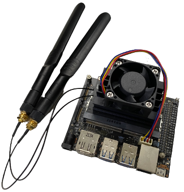
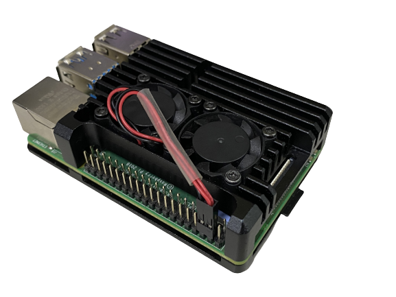

# 
Controller Selection 
 

- Two commonly available low-cost controllers capable of handling AI image recognition are the Jetson Nano and Raspberry Pi.
- They are suitable for various applications, including programming education in the field of education, smart home devices, self-driving cars, DIY projects, and more. This compact yet powerful microcomputer has become the top choice for electronics enthusiasts, students, and professionals.  
- We will compare the controller's specifications and prices to help us choose the right controller for our self-driving car.

## Controller Comparison
Here is a specification comparison between the two:

<table>
<tr>
<th rowspan="2" width=300>Photo</th>
<th>Nvidia Jetson Nano</th>
<th>Raspberry Pi 4B</th>
</tr><tr>
<td>
</td>
<td>
</td>
</tr><tr>
<th>Number of Pins</th>
<td>40P</td>
<td>40P</td>
</tr><tr>
<th>CPU</th>
<td>Quad-core ARM® Cortex®-A57 MPCore</td>
<td>1.5GHz 64-bit Quad-core ARM Cortex-A72 CPU</td>
</tr><tr>
<th>GPU</th>
<td>NVIDIA Maxwell™ architecture with 128 NVIDIA CUDA®  cores</td>
<td>Broadcom VideoCore VI  H.265 (4kp60 decode)  H264 (1080p60 decode, 1080p30 encode) OpenGL ES 3.1  Vulkan 1.0</td>
</tr><tr>
<th>Storage Spac</th>
<td>4 GB 64-bit LPDDR4</td>
<td>8GB LPDDR4-3200 SDRAM</td>
</tr><tr>
<th>Built-in Bluetooth and Wireless WiFi Connectivity</th>
<td>Requires external Bluetooth and wireless WiFi connectivity</td>
<td>Built-in</td>
</tr><tr>
<th>Gflops</th>
<td>472</td>
<td>13.5</td>
</tr><tr>
<th>Price</th>
<td>Expensive</td>
<td>Cheap</td>  
</tr>
</table>

- 一開始我們是使用價格更實惠、具有AI影像辨識能力的 Raspberry Pi 作為我們自動駕駛汽車的控制器。

- 但在全國賽我們發生了樹梅派鏡頭辨識失誤的情形，導致我們輸掉那一局比賽，因此我們重新研究 jetson nano ，打算使用 jetson nano 參加國際賽。
***
### 以下是我們對 jetson nano 和 Raspberry Pi 的比較

#### 1. 硬體架構
- Jetson Nano：配備了四核 ARM Cortex-A57 CPU 和 128 核的 NVIDIA Maxwell GPU，內存為 4GB LPDDR4。
- Raspberry Pi 4 (Pi 4)：配備了四核 ARM Cortex-A72 CPU，內存最高可選 8GB，但沒有內建專門的 GPU。
#### 2. 深度學習加速
- Jetson Nano：擁有 NVIDIA CUDA 和 cuDNN 支持，可以加速深度學習相關的工作負載（如使用 OpenCV 的 DNN 模組）。對於圖像分類、目標檢測等任務，Jetson Nano 的 GPU 能夠顯著提升處理速度。
- Raspberry Pi 4：沒有專用的 GPU 和深度學習加速功能，圖像識別任務完全依賴 CPU 處理，性能遠不及 Jetson Nano 的 GPU 加速。
#### 3. OpenCV 的性能
- Jetson Nano：由於擁有 CUDA 支持，在處理基於深度學習的圖像識別任務（如神經網絡推理）時表現更為優異。OpenCV 可以利用 NVIDIA 的 GPU 來加速圖像處理操作，例如卷積、矩陣運算等。
- Raspberry Pi 4：處理能力依賴 CPU，因此在面對同樣的任務時速度較慢。對於簡單的圖像處理任務（如濾波、邊緣檢測），Pi 4 的 CPU 也能勝任，但在處理更複雜的神經網絡推理時效率會明顯落後。
#### 4. 功耗
- Jetson Nano：功耗較大，典型使用場景下約 5W - 10W，尤其在使用 GPU 進行加速時，功耗會更高。
- Raspberry Pi 4：功耗較低，通常約 3.5W - 7W，適合對功耗要求較為敏感的應用場景。
#### 5. 實際應用場景性能對比
- Jetson Nano 在使用 OpenCV 和 DNN 模組進行即時物體檢測、圖像分類等任務時，速度顯著優於 Raspberry Pi 4。通過 CUDA 加速，Jetson Nano 能夠更快速地處理視頻流並進行即時推理。
- Raspberry Pi 4 則適合處理對性能要求不太高的任務，例如簡單的圖像處理操作或者非即時的圖像識別任務。
#### 6. 開發生態
- Jetson Nano 的開發生態專為 AI 和計算機視覺任務設計，有 NVIDIA 提供的 JetPack SDK，其中包括優化的 OpenCV、TensorFlow 和 PyTorch 等工具，便於開發者快速部署深度學習模型。
- Raspberry Pi 4 雖然也支持 OpenCV，但缺乏專門的硬體加速，對複雜深度學習任務的支持不如 Jetson Nano。
### 總結

經過我們比較結果也發現 Jetson nano 在鏡頭判斷的效能比 Raspberry Pi 4 好上許多，因此我們決定在世界賽使用 jetson nano 當作主控制器。

- __In conclusion, we have chosen to use the Raspberry Pi as the controller for our self-driving car in this competition.__
# 
[Return Home](../../)
 
