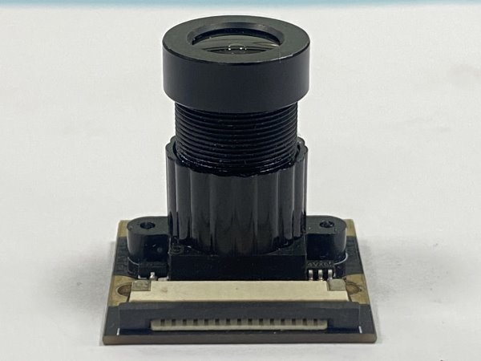
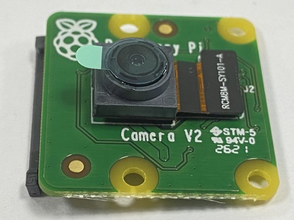
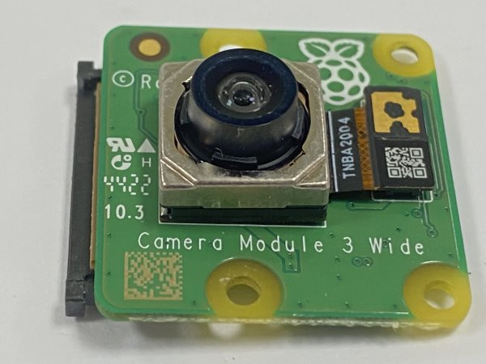
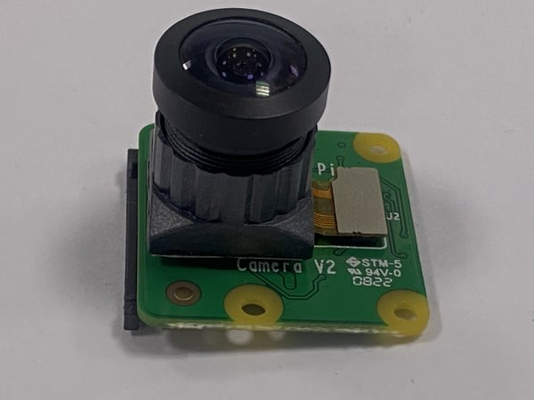
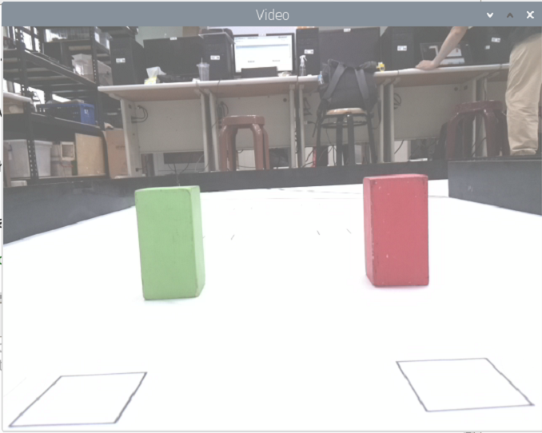
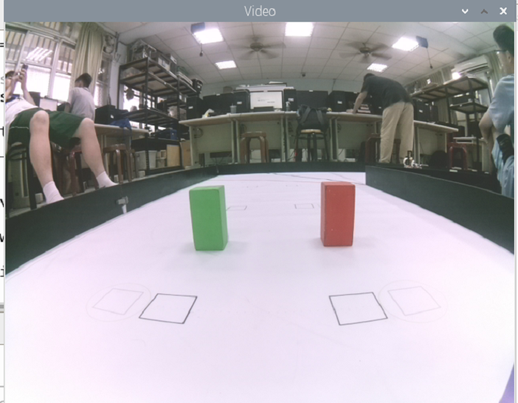
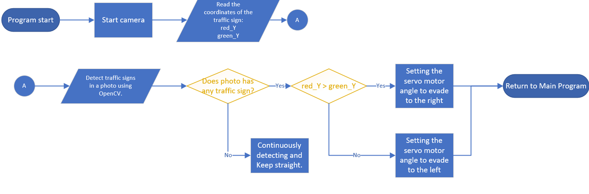

# 
Camera Selection(攝影鏡頭)
 
- In order for the vehicle to accurately avoid obstacles, a camera module needs to be installed on the vehicle to recognize the position and color of obstacles. This allows the controller to compute and control the vehicle's motors for obstacle avoidance.  
- Since we are using a Raspberry Pi as the controller, we need to find a camera module that is compatible with it. To do this, we referenced the camera module used by the American team last year and compared it with other camera modules from the same series.  
__Here is the product information:__
- 為了讓車輛能夠正確地閃避積木，需要在車輛上安裝一個鏡頭模組來辨識積木位置及顏色，以利控制器運算控制車輛馬達進行車輛閃避。
- 由於使用的控制器是 Raspberry Pi，因此需要尋找與其相容的鏡頭模組。為此，我們參考了去年美國隊伍使用的鏡頭模組，並尋找了同一系列的鏡頭模組進行比較。  
以下是產品資訊：
  1. Raspberry Pi Camera Rev 1.3(傳感器:OmniVision OV5647)
  2. Raspberry Pi Camera Module V2(傳感器:Sony IMX219)
  3. Raspberry Pi Camera Module V3(傳感器:Sony IMX708)
  4. 
- Although the frame rate of Camera Module V3 is higher, we decided not to use it because it is not compatible with the existing Raspberry Pi operating system.  
- The frame rate of Camera 1.3 is only 30p, while the frame rate of Camera Module V2 can reach up to 90p.  
- Through experimentation, we found that the Camera Module V2 version also delivers excellent recognition performance. Therefore, we have ultimately chosen the Camera Module V2 as the AI recognition camera module for our self-driving car.
- 雖然Camera Module V3的影格速率較高，但考慮到與現有的Raspberry Pi作業系統不相容，我們決定不使用該版本。
- 而Camera 1.3版本的影格速率僅為30p，相比之下，Camera Module V2 版本的影格速率最高可達到90p。
- 經過實驗發現Camera Module V2版本也有極佳的辨識效果，因此我們最終選擇了相機模組V2作為我們自駕車的AI辨識鏡頭模組。

#### Camera Module(攝影模組)

<table>
<tr align="center" >
<th rowspan="2">Model(型號)</th> 
<th >Raspberry Pi Camera Rev 1.3</th>
<th >Raspberry Pi Camera Module V2</th>
<th >Raspberry Pi Camera Module V3</thd>
<th >SONY IMX477</thd>
</tr>
<tr align="center">

<td></td>
<td></td>
<td></td>
<td></td>
</tr>
<tr align="center">
<td>Sensor</td>
<td>Omnivision OV547</td>
<td>Sony IMX 219</td>
<td>Sony IMX 708</td>
<td>SONY IMX 477</td>
</tr>
<tr align="center">
<td>Sensor Resolution</td>
<td>2592 * 1944 pix</td>
<td>3280 * 2464 pix</td>
<td>4608 * 2592 pix</td>
<td>4056 * 3040 pix</td>
</tr>
<tr align="center">
<td>FPS幀率</td>
<td>30p MAX</td>
<td>90p MAX</td>
<td>120p MAX</td>
<td>240p MAX</td>
</tr>
</table>

- In the experimental tests, it was found that when the vehicle was avoiding obstacles, the camera's field of view was too small to predict the position of the next obstacle. This caused problems for the vehicle's obstacle avoidance strategy.  
- Therefore, we modified the original camera lens  to a wide-angle lens. Compared to the original 72-degree field of view, the wide-angle lens provides a 160-degree field of view, which allows us to predict the position of the next obstacle in advance, thus improving the effectiveness of the vehicle's obstacle avoidance strategy.

- 在實驗測試中發現，當車輛在進行閃避積木時,會因鏡頭視野過小，無法預測得知下一個積木的位置，這樣會對於車輛的避障策略造成了困擾。
- 因此，將原本的鏡頭修改成廣角鏡頭。相較於原本的72度視野範圍，廣角鏡頭提供了160度的視野範圍，能夠讓我們提前預測下一個積木的位置，從而改善車輛的避障策略效果。

#### Wide-Angle Lens(廣角鏡)

<table>
<tr align="center">
<th> Without the Wide-Angle Lens(未加廣角鏡)</th> 
<th>With the Wide-Angle Lens(已加廣角鏡)</th>
</tr>
<tr align="center">
<td></td>
<td>
</td>
</tr>
<tr align="center">
<td></td>
<td> </td>
</tr>
</table>

- In the Raspberry Pi program, it is possible to set the resolution of the camera module. We will experiment with the following common resolutions to determine the camera module resolution that offers the best recognition performance.
- 在raspberry pi的程式中可以設定鏡頭模組的解析度，我們將實驗以下常見的解析度，以找出最佳辨識效果的鏡頭模組解析度。

  1. 1080x640 幀率30p
  2. 640x320 幀率60p
  3. 320x240 幀率90p

- In the experiments, it was found that when the camera module resolution was set to 1080x640, the high-resolution image processing requirements resulted in the program taking a significant amount of time to recognize obstacles. This led to a decrease in the program's computational efficiency.
- When the resolution was set to 320x240, although computational efficiency was extremely high, the low resolution resulted in the inability to recognize obstacles accurately.
- However, when the resolution was set to 640x320, we observed that obstacle recognition could be performed accurately, and the computational efficiency was not excessively slow, thus avoiding the issue of the vehicle colliding with obstacles.
- Therefore, we have set the camera module resolution to 640x320 to achieve the optimal recognition efficiency for the camera module resolution.
  
- 在實驗發現，當相機模組的解析度設定為1080x640時，由於高解析度的影像處理需求，程式需要花費大量的時間來辨識積木，這導致了程式的運算效率降低。
- 當解析度設定為320x240時，雖然運算效率極高，但由於解析度過低，導致無法正常辨識積木。
- 然而，當解析度設定為640x320時，我們觀察到可以正常辨識積木，而且運算效率也不會太慢，可避免了車輛撞上積木的問題。
- 因此，我們將相機模組的解析度設定為640x320，以獲得最佳辨識效率的鏡頭模組解析度。 

## Camera Module AI Obstacle Recognition Operation Process 鏡頭模組AI辨識積木運作流程

- When the program starts, it will start the camera, continuously take pictures and transmit them to the main controller. Then, the program will use OpenCV's image recognition function to detect whether there are blocks in the photo. If blocks are detected, it will compare the size of the red and green traffic signs. If the red sign is larger, the vehicle will flash right. If the green sign is larger, it will flash left. If no traffic signs are detected, the vehicle will continue straight.

- 程式啟動後，將啟動攝影機，持續拍攝照片並將其傳輸至主控制器。然後，程式將使用OpenCV的圖像識別功能來檢測照片中是否存在積木。如果檢測到積木，它將比較紅色和綠色交通標誌的大小。如果紅色標誌較大，車輛將向右閃爍。如果綠色標誌較大，它將向左閃爍。如果未檢測到交通標誌，車輛將繼續直行。

# 
[Return Home](../../)
  

