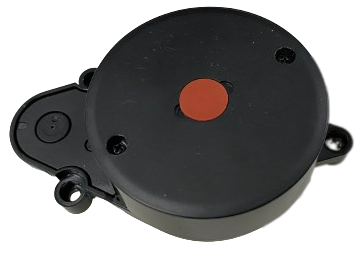
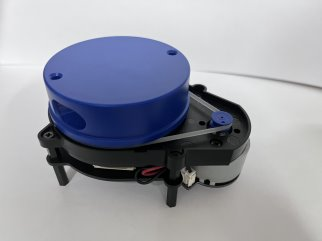
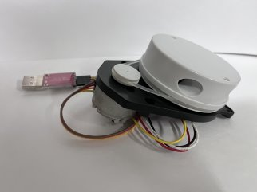
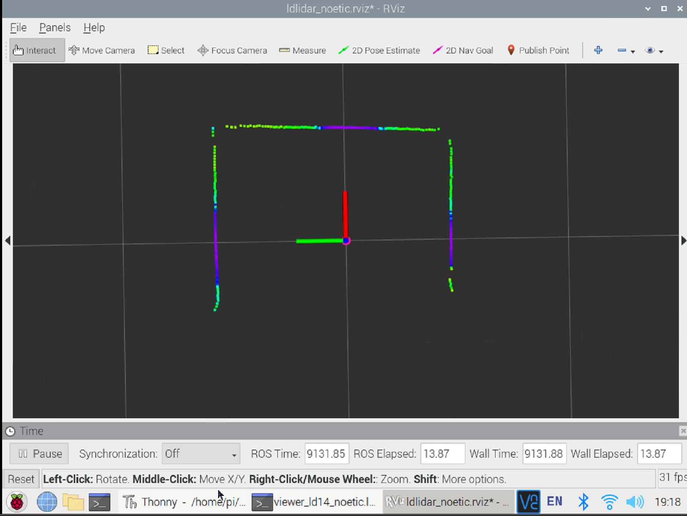
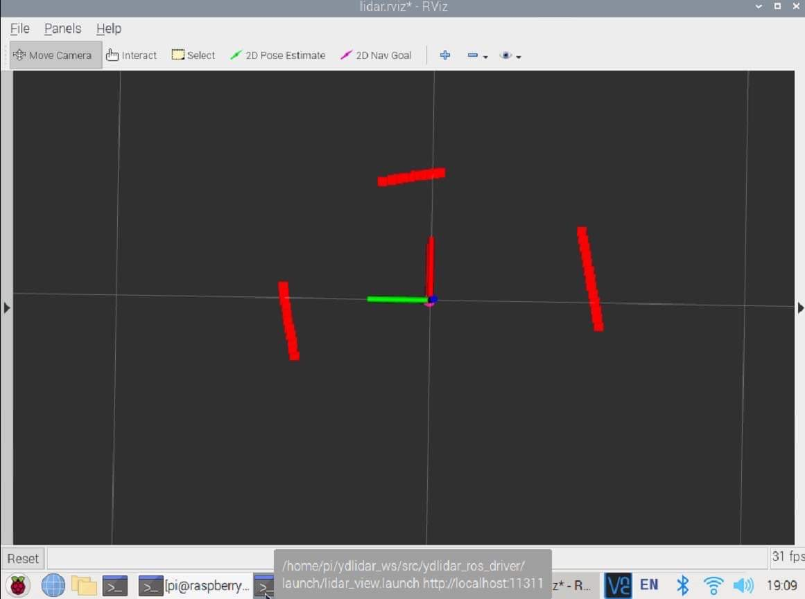
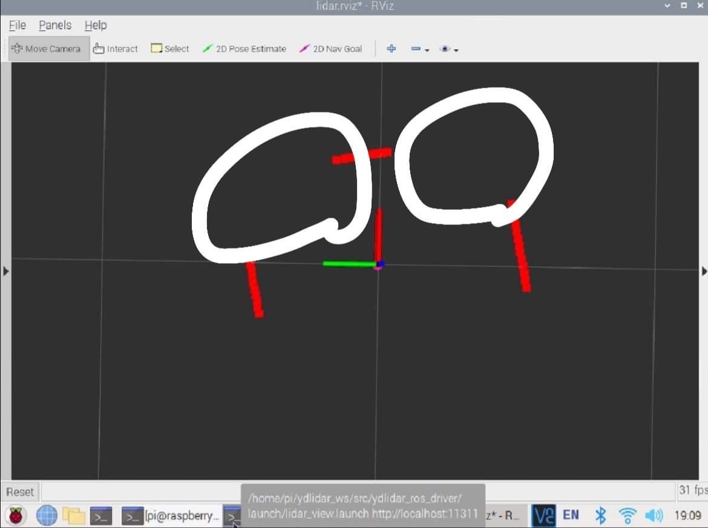
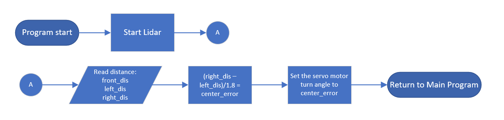
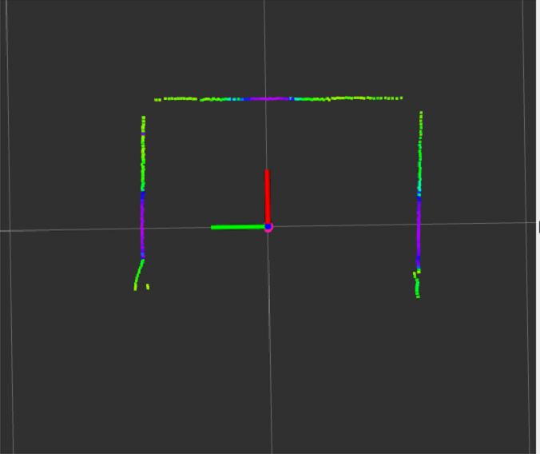
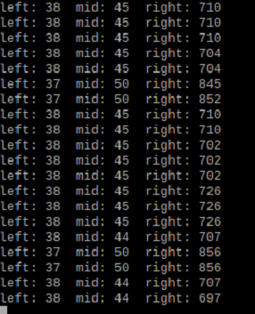

## 
 LiDAR Sensor Selection 
 
 - ### LiDAR Sensor Introduction
   - LiDAR Sensor, also known as Light Detection and Ranging, is a technology that uses laser pulses to measure distances and create maps. LiDAR systems typically consist of a laser, a receiver, computing equipment, and a navigation system.  
   - LiDAR Sensor is widely used in various fields, including applications such as autonomous vehicles, environmental monitoring, drones, and aviation.  
   - Therefore, in this competition, we have chosen __LiDAR sensor__ as the sensor for detecting the distance between the vehicle and the walls.

- ### Comparison between Ultrasonic and LiDAR Sensor
  - Ultrasonic sensors can only detect in one direction, typically limited to the front, and are used for distance measurement and obstacle detection. LiDAR, on the other hand, offers 360-degree coverage, allowing simultaneous sensing in all directions. It is used for high-precision environmental awareness, map creation, collision risk reduction, and finds extensive applications in areas such as autonomous driving and environmental modeling. LiDAR excels over ultrasonic sensors in providing comprehensive environmental information, making it more advantageous in robot navigation.  
- ### Comparison of Different LiDAR Sensors
  - We compared commonly available and cost-effective LiDAR models in the market, including D100, YDLIDAR X2, and YDLIDAR X4, with the expectation of finding the best LiDAR to be used as the sensor for this competition.  
  - The D100 has a detection frequency of 2300Hz, which is lower compared to the 3000Hz of YDLIDAR X2 and the 5000Hz of X4, making its response slightly slower.  
  - Due to unfamiliarity with the use of YDLIDAR X4 and YDLIDAR X2, we encountered issues with missing angles in obstacle detection. Therefore, for this competition, we decided to use the __D100__ sensor for detecting the distance of the vehicle from the field's edge walls.

- ###  LiDAR 介紹
    - 光達，也被稱為激光雷達（LiDAR，Light Detection and Ranging的縮寫），是一種使用激光脈衝來測量距離和創建地圖的技術。激光雷達系統通常由激光器、接收器、計算設備和導航系統組成。
    - 激光雷達在多個領域都有廣泛的應用，如自動駕駛汽車、環境監測、無人機和航空等。
    - __因此，在次競賽我們選用光達來做為偵側車輛與牆體之間距離的感測器。__

  - #### 超音波與LiDAR之異差
      超音波感測器只能單向偵測，限於前方，用於距離測量與障礙物檢測。光達則具備360度全方位覆蓋範圍，可同時感測四周，用於高精度環境感知和地圖製作，減少碰撞風險，並廣泛應用於自動駕駛、環境建模等領域。光達優於超音波在提供完整環境資訊方面，使其在機器人導航中更為優勢。

  - #### 各式光達的比較  
       
      - 我們採用市面上常見、價格便宜D100、 ydlidarx2及ydlidarx4的光逹做比較，期望找到最佳的光逹，作為次此競賽的感測器。      
      - D100偵測頻率是2300，相比 ydlidar x2 的 3000HZ 和 x4 的 5000HZ，頻率更小，因此反應會慢一點。  
      - 由於對ydlidar x4和ydlidar x2的使用不熟悉，導致在偵測障礙物時出現了缺角問題。因此，在本次競賽中，我們決定採用 __D100__ 感測器來進行車輛偵測場邊牆距離的感測器。

   - #### Performance Testing of Low-Cost LiDAR Sensors Commonly Available in the Market(以市售常見低價不同種類之光達性能實測)
    
    |  LiDAR D100    |  Ydlidar x4  |   Ydlidar x2    |      
    | :----: | :----: | :----:|
    ||||

   - #### Missing Point Problems of LiDAR Sensors ydlidar x4, ydlidar x2, and D100(實測光達ydlidar x4、ydlidar x2 、D100 之缺角情況)

    

    <table>
        <tr align="center">
        <th> LiDAR D100</th>
        <th colspan="2">Ydlidar X4 X2</th>
        </tr>
        <tr align="center">
        <td></td>
        <td></td>
        <td></td>
        </tr>
    </table>  
    
 

- ### LiDAR-controlled steering detection process光達控制轉向偵測流程
  - This is the process for using the LiDAR sensor in this competition.
  - When the LiDAR sensor and program are started, the LiDAR sensor detects the distance between the vehicle and the walls in front, right, and left. The distance values are transmitted to the Raspberry Pi controller via ROS for calculation and judgment. The controller then uses this information to determine which side the vehicle is leaning towards. The controller also transmits the steering values to the front steering servo motor to control the vehicle's movement and steering.
  - 這是此次競賽光逹感測器使用流程。
  - 在啟動光達Sensor和程式時，光達感測器偵測正前方、右方和左方邊牆與車輛的距離數值，藉由ROS傳輸距離數值給樹梅派控制器中運算判斷，以了解車輛是偏向哪一邊，也會將轉向數值傳給前轉向伺服馬達控制車輛行進轉向。
    

    - ####  Using LIDAR Sensor to center on the road 使用光達感測器道路置中
      - Using LIDAR sensor to measure the distances between the object's right and left sides and the walls, we can calculate the error values for both sides.  
      - By multiplying these error values with coefficients, we can obtain the angle to center the servo motor on the road.  
      - 在程式執行時,會使用光達測量車輛兩側與牆的距離，我們可以計算出兩側的誤差值。  
      - 透過將這些誤差值與係數相乘，我們可以獲得使伺服馬達在道路上置中的角度。  
    

  
    |LIDAR sensor Detects Surrounding Walls(光達偵測周圍牆壁)|LIDAR sensor Readings(光達讀取的數值)|
    |:---:|:---:|
    |||
    

# 
[Return Home](../../)
  
