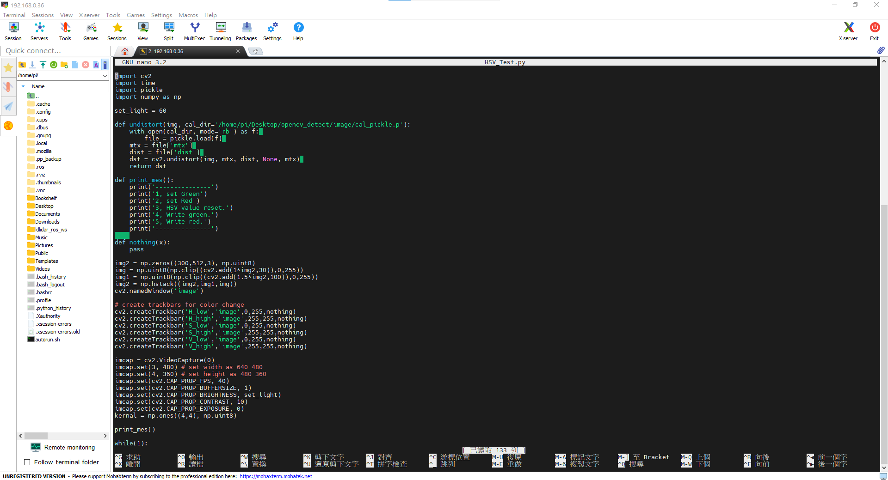
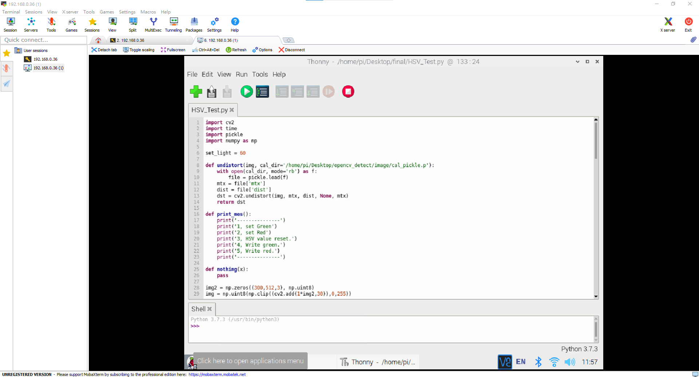
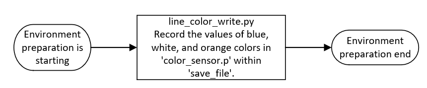
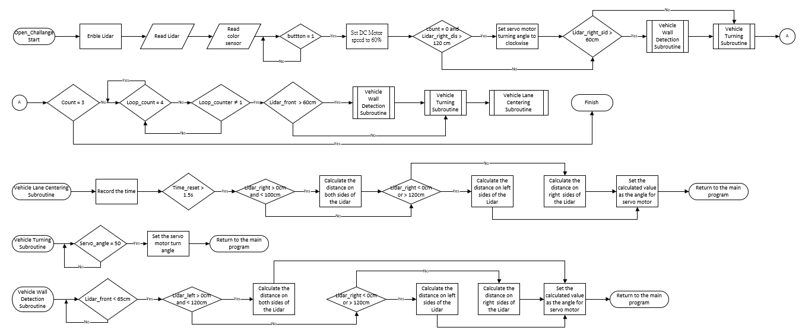

<div align="center"></div>

## <div align="center">Open Challenge Code Overview(資格賽程式概述)</div> 

 - ####  Program Libraries
   - In the competition, vehicle control involves complex operations such as image recognition, color identification, distance detection, motor rotation, and vehicle steering. All of these are implemented using the __Python__ programming language.
   - Through the built-in SSH or VNC functionality in Mobaxterm or using RealVNC, we can easily connect to the Raspberry Pi, access its editor interface, carry out programming tasks, and perform real-time execution tests.
   - The libraries introduced in this competition program are as follows.
   - 在競賽活動中，車輛行進的控制包含影像辨識、顏色判別、距離偵測、馬達轉動以及車輛轉向等複雜操作，均透過 __Python__ 程式語言設計來實現。
   - 透過Mobaxterm工具內建的SSH或VNC功能或RealVNC，讓我們能夠輕鬆地連線到樹莓派，進入其編輯器界面，開展程式撰寫的工作並即時進行執行測試。
   - 本次競賽程式所引入的程式庫如下：  
```
   #Import the required modules
   import pigpio       #Raspberry Pi I/O Control Function Library
   import time         #Time Module
   import smbus        #I2C Manage  Module
   import struct       #Binary Data Packing and Unpacking Modul
   import os           #System Information Reading Module 
   import math         #Mathematical Calculation Module
   import cv2          #OpenCV  Module
   import threading    #Multithread Management  Module
   import pickle       #Serialization/Deserialization Modul
   import rospy        #ROS Python Commands Module
   import numpy as np  #Multidimensional Arrays and Matrix Operations Module
   import signal       #Exception Handling Module
   from sensor_msgs.msg import LaserScan  #ROS Data Structure Definitions
```
<div align="center">
</div>
 <div align="center">
 <table>
 <tr align="center">
 <th> Edit python of  Mobaxterm_SSH  
 </th>
 <th> Edit python of  Mobaxterm_VNC
 </th>
 <th>Edit python of RealVNC
 </th>
 <tr align="center" > 
 <td> </td>
 <td> </td>
 <td> </td>
 </tr>
 </tr>
 </table>
 </div>

 - ### Introduction to the Required Module Programs in the Operating Software:
 - ### 運作程式中所需要的模組程式介紹：
   - #### Field Environment Value Recording Configuration Workflow(場地環境值記綠設定運作流程圖)
       
   
     - #### [line_color_write.py](./line_color_write.py)
       - The main functionality of the "line_color_write.py" program is to read the color values of white areas, orange lines, and blue lines, and save these values to a file named "color_sensor.p". Additionally, the program stores this file in the "save_file" directory.       
       - "line_color_write.py" 這個程式主要功能是用來讀取場地中白色區域、橘色線條和藍色線條的顏色數值，並保存到名為color_sensor.p檔案並存入到"save_file"的資料夾中。
  
     - #### [save_file](./save_file)
       - The function of the 'save_file' folder is to store color values related to the white area of the field, orange lines, and blue lines.
       - These numerical data are used for image processing, image recognition, and determining whether the next turn is reached or whether to walk forward or backward.
       - save_file 資料夾的功能是用於儲存場地白色區域、橘色線條和藍色線條相關的顏色數值。  
       - 這些數值資料則用於圖像處理、影像辨識及判斷是否到逹下一個彎道或順逆行走的判斷依據。
   - #### Open Challenge Program Operation Flowchart(資格賽程式運作流程圖)
    
    
     - ### [vehicle_function.py](./vehicle_function.py)
       - "vehicle_function.py," which is the program library used in this competition, provides custom functions for vehicle movement, image recognition, color recognition, and controlling servo motors. These custom functions simplify complex procedures into subroutines for ease of debugging.
       - "vehicle_function.py"，它是本次競賽所使用的程式函式庫，提供車輛移動、影像辨識、顏色辨識和操控伺服馬達等自定義函式程式，將複雜程序簡化成副程式概念，方便除錯。  
    
     - ### [Open_Challenge.py](./Open_Challenge.py)
       - "Open_Challenge.py" is the main program responsible for controlling the self-driving car. It reads the values detected by the color sensor and LIDAR sensor to drive the car's motors and control its steering. Its purpose is to enable the vehicle to accurately navigate the track in both clockwise and counterclockwise directions to complete the mission.
       - "Open_Challenge.py"，它是執行自駕車控制的主程式，讀取顏色感測器和光達感測器所偵測的數值，來驅動車輛的馬達並進行轉向。其目的在於使車輛能夠準確地順逆時針繞場地三圈，以完成任務。

- ### 資格賽程式運作流程流程圖說明   Open Challenge Program Operation Flowchart Description
  - The LiDAR will start up with the program, and the program will read LiDAR data indefinitely.  [Wall-Steering@Steering_overview](../../Image_Processing_and_Steering/Steering_overview#wall-steering)
  - The vehicle program system will first initialize, setting the DC motor speed to 0, the servo motor angle to 0, and the turn direction to counterclockwise by default.  
  - After the switch button is pressed, the DC motor speed is set to 90%. If the lap number is 0 and the LiDAR right side is greater than 120 cm, the vehicle will turn clockwise. Otherwise, it will skip. When the distance in front is less than 60, the vehicle will turn.  
  - The program will continuously check if it has finished three laps. If not, it will detect if the current lap is finished. If not, it will determine if it is the second lap. If so, it will determine if the distance in front is greater than 60. If yes, it will continue to go straight until it is less than 60 cm, then turn. After turning, it will go straight for a distance, otherwise the LiDAR may miscalculate and turn early.
    
  - __Subroutine Description:__         
      __1.Vehicle Lane Centering Subroutine：__  
     The vehicle continuously monitors the current program execution time. If the time exceeds the set limit, it checks whether the distances on the left and right sides of the LIDAR are within the range of 0 to 100 cm. If they are within this range, it calculates the difference between the right-side distance and the left-side distance and sends the result to the servo motor for centering. If the distances are not within this range, it checks whether the right-side distance from the LIDAR is between 0 to 120 cm. If it is, it uses the left-side value in the algorithm; otherwise, it uses the right-side value. Finally, the calculated value is output to the servo motor as the centering angle.
    
      __2.Vehicle Turning Subroutine:__  
        When the vehicle reaches the turning point, it will turn based on the angle of the turn until it completes the turn.  
        
      __3.Vehicle Wall Detection Subroutine：__    
         This action continuously checks if the distance in front is less than 65cm while moving forward. During straight-line movement, it also performs road centering until it detects a wall to initiate a turn.  
    
  - 光達會和程式一起啟動，程式會無限次讀取光達資料。 
  - 車輛程式系統會先初始化，將直流馬達速度設為0，伺服馬達角度設為0，轉彎預設為逆時針。
  - 當開關按鈕按下之後將直流馬達速度設為90%，在判斷圈數是否0且光達右側是否大於120cm，如果是，將轉彎順時針，如果否則跳過。當前方距離小60 cm時，車輛會進行轉彎。
  - 程式會一直判斷是否跑完三圈，如果沒有，就偵測目前這圈跑完了沒，如果沒有，判斷這是不是第二圈，如果是，判斷是否前方距離是大於60cm，如果是就一直直走直到小於60cm，進行轉彎動作，轉彎之後要先直走一段距離，否則光達可能會誤測，提早轉彎。
  - __副程式描述:__  
    __1. 車輛行駛車道置中副程式:__ 車輛會一直讀取目前程式執行的時間，如果大於設定時間，會判斷光達左右側的距離是不是大於0和小於100cm，如果在範圍內，就將右側數值減掉左側數值，再將結果丟給伺服馬達校正置中，如果不在範圍內，會判斷光達右側距離是否在0~120cm之間，如果是，會將左側數值丟入演算法，如果否則丟入右側數值，最後將數值輸出給伺服馬達作為置中角度。  
    __2. 車輛轉彎副程式:__ 當機器到達轉彎處時，機器會根據轉彎角度進行轉彎，直到完全轉過彎道。    
    __3. 車輛測牆副程式:__ 此動作會無限偵測前方距離是否小於65cm，在直行的過程中也會進行道路置中，直到測道牆進行轉彎。  

# <div align="center">[Return Home](../../../)</div>  
