

## 
3D Vehicle Model Design - 3D車輛模型設計 

 - 此次競賽所使用的車輛車架是我們自製研發，以下將介紹車輛車架設計、製作方式。
 - 我們使用Onshape設計車輛的3D模型結構，並依車架結構特性，分別以雷切機及3D印表機等設備製作所需要的車輛零件。
 - The vehicle chassis used in this competition is our in-house, self-developed design. The following will introduce the vehicle chassis design and production process.
 - We use Onshape to design the 3D model structure of the vehicle, and based on the chassis's characteristics, we manufacture the necessary vehicle parts using equipment such as laser cutting machines and 3D printers.
- ### Onshape Model Draft - Onshape繪圖
    

    <table>
    <tr>
    <th>3D Vehicle Model </th>
    <th>Vehicle Underfloor</th>
    <th>Vehicle Mid-Deck</th>
    <th>Vehicle Top Deck</th>
    </tr><tr>
    <td>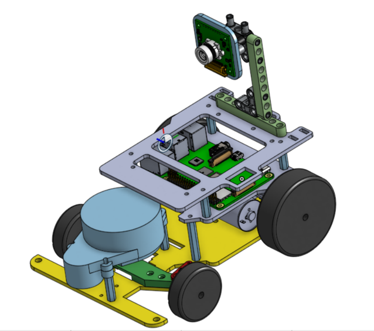</td> 
    <td>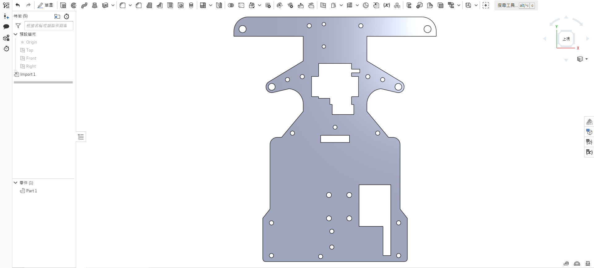</td> 
    <td>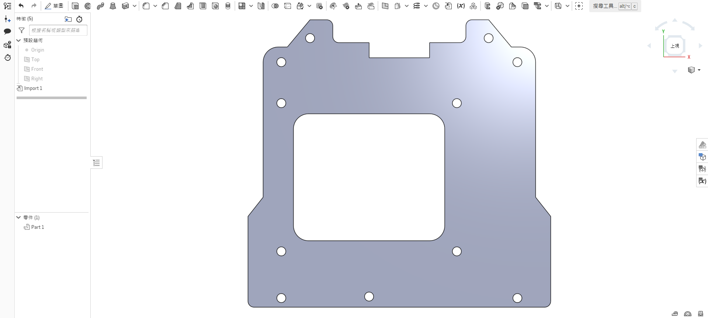</td> 
    <td>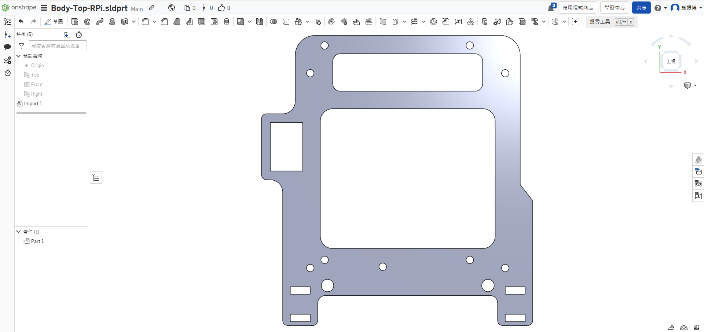</td>
    </tr>
    </table>
    
 
    

    <table>
    <tr>
    <th>3D Vehicle Chassis Design</th>
    <th>3D Vehicle Chassis Models</th>
    </tr><tr>
     <td>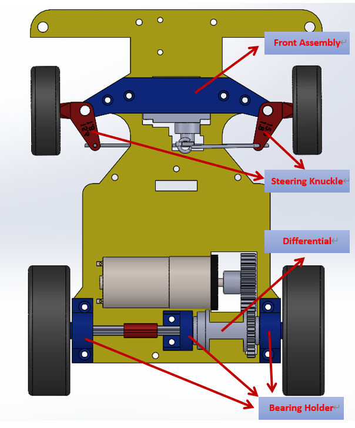</td> 
    <td></td> 
    </tr>
    </table>
    
 

  - ### Onshape Introduction
    - We use Onshape to design 3D models of self-driving cars. Onshape is a free and easy-to-use web-based CAD software.
    - After creating a model in Onshape, you can output a 2D dimension drawing, which can then be sent to a laser-cutting machine for cutting or converted and sent to a 3D printer for output.
    - All 3D/2D vehicle models created for this competition were designed in OnShape.
    - Software Website：[OnShape](https://www.onshape.com/en/) 

  - ### Onshape的介紹
     - 使用 Onshape 來設計自駕車的 3D 模型，而 Onshape 是免費且容易操作的網頁型態設計軟體。
     - 藉由 OnShope 建立模型後，可輸出平面尺寸圖，再交由雷切機進行切割或轉檔交由3D印表機輸出。
     - 本競賽活動所建立的3D/2D車輛模型均由OnShape設計而成。
     - Website：[OnShape](https://www.onshape.com/en/)
  

        |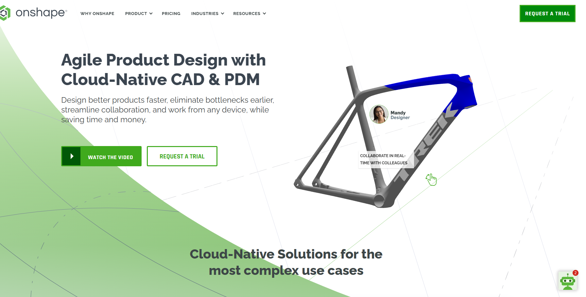| 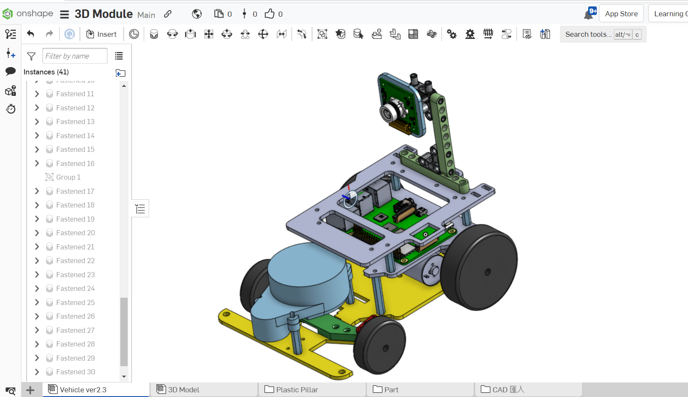|
        |:---:|:---:| 

- ### The Production of Vehicle Chassis Panels Introduction - Using a laser-cutting machine 車輛車架平板之製作介紹 - 使用雷切機
  - 雷切機是一種利用雷射束來切割材料的機器。雷射束具有高能量密度，可以快速、精確地切割各種材料，包括木材、金屬、塑料、紙張等。"
  - 我們使用學校提供的雷切機，將3mm厚的木板，依照自行設計的車輛平板尺寸圖，將車輛車架所需的車"vehicle Underfloor"、"Vehicle Mid-Deck"及"Vehicle Top Deck"生產出來。
  - 我們採用材質較輕的木板，作車輛平板材料，以少車輛重量。
  - 以下介紹使用雷切機製作車輛平板的過程。
  - A laser-cutting machine is a device that utilizes a laser beam to cut materials. The laser beam has high energy density and can cut a variety of materials, including wood, metal, plastic, paper, and more, quickly and precisely.
  - We use the laser-Cutting machine provided by the school to produce the 'vehicle underfloor,' 'vehicle mid-deck,' and 'vehicle top deck' required for the vehicle chassis. We cut 3mm thick wooden boards according to the self-designed vehicle flat panel dimensions chart.  
  - We use lighter-weight wooden boards as the material for vehicle flat panels to reduce the vehicle's weight.  
  - Here is an introduction to the process of creating vehicle flat panels using a laser cutting machine.

    - ####  Operation of Laser-Cutting Machine 雷切機操作
    
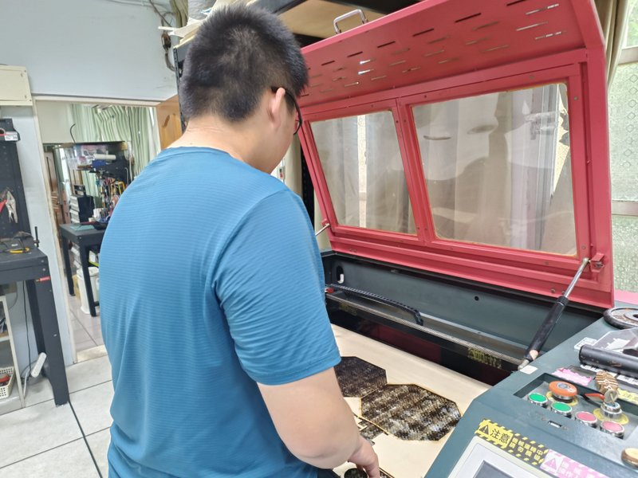

    - #### Vehicle Chassis Panels Dimensions Chart.車輛平板尺寸圖
        

        <table>
        <tr>
        <th>Lens Holder</th>
        <th>Vehicle Underfloor</th>
        <th>Vehicle Mid-Deck</th>
        <th>Vehicle Top Deck</th>
        </tr><tr>
        <td>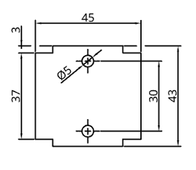</td> 
        <td>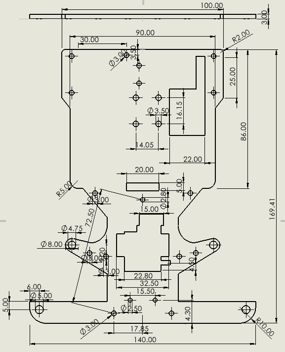</td> 
        <td>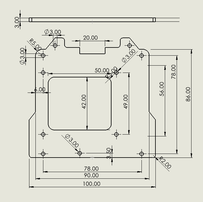</td> 
        <td>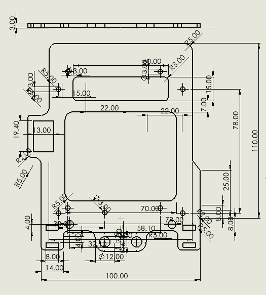</td>
        </tr>
        </table>
        
 

    - #### Vehicle body wooden panels produced using a laser cutting machine以雷切機生產的車體木質平板成品
        

        <table>
        <tr>
        <th>Lens Holder</th>
        <th>Vehicle Underfloor</th>
        <th>Vehicle Mid-Deck</th>
        <th>Vehicle Top Deck</th>
        </tr>
        <tr>
        <td>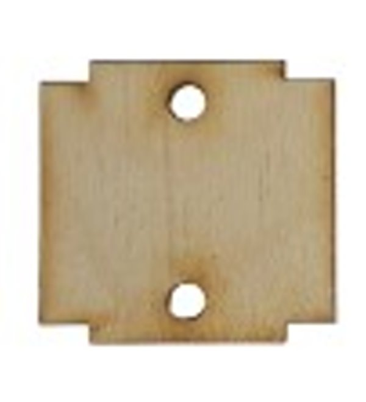</td>
        <td>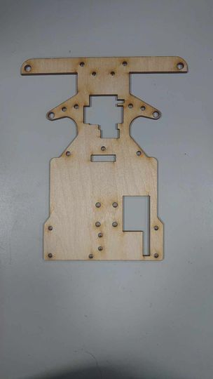</td>
        <td>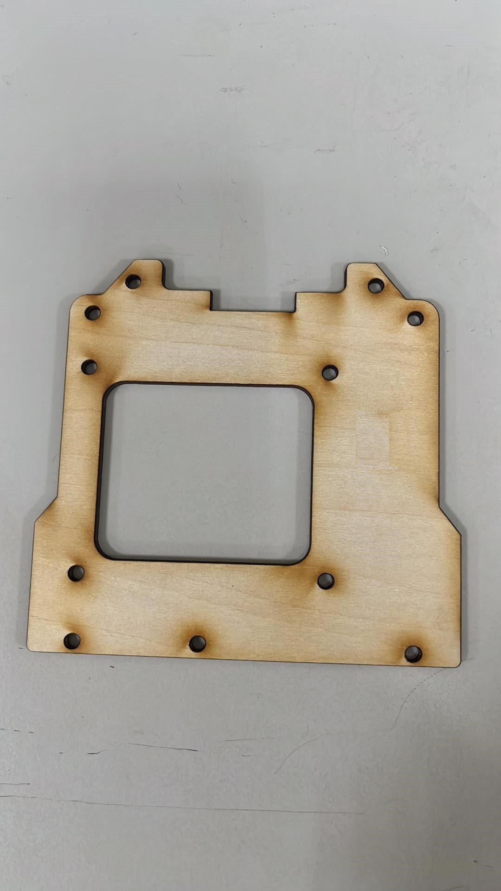</td>
        <td>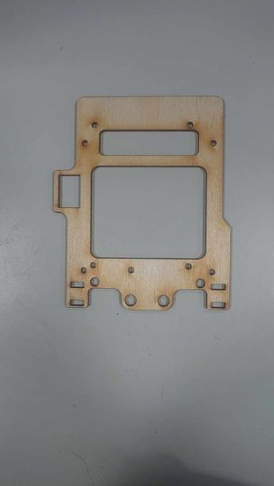</td>
        </tr>
        </table>
        

     - 使用上方的3D印表機所生產的車輛車架，經實驗發現，容易在車輛撞牆時，因馬達扭力，造成車架毀壞，因此改用Stereolithography (SLA) 3D Printer生產車輛所需的支撐架，以確保車輛在競賽不會有同樣的情形發生。 
        
     - The vehicle chassis produced using the 3D printer mentioned above was found to be prone to damage during collisions due to motor torque. As a result, we switched to using a Stereolithography (SLA) 3D printer to manufacture the required support frames for the vehicle, ensuring that the same issue does not occur during the competition."

  - #### Stereolithography (SLA) 3D Printer 光固化3D列印機
    - 光固化 3D 列印機的工作原理是將 UV 光源投射到一桶液體樹脂上。光逐層固化樹脂，直到整個物體凝固，並以其高精度和表面光潔度而聞名。它們通常用於製造高精度、複雜結構的物體。
    - The working principle of a stereolithography (SLA) 3D printer is to project a UV light source onto a vat of liquid resin. The light cures the resin layer by layer until the entire object solidifies, known for its high precision and surface smoothness. They are typically used to manufacture highly precise and intricately structured objects.

    

    <table>
    <th> Stereolithography (SLA) 3D Printer</th>< tr></tr>
    <td align="center">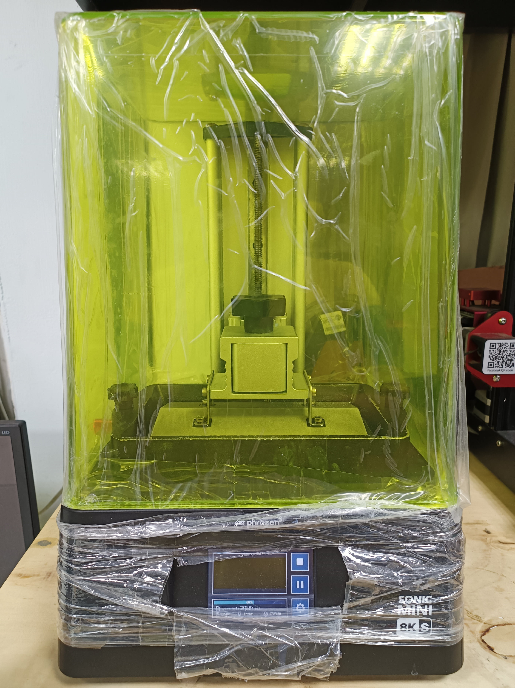</td>
    </tr>
    <table>
    

 - ###  Onshpae Modle Draft- 3D Vehicle Modles
    - 此次競賽所使用的車輛車架是我們以Onshpae繪製研發。
    - The vehicle chassis used in this competition was designed and developed by us using Onshape.
    

    <table>
    <tr>
    <th>3D Vehicle Chassis Design</th>
    <th>3d Vehicle Models</th>
    </tr><tr>
    <td></td> 
    <td></td> 
    </tr>
    </table>
    
 

    - ####  3D Vehicle Model Dimension Diagram
      

      <table>
      <tr>
      <th>Fornt Assembly</th>
      <th>Steering Kunckle</th>
      <th>Center Bearing Holder</th>
      <th>Out Bearing Holder</th>

      </tr><tr>
      <td>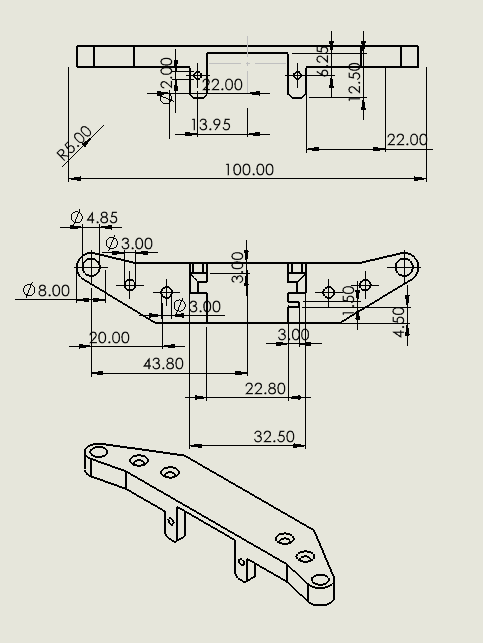</td> 
      <td></td> 
      <td>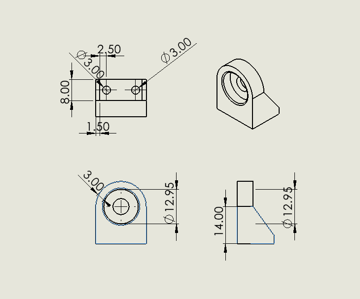</td>
      <td>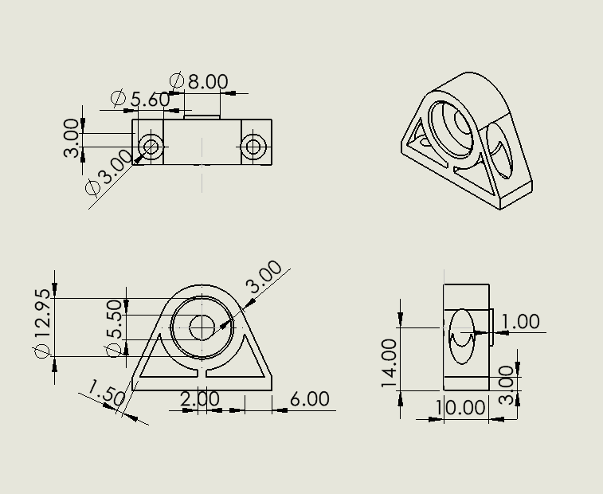</td>
      </tr>
      </table>
      
 

    - ####  Vehicle body support components produced with Stereolithography (SLA) 3D Printer
      

      <table>
      <tr>
      <th>Fornt Assembly</th>
      <th>Steering Kunckle</th>
      <th>Bearing Holder</th>

      </tr><tr>
      <td>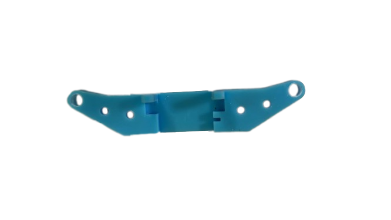</td> 
      <td>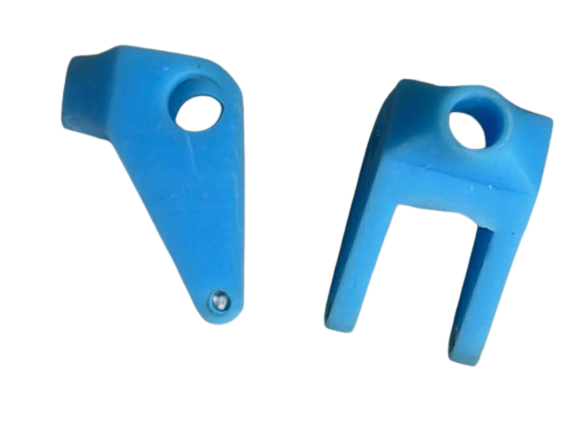</td> 
      <td>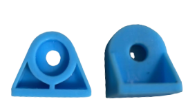</td>
      </tr>
      </table>
      
 

# 
[Return Home](../../)
  
 