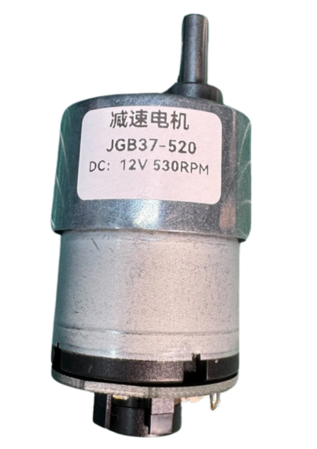
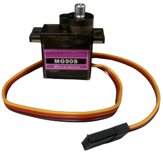
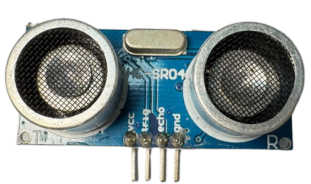
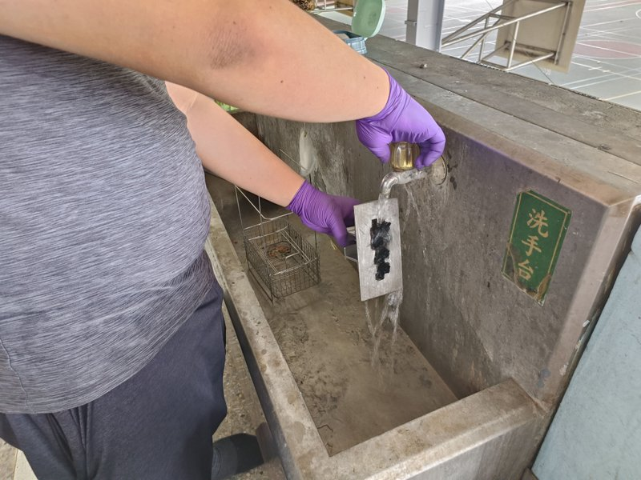
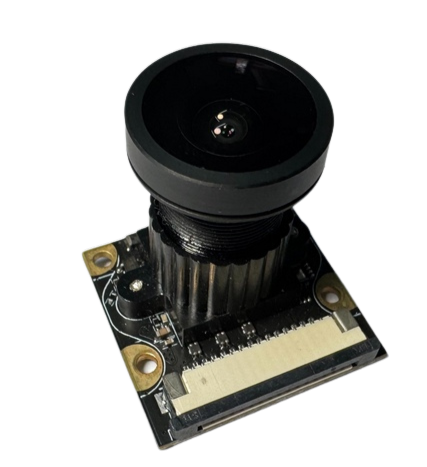
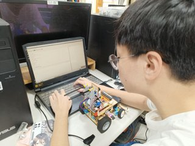
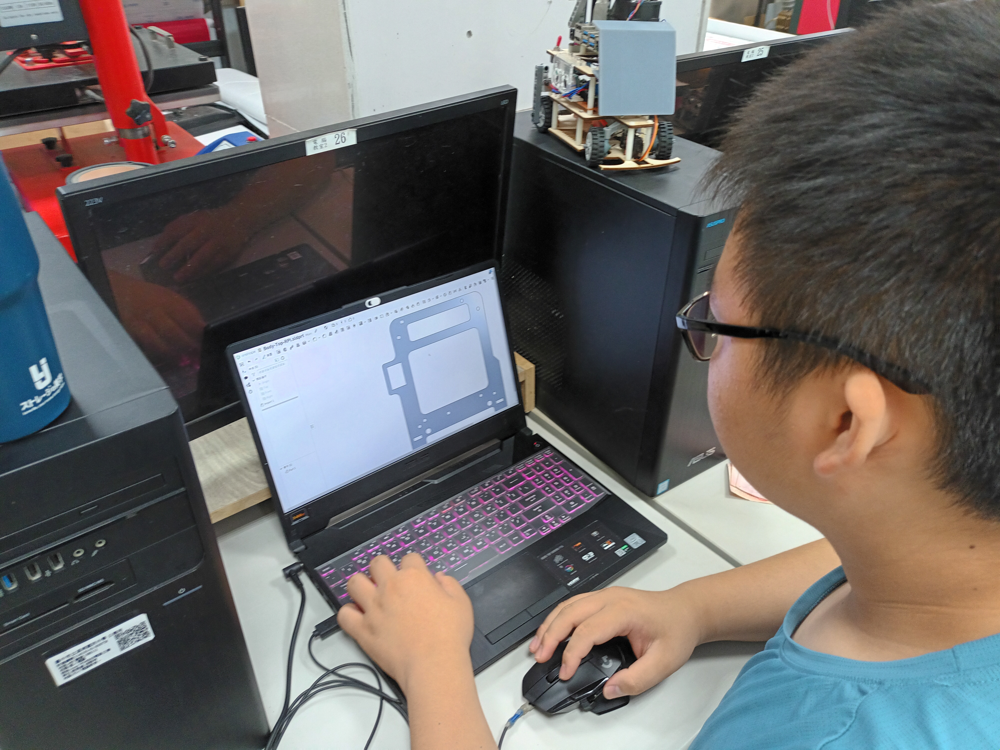

<div align="center"></div>

# <div align="center">Work Diary (工作日誌)</div>

  Here is the record of the process for own design and manufacturing of vehicle and components, with off the shelf electrical components, such as motors and sensors.  
以下為自行設計和製造車輛及其組件，利用選購的電動機和感應器等現成電氣元件的歷程紀錄
## 2024/03/04 ~ 2024/03/10  

**Member:** HU,SIAN-YI、LAI,MENG-CHENG、HUANG,KE-FU

**Content:**  

Since we initially did not know how to start constructing and producing, we referred to the models of last year's seniors as a reference for this year.

由於一開始我們還不知道如何開始建構及製作，因此我們參考了去年學長姐們的機型做為今年的參考。

<div align="center">
<table>
<tr align="center">
<th colspan="2">Last year's senior's model(去年學長姐們的機型)</th>
</tr>
<tr align="center">
<td> </td>
<td></td>
</tr>
<tr align="center">
<th colspan="2">Refer to the seniors GitHub reports(參考學長姐們的Github報告)</th>
</tr>
<tr align="center">
<td> </td>
<td></td>
</tr>
</table>
</div>

## 2024/03/11 ~ 2024/03/17

**Member:** HU,SIAN-YI、LAI,MENG-CHENG、HUANG,KE-FU

**Content:**

- To ensure the smooth progress of the competition activities, our team carefully planned the completion times for each stage of the competition tasks and organized the upcoming schedule, as shown in the chart below.
- After building the robot, we started writing the program and started thinking about where we could improve it.

- 為確保競賽活動順利進行，我們小組進行了競賽活動各階段工作完成時間的細心規劃，安排好接下來的進度，如下圖。
- 在製作完機器人後，我們開始在撰寫程式，並開始構思哪裡可以進行改進。

  **Completion Time Planning Table for Each Stage of the Competition Activities (Gantt Chart)**

  **競賽活動各階段工作完成時間規劃表(甘特圖)**

<div align="center" >
  
</div>

### Writing the program and adjusting the machine(撰寫程式和調整機器)

<div align="center" >
<table >
<tr align="center">
<th>Writing the program</th>
<th>Adjusting the machine</th>
<tr align="center">
<td>
</td>
<td>
</td>
</tr>
</table>
</div>

## 2024/03/18 ~ 2024/03/24

**Member:** HU,SIAN-YI、LAI,MENG-CHENG、HUANG,KE-FU  

**Content:**  

#### Raspberry pi 4

- We started writing the program for the qualifying competition. Thanks to the help of the seniors, our progress was accelerated a lot, so we quickly completed the writing of the qualifying competition.
- We started to write the obstacle avoidance program for the task competition and practiced the skills of adjusting the lens, because the accuracy of the lens will lose its accuracy in a few days, which will lead to mis-measurement of the lens.

- 我們開始撰寫資格賽的程式，由於有學長姐們的幫助讓我們進度加速了不少，所以我們很快就完成了資格賽的撰寫。
- 我們開始進行任務賽避障程式的撰寫，並練習調整鏡頭的技巧，因為過幾天鏡頭準度會跑掉，會導致鏡頭誤測。

#### Practice status(練習狀況)

<div align="center" >
<table >
<tr align="center">
<th>Adjust the camera</th>
<th>Write the program</th>
<tr align="center">
<td>
</td>
<td>
</td>
</tr>
</table>
</div>


## 2024/03/25 ~ 2024/03/31  

**Member:** HU,SIAN-YI、LAI,MENG-CHENG、HUANG,KE-FU

**Content:** 

- Due to the use of radar in the models by our senior students,  but we found during testing that the radar data was unstable, and there were also challenges with camera control. Even after calibrating the camera, errors still occurred. As a result, we plan to redesign a new machine. To be cautious, we have decided to continue developing the Raspberry Pi system alongside the new machine design. This will ensure that the stability and reliability of the original system are maintained during the development of the new machine.
- After identifying these issues, we started selecting a controller. We noticed that last year's competition champion used a Jetson Nano as the controller, so we plan to use the Jetson Nano to design a new model. The Jetson Nano also performs better in handling camera processing.
- Currently, the Raspberry Pi development is being handled by MENG-CHENG, while SIAN-YI is managing the development of the new machine.

- 由於學長姐們的機型使用了雷達，但我們在測試過程中發現雷達的數據並不穩定，且相機控制也存在挑戰。即使對鏡頭進行了校正，仍然會有誤差發生。因此，我們計劃重新設計一台新機器。為了保險起見，我們決定在設計新機器的同時，繼續開發樹梅派系統，這樣能夠確保在新機器的開發過程中，仍然能保持原有系統的穩定性和可靠性。
- 我們在發現這些問題後，開始挑選控制器，因為看過上一屆的比賽冠軍是使用 Jetson nano 作為控制器使用，所以我們打算以 Jetson nano 作為控制器設計出一台新的機型。
- 目前樹梅派由孟承去做撰寫，而開發新機器則是由賢邑去做處理

<div align=center>
<table>
<tr>
<th rowspan="2" width=300>Photo</th>
<th>Nvidia Jetson Nano</th>
<th>Raspberry Pi 4B</th>
</tr><tr>
<td><div align=center></td>
<td><div align=center></td>
</tr><tr>
<th>Number of Pins</th>
<td>40P</td>
<td>40P</td>
</tr><tr>
<th>CPU</th>
<td>Quad-core ARM® Cortex®-A57 MPCore</td>
<td>1.5GHz 64-bit Quad-core ARM Cortex-A72 CPU</td>
</tr><tr>
<th>GPU</th>
<td>NVIDIA Maxwell™ architecture with 128 NVIDIA CUDA®  cores</td>
<td>Broadcom VideoCore VI<br> H.265 (4kp60 decode)<br> H264 (1080p60 decode, 1080p30 encode) OpenGL ES 3.1<br> Vulkan 1.0</td>
</tr><tr>
<th>Storage Spac</th>
<td>4 GB 64-bit LPDDR4</td>
<td>8GB LPDDR4-3200 SDRAM</td>
</tr><tr>
<th>Built-in Bluetooth and Wireless WiFi Connectivity</th>
<td>Requires external Bluetooth and wireless WiFi connectivity</td>
<td>Built-in</td>
</tr><tr>
<th>Gflops</th>
<td>472</td>
<td>13.5</td>
</tr><tr>
<th>Price</th>
<td>Expensive</td>
<td>Cheap</td>  
</tr>
</table>
</div>

## 2024/04/01 ~ 2024/04/07

**Member:** HU,SIAN-YI、LAI,MENG-CHENG、HUANG,KE-FU

**Content:**

- We decided to split our testing efforts, with one team continuing to test and refine the Raspberry Pi 4B, and the other starting research on the Nvidia Jetson Nano.
- We have started our research on the Jetson Nano and are setting up its environment.

- 我們決定分兩面進行測試，一方面繼續測試並修正 Raspberry Pi 4B，另一方面開始研究 Nvidia Jetson Nano。
- 我們開始進行 Jetson Nano 研究，並著手進行 Jetson Nano 的環境架設。

[Jetson Nano environment setup(Jetson Nano 環境架設)](../../src/System_Platform_Software/README.md)

<div align="center" >
<table >
<tr align="center">
<th>Jetson nano environment setup</th>
<tr align="center">
<td></td>
</tr>
</table>
</div>

## 2024/04/08 ~ 2024/04/14

**Member:** HU,SIAN-YI、LAI,MENG-CHENG、HUANG,KE-FU  

**Content:**  


- We began designing our machine’s chassis in Onshape and started using a laser cutter to cut the wooden boards, initiating the assembly process.
- We researched online to plan out the sensors we would need and prepared to make purchases.

- 由於 Jetson nano 處理太多的感測器會導致有卡頓的問題，所以我們決定要而外選用控制板來處理感測器的數值。
- 我們拿了兩個控制器進行比較，分別是 Raspberry Pi Pico 和 Esp32 wifi ，經過比較發現 Raspberry Pi Pico 略勝一籌，因此我們選用 Raspberry Pi Pico 當作控制器。

<div align=center>
<table>
<tr>
<th rowspan="2" width=300>Photo</th>
<th>Raspberry Pi Pico</th>
<th>Esp32 wifi</th>
</tr><tr>
<td><div align=center></td>
<td><div align=center></td>
</tr><tr>
<th>CPU</th>
<td>Dual-core ARM Cortex-M0+ @ 133 MHz</td>
<td>Dual-core Xtensa LX6 @ 160/240 MHz</td>
</tr>
<tr>
<th>RAM</th>
<td>264 KB SRAM</td>
<td>520 KB SRAM</td>
</tr>
<tr>
<th>WIFI</th>
<td>None</td>
<td>Wi-Fi 802.11b/g/n (2.4 GHz), Bluetooth (v4.2)</td>
</tr>
<tr>
<th>Storage</th>
<td>2 MB Flash</td>
<td>Supports external Flash (typically 4 MB to 16 MB)</td>
</tr>
<tr>
<th>GPIO</th>
<td>26 GPIO pins</td>
<td>34 GPIO pins</td>
</tr>
<tr>
<th>ADC</th>
<td>3-channel ADC (12-bit).</td>
<td>18-channel ADC (12-bit).</td>
</tr>
<tr>
<th>PWM</th>
<td>Configurable PWM output.</td>
<td>Supports multi-channel PWM</td>
</tr>
<tr>
<th>Data transmission interface</th>
<td>I2C, SPI, UART</td>
<td>I2C, SPI, UART, CAN, I2S</td>
</tr>
<tr>
<th>Voltage input</th>
<td>1.8V - 5.5V</td>
<td>2.2V - 3.6V</td>
</tr>
<tr>
<th>size</th>
<td>51 x 21 mm</td>
<td>18 x 25 mm</td>
</tr>
<tr>
<th>Price</th>
<td>cheap</td>
<td>Relatively expensive</td>
</tr>
<tr>
<th>Development environment</th>
<td>MicroPython、C/C++</td>
<td>Arduino IDE、MicroPython、ESP-IDF</td>
</tr>
</tbody>
</table>
</div>

__如圖表所示，Raspberry Pi Pico 提供簡單性、低功耗和經濟實惠的特點，非常適合無線需求較低的應用，並且符合這次比賽的需求。__

__As shown in the chart, the Raspberry Pi Pico offers simplicity, low power consumption, and affordability, making it ideal for applications with low wireless demands, and it also aligns well with the requirements of this competition.__


## 2024/04/15 ~ 2024/04/21  

**Member:** HU,SIAN-YI、LAI,MENG-CHENG、HUANG,KE-FU  

**Content:**  

#### Raspberry pi 4

- We began adjusting the Raspberry Pi program for the final round of the obstacle-avoidance task. The first step is to fine-tune the P value for obstacle avoidance to optimize the control response. Once the machine operates stably, we will further adjust the lines on the camera display, fine-tuning the vehicle's response to the x-axis of the blocks. This will enhance the overall obstacle avoidance performance. These steps will progressively improve the system's stability and accuracy, ensuring the successful completion of the obstacle-avoidance task.

- 我們開始調整樹梅派的決賽閃避積木程式，首先會從閃避積木的P值入手進行調整，以優化控制反應。當機器運行穩定後，我們將進一步調整鏡頭螢幕上的線條，調整車輛與積木x軸的反應程度，從而提高整體的避障效能。這樣的步驟能夠逐步提升系統的穩定性和準確性，確保最終能夠順利完成閃避積木的任務。

#### Jetson nano

- We began designing our machine’s chassis in Onshape and started using a laser cutter to cut the wooden boards, initiating the assembly process.
- We researched online to plan out the sensors we would need and prepared to make purchases.

- 我們使用 Onshape 開始繪製新機器的底盤，並嘗試使用雷射切割機切割木板，開始進行組裝。
- 我們上網搜尋並構思所需的感測器，準備開始購買。

<div align="center" width=100%>
<table >
<tr align="center">
  <th>Program adjustments</th>
  <th>board</th>
  <th>onshape <a href="https://www.onshape.com/en/" target="_blank">website</a></th>
  </tr>
<tr align="center">
  <td>  </td>
  <td>  </td>
  <td>
  </td>
  </tr>
</table>
</div>
 
## 2024/04/22 ~ 2024/04/28 

**Member:** HU,SIAN-YI、LAI,MENG-CHENG、HUANG,KE-FU  
**Content:**  

#### Raspberry pi 4

- This week, we have nearly finished adjusting the Raspberry Pi's obstacle-avoidance program. However, we noticed that during turns, the machine would often collide with nearby blocks. After identifying the issue, we first checked whether other blocks were in the line of sight, but no blocks were detected. Despite this, the problem persisted, so we shifted our focus to the timing of the turns. Eventually, we decided to have the machine travel a little further before making a turn. This adjustment successfully resolved the issue and prevented the machine from colliding with the nearby blocks.

- 這個禮拜我們已經將樹梅派的積木閃避調整得差不多了，但在進行迴轉時，機器很容易撞到旁邊的積木。在發現這個問題後，我們首先檢查了當時是否有看到其他積木，但經過檢查後並未發現積木。儘管如此，問題依然存在，因此我們將焦點轉向轉彎的時機。最終，我們決定在進行迴轉前，讓機器再多走一段距離，這樣就成功解決了這個問題，避免了機器撞到旁邊的積木。

<div align="center" width=100%>
<table >
<tr align="center">
  <th>Colliding with blocks</th>
  </tr>
<tr align="center">
  <td>  </td>
  </td>
  </tr>
</table>
</div>

#### Jetson nano

- We searched online for suitable motors and initially chose the JGB37-520, purchasing one motor for testing.
- The MG513 series has various models, some of which are already available in our club, so we also tested two motors from this series.
- While testing the motor operation, we found that simply supplying positive and negative terminals was insufficient for precise control of the DC motor and speed adjustment. Therefore, we needed a motor driver to regulate the speed of the DC geared motor. We considered three options: the L293D chip, the L298N module, and the TB6612FNG. To reduce weight, we chose the compact L293D chip. Its small size allows for the installation of more sensors, saving space, reducing weight, and enhancing the robot's maneuverability.

- 我們上網尋找有哪些馬達可以使用，我們首先看上 JGB37-520 ，在網路上先買了一顆馬達進行測試。
- 而 MG513 有許多種不同的分支，下面幾顆是目前社團擁有的，所以我們也使用者兩顆馬達進行測試。
- 在測試馬達的作動方式時，單純的提供正負極並沒有辦法很好的控制直流馬達的作動，無法調節速度，因此還需要馬達控制器來調節直流減速馬達的速度，有兩種選擇：L293D晶片、L298N模組和TB6612FNG。為了減輕重量，我們選擇了體積較小的L293D晶片。它的小巧尺寸使我們能夠安裝更多的感應器，進而節省空間、減輕重量，並增加機器人的機動性。


### DC Motor(直流馬達)

<div align="center">
<table>
<tr ><th colspan="4">DC Motor Comparison</th></tr>
<tr align="center">
<th rowspan="2" >Model</th>
<th >MG513-P20</th>
<th >MG513-P30</th>
<th >JGB37-520</th>
</tr>
<tr align="center">
<td colspan="2"></td>
<td ></td>
</tr>
<tr align="center">
<td >Reduction ratio</td> 
<td >20</td>
<td >30</td>
<td >19</td>
</tr>
<tr align="center">
<td >Speed</td> 
<td >549rpm</td>
<td >366rpm</td>
<td >530rpm</td>
</tr>
<tr align="center">
<td>Torque</td>
<td>0.66kg.cm</td>
<td>1kg.cm</td>
<td>2.2kg.cm</td>
</tr>
</table>
</div>

### Motor Drive Controller(馬達驅動控制器)

<div align="center">
<table>
<tr><th colspan="4">Motor Control Comparison</th></tr>
<tr align="center" >
<th rowspan="2">Model</th>
<th>L293D</th>
<th>L298N</th>
<th>TB6612FNG</th>
</tr>
<tr align="center">
<td> </td>
<td ></td>
<td ></td>
</tr>
<tr align="center">
<td>Occupied Area(mm)</td>
<td>29.5x8</td>
<td>43.5x43.5</td>
<td>20.5x20.4</td>
</tr>
<tr align="center">
<td>Output Voltage</td>
<td>4.5V to 36V</td>
<td>5V to 46V</td>
<td>2.5V to 13.5V</td>
</tr>
<tr align="center">
<td>Rated Power </td>
<td>5W</td>
<td>10W</td>
<td>1.36W</td>
</tr>
</table>
</div>

## 2024/04/29 ~ 2024/05/05

**Member:** HU,SIAN-YI、LAI,MENG-CHENG、HUANG,KE-FU

**Content:**  

#### Raspberry pi 4

- During the vehicle's operation, we noticed that the vehicle often misidentified pink and orange as red. Initially, we tried to resolve this issue by adjusting the HSV values for color detection, but even with adjustments, we couldn't effectively filter out these two colors. As a result, we decided to switch the color detection method to using YCrCb color space. This change allowed us to more accurately identify and filter out pink and orange, thereby improving the overall color recognition accuracy.

- 在車輛運行時，我們發現車輛容易將粉紅色和橘色誤測為紅色。最初，我們嘗試通過調整HSV的紀錄數值來解決這個問題，但即使進行了調整，仍然無法有效過濾掉這兩種顏色。因此，我們決定改變顏色記錄的方式，轉而使用YCrCb的顏色記錄方式。這樣的改變讓我們能夠更精確地識別和過濾粉紅色和橘色，從而提高顏色辨識的準確性。

- [YCrcb](https://www.fuji.com.tw/posts/4934#google_vignette)

<div align="center" width=100%>
<table >
<tr align="center">
  <th>Introduction to YCrcb</th>
  <th>Adjusting YCrCb</th>
  </tr>
<tr align="center">
  <td>  </td>
  <td>  </td>
  </td>
  </tr>
</table>
</div>


#### Jetson nano

- Since the vehicle needs continuous movement, we need battery power. Given that the motors require a 12V supply, we chose a battery with 12V and 3A. We considered two options: lithium-ion batteries (18650) and lithium polymer batteries (3S). However, due to the heavier weight and larger size of the 18650 batteries, we opted for the lithium polymer battery.
- The Jetson Nano has a maximum voltage limit of 5V, so we need a buck converter to lower the voltage and protect the device. Initially, we planned to use an LM2596 DC-DC adjustable buck module, as it displays the current output voltage. However, since its maximum current is limited to 3A, we selected a constant voltage and current buck converter that supports up to 5A. Although it lacks a display, we will install a low-voltage alarm to monitor the battery voltage and ensure it remains within a safe range.

- 由於車輛需要持續移動，因此我們選擇電池供電。考慮到馬達運作需要12V電壓，我們決定使用電壓為12V、電流為3A的電池。有兩種選擇：鋰離子電池（18650）和鋰聚合電池（3S）。但由於18650電池較重且占用空間較大，因此我們選擇了鋰聚合電池。
- Jetson Nano 的最大電壓僅支援5V，因此我們需要使用降壓模組來降低電壓，以保護設備。我們原本計劃使用 LM2596 DC-DC 可調降壓模組，因其具備電壓顯示功能。然而，由於其最大支援電流僅為3A，我們改選了一個能支援5A電流的恆壓恆流降壓模組。儘管該模組無電壓顯示，我們會安裝一個低電壓警報器來監控電池電壓，確保電壓維持在正常範圍。


### Batteries(電池)

<div align="center" width=100%>
<table >
<tr>
  <th> 18650 lithium batteries(18650充電電池) </th> <th>Li-Polymer 3S Battery (鋰聚合物電池 3S)
  </th>
</tr>
<tr>
  <td>
   </td>
  <td>
  
  </td>
</tr>
</table>
</div>

### Step-Down Module(降壓模組)

<div align="center" width=100%>
<table >
<tr align="center">
  <th> 	LM2596 DC-DC Adjustable Buck Module LM2596 DC-DC </th>
  <th>5A Constant Voltage Constant Current Buck Power Supply Module ADIO-DC36V5A</th>
</tr>
<tr align="center">
  <td>    </td>
  <td>
  </td>
  </tr>
</table>
</div>

### Low Voltage Alarm(低電壓警報器)

<div align="center" width=100%>
<table >
<tr align="center">
  <th> Low Voltage Alarm</th>
</tr>
<tr align="center">
  <td>    </td>

  </tr>
</table>
</div>

## 2024/05/06 ~ 2024/05/12

**Member:** HU,SIAN-YI、LAI,MENG-CHENG、HUANG,KE-FU  

**Content:**  

#### Raspberry pi 4

- Next, we will begin writing the program for parking actions. We plan to use a LiDAR sensor to detect the wall in front, and when the distance is less than 50 cm, the vehicle will start turning. As for determining the location of the parking zone, it remains a challenge. We are continuing to work on solving this issue with the goal of accurately determining whether the vehicle has entered the parking zone and successfully completing the parking maneuver.

- 接下來，我們將開始撰寫停車的動作程式，計劃使用光達來偵測前方的牆壁，當距離小於50公分時，車輛將開始轉彎。至於如何判斷停車區的位置，目前仍然是個挑戰，我們正在繼續嘗試解決這個問題，目的是能夠準確地判斷車輛是否進入停車區並完成停車動作。

<div align="center" width=100%>
<table >
<tr align="center">
  <th>Move forward until the wall is detected</th>
  </tr>
<tr align="center">
  <td>  </td>
  </td>
  </tr>
</table>
</div>

#### Jetson nano

- Next is motor control. After researching online, we found that MG90S and SG90 are common choices. The main difference between them is in the gear material, with MG90S using metal gears and SG90 using plastic gears. Since our design requires frequent and continuous motor rotation, we chose the more durable MG90S to reduce the risk of damage.

- 接下來是馬達的操控。經過網上資料查詢，我們發現 MG90S 和 SG90 是常見的選擇。這兩者的主要差異在於前齒輪的材質，MG90S 採用金屬齒輪，而 SG90 則為塑料齒輪。由於我們的設計需要馬達進行頻繁且持續的旋轉，因此我們選擇了較為耐用的 MG90S，以減少損壞風險。

##### Servo Motor(伺服馬達)

<div align="center">
<table>
<tr align="center">
<th rowspan="2">Model(型號)</th>
<th> MG90S</th>
<th >SG90</th>
</tr>
<tr align="center">
<td></td>
<td > </td>
</tr>
<tr align="center">
<td>Rotation angle(轉動角度)</td>
<td>90° MAX</td>
<td>0~90°/180° MAX</td>
</tr>
<tr align="center">
<td>Torque(轉矩)</td>
<td>2.0kg/cm</td>
<td>1.4 kg/cm</td>
</tr>
<tr align="center">
<td>Speed(轉速)</td>
<td>0.11s</td>
<td>0.1S</td>
</tr>
</table>
</div>

## 2024/05/13 ~ 2024/05/19

**Member:** HU,SIAN-YI、LAI,MENG-CHENG、HUANG,KE-FU  

**Content:**

#### Raspberry pi 4

- This week, we confirmed the national competition rules, determining that the parking zones are located on both sides of the starting area. Although we have a general idea of where the parking zone is, determining whether the parking zone is in the front or rear section after the vehicle enters the end zone remains a challenge. Currently, our preliminary approach is to use infrared sensors to detect the side walls of the parking zone, helping to identify the vehicle's position and determine the specific section of the parking zone.

- 這周我們確認了全國賽的比賽規則，確定停車區只會在出發區的兩邊位置。雖然已經知道了停車區的大致位置，但當車輛進入結束區後，要判斷停車區是在結束區的前段還是後段仍然是個問題。目前，我們的初步想法是使用紅外線來偵測停車區的邊牆，藉此確定車輛以及斷停車區的位置。

#### Jetson nano

- Through experiments, we found that the radar was difficult to control, so we decided to try using an ultrasonic sensor (HC-SR04) as a substitute. However, this proved less effective, as the ultrasonic sensor can only detect the distance of obstacles directly in front, and its accuracy is reduced when the vehicle sways from side to side.
- We ultimately decided to use the ultrasonic sensor (HC-SR04) to comply with this year’s new rule for detecting the side wall of the parking area. We plan to install the ultrasonic sensors on both sides of the machine so that, upon detecting the parking location, it can reverse into the parking area.

- 透過實驗我們發現，雷達並不容易控制，因此決定嘗試用超音波模組（HC-SR04）替代雷達的功能。但後來發現效果不佳，因為超音波只能偵測前方障礙物的距離，且在車輛左右晃動時，偵測距離不穩定。
- 最終我們決定使用超音波（HC-SR04）來應對今年的新規則，即偵測停車場的邊牆。我們計畫將超音波模組安裝在機器的兩側，並在偵測到停車場位置後，以後退的方式進入停車場。

##### Distance Sensor(距離感測器)

<div align="center" width=100%>
<table >
<tr align="center">
<td colspan="2">HC-SR04</td>
</tr>
<tr>
  <td></td>
  <td></td>
  </tr>
</table>
</div>

## 2024/05/20 ~ 2024/05/26

**Member:** HU,SIAN-YI、LAI,MENG-CHENG、HUANG,KE-FU  

**Content:**  

#### Raspberry pi 4

- This week, we revisited the idea of using infrared sensors. We found that in order for the infrared sensors to detect the side walls, the vehicle would need to be positioned very close to them, which would increase the width of the vehicle. However, a wider vehicle could potentially collide with the blocks during task missions. Considering this issue, we ultimately decided to abandon the idea of using infrared sensors.

- 這周，我們重新審視了使用紅外線感測器的想法。發現為了讓紅外線偵測到邊牆，車輛必須非常靠近邊牆，這會使車身變寬。然而，過寬的車身在執行任務賽時，可能會導致車輛擦撞到積木。考慮到這個問題，我們最終決定放棄使用紅外線感測器的方案。

#### Jetson nano

- This week, we used Onshape to design component models and planned to produce them using stereolithography (SLA) printing. Given SLA’s high precision and smooth finish, we chose this method for critical parts, especially the Ackermann steering components and bearing mounting brackets in the front steering mechanism, which require precise measurements and quality.
- After printing, we used an SLA cleaning machine to thoroughly remove any residual material, ensuring the components were clean and ready for assembly.
- During assembly, we noticed that the photopolymer parts were somewhat fragile and prone to deformation. To address this, we applied secondary UV curing, which effectively reduced deformation and improved the durability of these critical components.

- 本週，我們使用 Onshape 繪製零件模型，並計劃以立體光固化（SLA）方式進行打印。考慮到 SLA 提供的高精度與光滑表面，我們選擇了這種方法來製作一些關鍵部件，尤其是前置轉向機構中的阿克曼轉向組件和軸承安裝支架，這些元件需要精確的尺寸和高品質。
- 打印完成後，我們使用光固化清洗機將殘餘材料徹底清除，確保零件乾淨並準備好進行組裝。
- 在組裝過程中，我們發現光敏聚合物部件較為脆弱，容易變形。為了解決這個問題，我們進行了紫外線二次固化，有效減少變形，並提升了這些關鍵部件的耐用性。

- ##### Drawing parts(繪製零件)

<div align="center" width=100%>
<table >
<tr align="center">
<td>Draw parts</td>
<td>Onshape</td>
</tr>
<tr>
  <td></td>
  <td></td>
  </tr>
</table>
</div>

- ##### Supplementary Information
    - __Maintenance Process:__

       Without regular maintenance, a stereolithography 3D printer may become clogged with resin and become unusable, requiring periodic cleaning. So we recorded the cleaning methods we learned from our seniors and started cleaning ourselves.
     
    1. After printing is completed, the object will adhere to the printing platform, so we remove the platform for cleaning.
    2. Place the platform on a rack and put it into the UV curing washing machine.    
    3. Set the time and wait for the washing machine to complete the cleaning. The machine will rotate the alcohol in the washing tank to perform the first cleaning of the platform and the object.
    4. Rinse the alcohol off the finished product with water.
    5. Use a scraper to remove the object from the platform.
    6. Remove the support structures from the edges of the object.
    7. Perform a second cleaning with alcohol to thoroughly clean the resin off the object.
    8. Clean any remaining resin off the platform with alcohol.
    9. Finally, dry the platform and reinstall it back onto the stereolithography 3D printer of machine.

    <div align="center">
    <table>
    <tr>
    <td>Step 1</td>
    <td>Step 2</td> 
    <td>Step 3</td></tr>
    <tr align="center">
    <td></td>
    <td></td> 
    <td></td>
    </tr>
    <td>Step 4</td>
    <td>Step 5</td> 
    <td>Step 6</td></tr>
    <tr align="center">
    <td></td>
    <td></td>
    <td></td>
    </tr>
    <td>Step 7</td>
    <td>Step 8</td>
    <td>Step 9</td></tr>
    <tr>
    <td></td>
    <td></td>
    <td></td>
    </tr>
    </table>
    </div>


  - #####  Vehicle body support components produced with Stereolithography (SLA) 3D Printer
      <div align=center>
      <table>
      <tr>
      <th>Front Assembly</th>
      <th>Steering Knuckle</th>
      <th>Steering shaft holder</th>
      <th>Cross pin</th>
      </tr><tr>
      <td></td> 
      <td></td> 
      <td></td> 
      <td></td>
      </tr>
      </table>
      </div> 
      <div align=center>
      <table>
      <tr>
      <th>Bearing Holder</th>
      <th colspan="2">differential housing</th>
      <th>Motor Holder</th>
      </tr><tr>
      <td></td> 
      <td></td>
      <td></td>
      <td></td>
      </tr>
      </table>
      </div> 


## 2024/05/27 ~ 2024/06/02

**Member:** HU,SIAN-YI、LAI,MENG-CHENG、HUANG,KE-FU  
**Content:**  

#### Raspberry pi 4

- Since the infrared sensor approach proved infeasible, we decided to switch to LiDAR for side wall detection. When the LiDAR detects that the distance to the side wall is less than 35 cm and this detection occurs twice, the vehicle will exit the loop; otherwise, it will continue moving forward. To prevent false positives from multiple wall detections in a short time, we added a delay after each detection to ensure stability. This adjustment enhances the vehicle’s accuracy in recognizing side walls and prevents unnecessary stops or erroneous actions.

- 由於紅外線感測器方案不可行，我們決定改用光達來進行邊牆偵測。當雷達與邊牆的距離小於35公分，並且偵測到牆壁的次數達到2次時，車輛才會跳出迴圈，否則繼續向前行駛。為了避免車輛在短時間內多次偵測到牆壁而產生誤判，我們在判斷後加上了延遲時間，以確保偵測結果的穩定性。這樣的調整可以提升車輛對邊牆的準確識別，避免不必要的停頓或錯誤操作。

<div align="center" width=100%>
<table >
<tr align="center">
  <th>LiDAR wall detection code</th>
  </tr>
<tr align="center">
  <td>  </td>
  </td>
  </tr>
</table>
</div>

#### Jetson nano

- In order to ensure that the vehicle can accurately avoid obstacles in complex environments, we decided to install a high-performance camera module. Considering that the Jetson Nano is used as the controller, we selected a camera module that is highly compatible with it to ensure stable system performance. We ultimately chose the IMX477-160 12.3MP high-resolution camera module, which provides excellent resolution and image quality, offering clear and detailed visual data. This choice not only enhances the vehicle’s environmental recognition capabilities but also significantly improves its obstacle avoidance performance, helping the vehicle more accurately perceive obstacle positions.

- 為了讓車輛能夠在複雜環境中正確閃避各種障礙物，我們決定在車輛上安裝一個高效能的相機模組。考量到我們使用的控制器是 Jetson Nano，因此我們選擇了一款與之高度兼容的相機模組，確保系統運行穩定。我們最終選擇了 IMX477-160 12.3MP 高解析度相機模組，這款相機擁有出色的解析度和影像質量，能夠提供清晰的影像資料。這樣的選擇不僅能提升車輛的環境辨識能力，還能有效提高避障效果，幫助車輛在比賽中更準確地感知障礙位置。

[IMX477-160 12.3MP Camera](https://shopee.tw/%E7%8F%BE%E8%B2%A8-SONY-IMX477-%E6%94%9D%E5%BD%B1%E9%8F%A1%E9%A0%AD%E6%A8%A1%E7%B5%84-1230%E8%90%AC%E5%83%8F%E7%B4%A0-160%C2%B0%E5%BB%A3%E8%A7%92-%E6%94%AF%E6%8F%B4%E6%A8%B9%E8%8E%93%E6%B4%BECM3-4%E3%80%81Jetson-Nano-i.10207300.8215149686?sp_atk=21737f61-91b3-4fa6-9e87-0f9a4884b88b&xptdk=21737f61-91b3-4fa6-9e87-0f9a4884b88b)

### Camera Module(攝影模組)

<div align="center">
<table>
<tr  align="center">
<th rowspan="2">Model(型號)</td>
<th>IMX477-160 12.3MP Camera</th>
</tr>
<tr  align="center">
<td ></td>
</tr>
<tr  align="center">
<td>sensor</td>
<td>Sony IMX477</td>
</tr>
<tr  align="center">
<td>sensor resolution</td>
<td >4056 x 3040 pix</td>
</tr>
<tr  align="center">  
<td>FPS (Frames Per Second) </td>
<td >60fps </td>
</tr>
</table>
</div>


## 2024/06/03 ~ 2024/06/09  

**Member:** HU,SIAN-YI、LAI,MENG-CHENG、HUANG,KE-FU
**Content:**

### Raspberry pi 4

- This week, we encountered issues with abnormal LiDAR readings. Initially, we suspected a malfunction with the LiDAR sensor itself and replaced it with a new one, but the problem persisted. We then considered the adapter might be the cause, but replacing it also did not resolve the issue. We are currently continuing to investigate the root cause to identify the best solution.

- 這周，我們遇到光達數值異常的問題。起初以為是光達本身損壞，因此更換了一顆新的光達，但問題依然存在。接著我們懷疑可能是轉接頭的問題，更換後問題依然無法解決。目前我們還在持續排查問題的原因，以找出最佳的解決方法。

### Jetson Nano

- We plan to install NoMachine on the Jetson Nano for more convenient remote operation and program adjustments. With NoMachine, we can directly access and control the Jetson Nano from any device on the same network without the need to connect an HDMI screen, keyboard, or mouse. This setup not only improves our work efficiency but also enables the Jetson Nano to adapt more flexibly to different testing environments.
- Since NoMachine requires devices to be on the same network, we purchased a Wi-Fi adapter and installed it in the Jetson Nano's USB slot to enable wireless connectivity.
- During testing, we found that the Wi-Fi adapter (as shown in the lower left image) could easily collide with nearby obstacles. To reduce the adapter’s outward extension, we switched to a USB 3.0 90-degree adapter, which helps prevent collisions when avoiding obstacles.

- 我們計劃在 Jetson Nano 上安裝 NoMachine，以便更方便地進行遠端操作和程式調整。透過 NoMachine 連接，我們可以從任何連接到同一網路的裝置直接存取並控制 Jetson Nano，而無需額外連接 HDMI 螢幕、鍵盤或滑鼠。這樣的設置不僅提高了工作效率，也讓 Jetson Nano 能夠更加靈活地適應不同場地的測試需求。
- 由於使用 NoMachine 需要在同一個網路上連接，我們購買了一個 Wi-Fi 接收器，並將其安裝在 Jetson Nano 的 USB 插槽中，方便進行無線連接。
- 在實際測試中，我們發現 Wi-Fi 接收器（如左下圖）容易碰到附近的積木，因此改用 USB 3.0 90 度轉接頭來縮短接收器的延伸角度，這樣在避開障礙物時更不容易碰到。


<div align="center" width=100%>
<table >
<tr align="center">
  <th>NoMachine IP address selection</th>
  <th>NoMachine login screen</th>
  <th>NoMachine connected screen</th>
  </tr>
<tr align="center">
  <td></td>
  <td></td>
  <td></td>
  </tr>
</table>
</div>
<div align="center" width=100%>
<table >
<tr align="center">
  <th>USB Horizontal 180°</th>
  <th>USB Vertical 90°</th>
</tr>
<tr align="center">
  <td align="center"></td>
  <td align="center"></td>
</tr>
</table>
</div>

<div align="center" width=100%>
<table >
<tr align="center">
  <th >Event Photo(活動照片)</th>
  <th >Event Photo(活動照片)</th>
</tr>
<tr>
  <td align="center"></td>
  <td align="center"></td>
</tr>
</table>
</div>

## 2024/06/10 ~ 2024/06/16

**Member:** HU,SIAN-YI、LAI,MENG-CHENG、HUANG,KE-FU  

**Content:**

### Raspberry pi 4

- This week, we encountered issues with abnormal LiDAR readings. Initially, we suspected a malfunction with the LiDAR sensor itself and replaced it with a new one, but the problem persisted. We then considered the adapter might be the cause, but replacing it also did not resolve the issue. We are currently continuing to investigate the root cause to identify the best solution.

- 這周，我們繼續針對光達的問題進行排查。排除硬體問題後，我們開始檢查軟體部分，懷疑是否是變數使用錯誤導致光達數值異常。我們仔細檢查了所有變數，並將其進行了統整和修改，但問題依然沒有得到解決。目前，我們還在進一步分析軟體層面的其他潛在原因。

### Jetson Nano

- For writing technical documentation, we chose to use VS Code with Git, which provides both a flexible editing environment and robust version control. VS Code supports multiple languages and extensions, enabling us to code and document simultaneously, while Git allows us to track every change and easily revert if needed. With Git's branching feature, each team member can work in their branch without impacting the main document's stability. When multiple editors modify the same file, Git promptly flags conflicts, allowing the later editor to review and merge changes efficiently. Additionally, VS Code's Git extension simplifies the entire workflow, letting us manage versions directly within the editor, enhancing both the team's collaborative efficiency and document consistency.

- 在編寫技術文件時，我們選擇使用 VS Code 搭配 Git，這種方式不僅提供靈活的編輯環境，還具備強大的版本控制功能。VS Code 支援多種語言和插件，讓我們可以同時進行編碼和文件撰寫，而 Git 則讓我們能追蹤每次變更並輕鬆回溯。透過 Git 的分支功能，每位成員能在自己的分支中工作，避免直接影響主文件的穩定性。當多人同時修改同一文件時，Git 會即時標示衝突，使較晚上傳的編輯者能夠進行比較和合併，從而更高效地協同作業。此外，VS Code 的 Git 插件簡化了整體流程，讓我們能直接在編輯器中完成版本管理，這大大提升了團隊合作的效率和文件的一致性。

[github 主頁](../../README.md)

<div align="center">
<table>
<tr align="center">
<th>To edit in VSCode, simply install Git and enter git clone.</th>
<th>Click on the "Copy Repository" option.</th>
<th>Select the repository you want to clone for editing.</th>
</tr>
<tr>
<td align="center"></td><td>

</td>
<td></td>
</tr>
</table>
</div>

## 2024/06/17 ~ 2024/06/23

**Member:** HU,SIAN-YI、LAI,MENG-CHENG、HUANG,KE-FU  

**Content:**

### Raspberry pi 4

- Due to persistent issues with the LiDAR, we’re considering the possibility that the command used to call the LiDAR might be incorrect. However, as we’re unsure how to modify the command and with the competition date approaching, we’ve decided to explore alternative methods. Currently, we are considering using ultrasonic sensors for detection instead.

- 由於一直無法解決光達問題，我們在想是不是呼叫光達的指令是錯的，但是由於我們不了解呼叫程式如何修改，並且也接近比賽時間了，因此我們決定再尋找其他方法，目前是想要用超音波去做偵測。

#### Jetson nano

- During the hardware design process, we encountered issues where the Jetson Nano would fail to boot, or the Raspberry Pi Pico could not receive signals from the Jetson Nano, often due to incorrect power or data cable connections. To address this, we decided to use double-row female headers, double-row male headers, and Dupont wires as the connection method between the two devices.

- 在硬體設計過程中，遇到過幾次因電源接錯或資料線插錯而導致 Jetson Nano 無法開機，或是 Raspberry Pi Pico 無法接收到來自 Jetson Nano 的訊號，因此我們決定使用雙排排針母座、雙排排針公座以及杜邦線，作為兩者間的連接方式。
<div align="center">
<table>
<tr  align="center">
<th></th>
<th></th>
</tr>
</table>
</div>


## 2024/06/24 ~ 2024/06/30  

**Member:** HU,SIAN-YI、LAI,MENG-CHENG、HUANG,KE-FU  

**Content:**

### Raspberry pi 4

- This week, we began using ultrasonic sensors to detect walls. During testing, we observed that the vehicle often collides with obstacles while tracking, especially frequently hitting blocks. To address this, we decided to temporarily set aside the parking function development and focus on improving block avoidance. Once the vehicle reliably avoids obstacles, we will resume work on the parking program.

- 這周，我們開始使用超音波來偵測牆壁。在測試過程中發現，機器在循跡時經常會撞到障礙物，尤其容易撞到積木。因此，我們決定暫時擱置停車功能的撰寫，先集中精力完善積木的閃避功能，確保車輛穩定避障後，再繼續進行停車程式的開發。


### Jetson Nano

- Before dodging the blocks, we need to complete the basic task of circling the track three times. During this circling process, we noticed the possibility of the machine rubbing against the walls while turning. To address this, we utilize the 360-degree detection capability of LiDAR to keep the vehicle centered on the track. By subtracting the distances on the left and right sides, we obtain an error value, which is then corrected using the servo motor to ensure the vehicle continues to travel along the center of the track.

- 在閃避積木之前，我們需要先完成基本的環繞場地三圈。在繞圈的過程中，我們發現機器有可能在轉彎時擦撞到牆壁，因此需要利用鏡頭的反白偵測區來使機器維持在道路中央。透過反白數值的大小，我們可以得到車輛與牆壁的距離，再利用伺服馬達控制車輛遠離牆壁，使機器能夠持續行駛在道路中央。

<div align="center">
<table>
<tr  align="center">
<th>Vehicle Collides with Side Wall</th>
<th>Highlight detection area in camera view</th>
</tr>
<tr align="center">
<td></td>
<td></td>
</tr>
</table>
</div>

## 2024/07/01 ~ 2024/07/07

**Member:** HU,SIAN-YI、LAI,MENG-CHENG、HUANG,KE-FU  

**Content:**

### Raspberry pi 4

- Due to the approaching competition date, we decided to temporarily pause research on the Jetson Nano. In this week's tests, we found that the vehicle was detecting blocks that were too far ahead, causing it to start avoidance maneuvers too early and ultimately collide with the side walls. To address this, we added a black mask to the upper part of the screen to prevent the vehicle from detecting blocks that were too far ahead. After implementing this mask, the vehicle no longer detected distant blocks, successfully reducing interference.

- 由於比賽日期接近，我們決定暫時擱置 Jetson Nano 的研究，先專注將 Raspberry pi 4 調整完成。
- 在這周的測試中，我們發現車輛容易偵測到太前面的積木，造成提前閃避動作，最終撞上邊牆。為了解決這個問題，我們在畫面上方增加了黑色遮罩，讓車輛無法偵測到過於前方的積木顏色。加上遮罩後，車輛不再偵測過遠的積木顏色，成功減少了干擾的機率。

<div align="center">
<table>
<tr align="center">
<th>Uses Black Mask to Block Out-of-Bounds Colors</th>
</tr>
<tr align="center">
<td></td>
</table>
</div>

## 2024/07/08 ~ 2024/07/14

**Member:** HU,SIAN-YI、LAI,MENG-CHENG、HUANG,KE-FU  

**Content:**

### Raspberry pi 4

- After completing the block avoidance program, we started conducting success rate tests on the vehicle. Initially, we tested at 50% speed, and the vehicle was mostly able to respond correctly. However, when we increased the speed to 70%, we found that the color sensor occasionally misjudged the line color due to the higher speed. To resolve this, we adjusted the program to use LiDAR to measure the left and right directions for determining the turning direction, which reduced the chances of turning the wrong way due to color misjudgment.

- 完成積木閃避程式後，我們開始進行機器的成功率測試。一開始選擇了50%的速度，機器大多能夠順利反應。但當我們將速度提高到70%時，發現顏色感測器有時會因為速度過快而誤判地上的線條顏色。為了解決這個問題，我們調整了程式，改用光達測量左右方向來辨識轉彎方向，這樣可以減少因顏色誤判而轉錯方向的情況。

#### Detects Turning Direction

```
if get_left_dis > 100:
    reverse = False
else:
    reverse = True
if get_mid_dis > 55:
    servo.angle(-40)
```

## 2023/07/15 ~ 2023/07/21

**Member:** HU,SIAN-YI、LAI,MENG-CHENG、HUANG,KE-FU  

**Content:**

### Raspberry pi 4

- The robot is now capable of successfully avoiding obstacles and completing the third lap around the track. The next task is to detect blocks and perform a turnaround maneuver. The turnaround will only be executed if the last block of the second lap is red. Therefore, it is necessary to detect the lap count. We will utilize the color sensor to count the number of times the line is crossed and determine whether the set count has been reached.
- If the specified count has not yet been achieved, the system will continue to record the color of the nearest traffic sign until the count of line crossings is greater than or equal to the set value. At this point, color recording will cease.
- Once the color of the nearest traffic sign has been recorded, the program will determine whether the color is red. If the color is red, the system will set the angle of the servo motor to initiate a right turn and continue turning until the vehicle is oriented in the specified direction. If the detected color is not red, the vehicle will continue moving forward. However, if the color of the traffic sign is red, a turnaround maneuver will be executed.

- 已經可以完成閃避積木及繞場第三圈，接下來就是偵測積木並迴轉，迴轉是在第二圈的最後一個積木是紅色的才要進行的動作，因此要先偵測圈數，要利用顏色感測器來偵測經過的線條次數，並判斷是否超過了設定的次數。
- 如果未達到指定次數，系統將會持續紀錄距離最近的交通標誌顏色，直到經過的線條次數大於或等於設定次數，此時將不再紀錄顏色。
- 紀錄完最近的交通標誌顏色後，程式將判斷最近的交通標誌顏色是否為紅色。若標誌顏色為紅色，系統將設定伺服馬達角度為右轉角度，持續轉動直到車輛轉向指定的方向。若最近的交通標誌顏色不是紅色，則車輛會繼續向前行駛。

<div align="center">
<table>
<tr align="center">
<th>Displays the Color of the Closest Traffic Sign and the Number of Lines</th>
<th>Adjusting Values</th>
</tr>
<tr align="center">
<td></td>
<td></td>
</table>
</div>

## 2024/07/22 ~ 2024/07/28  

**Member:** HU,SIAN-YI、LAI,MENG-CHENG、HUANG,KE-FU  
**Content:**

- As the field mission has been roughly completed, we are now starting to write the technical report. Since we are not familiar with the correct technical report format, we referred to the official website's technical report documentation, and found that the report should include the following sections:

  1. module: This folder should contain documentation related to the vehicle models, such as files for laser cutting machines and 3D printers.

  2. other: This folder is used to store data that does not belong to other categories, such as communication protocols and engineering logs.

  3. schemes: This folder is dedicated to hardware introductions, explaining the functions of electronic components and how they are connected.

  4. src: All programs should be placed in this folder.

  5. t-photos: This folder should contain team photos, including a group photo and humorous pictures.

  6. v-photos: Machine photos from six different perspectives should be placed in this folder.

  7. video: Videos demonstrating the machine's operation should be placed in this folder, with each video lasting more than 30 seconds.

- When writing the technical report, we are switching between VS Code and the GitHub website. We use a desktop computer to view the GitHub web page and a laptop to edit the report in VS Code.

- 由於場地任務已經大致完成，因此要開始撰寫技術報告，由於我們還不清楚正確的技術報告標準，因此參考官網的技術報告文件，發現需要以下部分

  1. module 此資料夾內需放入車輛模型的文件，如雷射切割機、3D列印機的檔案
  
  2. other 此資料夾用於放置不屬於其他分類的資料，如通訊協定、工程日誌等
  
  3. schemes 此資料夾用於硬體介紹，說明電子元件的作用與如何連接
  
  4. src 此資料夾需要放入所有程式
  
  5. t-photos 此資料夾需要放入團隊的合照，包括一張合照和搞笑照片
  
  6. v-photos 此資料夾需要放入機器的照片，包括六個不同方位的視圖
  
  7. video 此資料夾應該放入機器運作影片，要超過30秒

- 再撰寫技術文件時，由於需要再VS Code和Github網站之間切換，因此我們改用一台桌機檢視Github網頁，一台筆電用VS Code編輯

<div align="center">
<table>
<tr align="center">
<th>Official Website's GitHub Examples</th>
<th>Adjustments for Laptop and Desktop Compatibility</th>
</tr>
<tr align="center">
<td></td>
<td></td>
</table>
</div>

## 2024/07/29 ~ 2024/08/04

**Member:** HU,SIAN-YI、LAI,MENG-CHENG、HUANG,KE-FU  

**Content:**

### Raspberry pi 4

- We made significant progress in our project. We successfully organized and listed the components in the parts inventory, and we uploaded it to the technical documentation. Additionally, we completed the drawing of the vehicle's introduction diagram. Throughout this process, we embarked on a learning journey, gradually familiarizing ourselves with GitHub syntax. Although we are not yet fully proficient in using GitHub, we dedicated time to researching relevant information online and steadily improving our skills. These achievements have brought valuable advancements to our report and project as a whole.
- This week, after completing the task race, we resumed working on the parking zone issue.

- 我們完成了將零件清單整理並列點，並上傳至技術文件中。此外，我們也完成了車體的介紹圖的繪製工作。在這個過程中，我們逐步學習了GitHub語法的使用並逐漸熟悉它。儘管對GitHub的使用不是很熟練，但我們努力在網上查詢相關資訊，並逐步提高了技能水平。這些進展為我們的報告帶來了寶貴的進步。
- 在這禮拜由於我們將任務賽處理完了，因此我們繼續處理停車區的問題。

### Team Members' Practice Status(隊員練習狀況)

<div align="center">
<table>
<tr  align="center">
<td></td>
<th></th>
</tr>
</table>
</div>

## 2024/08/05 ~ 2024/08/11

**Member:** HU,SIAN-YI、LAI,MENG-CHENG、HUANG,KE-FU  

**Content:**  

### Raspberry pi 4

- This week, we completed the handling of the parking zone.
- As the deadline for submitting the technical report is next week, we have begun revising the content of the technical documentation. We are also adjusting the website according to the official grading criteria and continuously adding to the technical report.
- Complete recording videos for each task and upload them to YouTube.

- 在這個禮拜我們將停車處理完成
- 由於下星期就要交出技術文件，因此我們開始修改技術報告的內容，並依官方評分標準調整網頁，持續補充技術報告。
- 完成各任務錄影，並上傳YOUTUBE

<table>
<tr align="center">
<th>Directory Home Page</th>
</tr>
<tr align="center">
<td> </td>
</tr>
</table>

  **Open Challenge 資格賽影片**

- [Open Challenge Full Width 60% Speed](https://www.youtube.com/watch?v=kdZ8KoKKiUw)
 

**Team Members' Practice Status(隊員練習狀況)**

<div align="center">
<table>
<tr align="center">
<th>Report writing</th>
<th>Mechanism adjustment</th>
</tr>
<tr align="center">
<td></td>
<td></td>
</table>
</div>

## 2024/08/12 ~ 2024/08/18

**Member:** HU,SIAN-YI、LAI,MENG-CHENG、HUANG,KE-FU  

**Content:**

### Raspberry pi 4

- This week, as our machine has been adjusted to run the mission race smoothly on the field, we have started shooting an introductory video for the mission race. In the video, we will showcase the actions our vehicle performs during the mission race, and we will provide explanations through subtitles synchronized with the video.

- 這星期由於我們的機器已經將數值調整到可以正常在場地上運行基本的任務賽，因此我們開始拍攝任務賽的影片。

<div align="center">
<table>
<tr align="center">
<th>Modify the program and test the vehicle 修改程式及測試車輛</th>
<tr align="center">
<td></td>
</table>
</div>

**任務賽影片**

- [Open Challenge](https://www.youtube.com/watch?v=n0Pp--26QGQ)</td>

## 2024/08/19 ~ 2024/08/25

**Member:** HU,SIAN-YI、LAI,MENG-CHENG、HUANG,KE-FU  

**Content:**

### Raspberry pi 4

As the competition is scheduled for this week, we have intensified our practice efforts, trying out various scenarios and adjusting our program to adapt to a wide range of situations. Experimenting with different scenarios has the advantage of helping us anticipate challenges that our machine might face and making necessary adjustments in advance. Here's our practice approach:

- We have assigned lane labels A, B, C, and D. Each lane is divided into three sections, with placement points for blocks both on the inner and outer sides in each section. Red blocks indicating turning conditions will be placed sequentially, while the positions of other blocks will be randomized.

We believe that this approach will assist our machine in preparing for a variety of scenarios, ensuring that we are well-prepared for the competition.

由於比賽即將在本週舉行，我們已經開始加強練習，嘗試不同的題目並調整程式，以適應大多數的情況。嘗試不同的題目有一個好處，就是可以幫助我們找出機器可能遇到的挑戰，並提前進行必要的調整。以下是我們的練習方式：

- 我們將走道編號為A、B、C、D。每個走道分為三個區域，每個區域都有內外兩個放置方塊的點。指示轉彎條件的紅色方塊會按順序放置，其他方塊則會隨機調整。
我們相信，這種做法將幫助我們的機器準備應對各種不同的情況，確保我們在比賽中做好充分的準備。


On August 25, we participated in the competition. In the first round of the qualifying session, our vehicle successfully completed all laps with a perfect score. In the second round, however, we encountered LiDAR reading issues, requiring us to request a repair. After fixing it, only one minute remained, so we could only complete two laps. Nonetheless, we advanced to the obstacle course in the afternoon.

In the first obstacle course attempt, the vehicle collided with the wall due to excessive avoidance maneuvers, stopping the race. After adjustments, the second run was successful in obstacle avoidance, but the vehicle failed to enter the finish zone, which impacted our score. Fortunately, an opponent’s error allowed us to advance.

比賽日是8月25日。在上午的資格賽中，我們的車輛在第一場順利完成所有圈數並獲得滿分；但在第二場，由於雷達讀數異常，我們不得不申請維修。修復完成後，距離比賽結束僅剩一分鐘，使得我們只能跑完兩圈。不過，仍順利晉級到下午的障礙賽。

在第一場障礙賽中，車輛因閃避幅度過大撞牆，導致比賽中止。經過調整後，第二場障礙賽順利完成避障，然而，由於未進入結束區而停止，未能取得理想分數。幸運的是，由於對手出現失誤，我們仍然成功晉級。

<div align="center">
<table>
<tr align="center">
<th>Waiting for test</th>
<th>Competition photo</th>
<th>Award-winning photo</th>
</tr>
<tr align="center">
<td></td>
<td></td>
<td></td>
</tr>
</table>
</div>

## 2024/08/26 ~ 2024/09/01

**Member:** HU,SIAN-YI、LAI,MENG-CHENG、HUANG,KE-FU  
**Content:**

Since we have confirmed our participation in the international competition, we are attempting to modify the machine. We have started testing the Raspberry Pi 5 and Jetson Nano, aiming to choose one of these controllers for replacement.

- The Raspberry Pi 5 has a processor speed that is 2 to 3 times faster than the Raspberry Pi 4, with GPU performance that is twice as powerful as the previous generation. Its memory and I/O bandwidth are also doubled, and it consumes less power for the same tasks.
- The Jetson Nano, compared to our original controller, the Raspberry Pi 4, offers significantly better performance and has a more powerful GPU (graphics processing unit) than the Raspberry Pi 4, which enhances camera recognition capabilities.

由於我們已經確定要參加國際賽，所以我們嘗試將機器進行改造，我們分別開始測試 Raspberry pi 5 和 Jetson nano ，想要從這兩種中選一種控制器更換。

- Raspberry pi 5 處理器速度是 Raspberry pi 4 的2~3倍，GPU效能為上一代的兩倍，記憶體與I/O頻寬也是上一代的兩倍，且在同樣的任務上有較少的功耗。
- Jetson nano 相較於我們的原控制器 Raspberry pi 4 的性能高上許多，而且擁有比 Raspberry pi 4 處理功能更強大的GPU（圖形處理器），鏡頭辨識較強。

<div align="center">
<table>
<tr align="center">
<th>Raspberry pi 4</th>
<th>Raspberry pi 5</th>
<th>Jetson nano</th>
</tr>
<tr align="center">
<td></td>
<td></td>
<td></td>
</table>
</div>

#### Raspberry pi 5

We set up a machine with a controller of Raspberry pi 5 and started to install and test the functions of Raspberry pi 5.

- When we tried to insert the SD card from our Raspberry Pi 4 into the Raspberry Pi 5, we found that the boot operation could not be performed. Therefore, we formatted the SD card that was originally a backup for the Raspberry Pi 4 to use it for the Raspberry Pi 5 image file. After burning the Raspberry Pi 5 image file, the boot was successful.
- We began setting up the environment. We chose to start the installation using VNC, which allows us to control the Raspberry Pi 5 from the computer for subsequent actions. Then we installed two pieces of software: OpenCV and ROS. OpenCV is the software used to operate the camera, while ROS is the software needed to run the radar.

我們組了一臺跟 Raspberry Pi 4 一樣的機器，將控制器更改為 Raspberry pi 5 的機器，著手安裝測試 Raspberry pi 5 的功能。

- 在我們嘗試將我們在 Raspberry pi 4 上的SD卡插入 Raspberry pi 5 上時，發現無法進行開機動作，因此我們將原本備用 Raspberry pi 4 的SD卡格式化，要拿來灌入 Raspberry pi 5 的映像檔，燒入 Raspberry pi 5 的映像檔後才成功開機。
- 我們開始進行環境架設工作，我們選擇從 VNC 開始安裝，這樣可以讓我們從電腦操縱 Raspberry pi 5 進行後續動作，接著我們安裝 OpenCV 和 ROS 這兩個軟體， OpenCV 是要執行鏡頭用的軟體，而 ROS 是執行雷達需要用到軟體。

<div align="center">
<table>
<tr align="center">
<th>SD card settings</th>
<th>VNC remote connection installation</th>
<th>OpenCV installation</th>
<th>ROS installation</th>
</tr>
<tr align="center">
<td></td>
<td></td>
<td></td>
<td></td>
</table>
</div>

#### Jetson nano

We have assembled an additional machine specifically for use with the Jetson Nano and have begun delving into its functionalities and applications. This machine will serve as our experimental platform to explore the computational capabilities and hardware integration of the Jetson Nano, laying the groundwork for future development.

Building on our previous research with the Jetson Nano, we split the camera display into two modes during testing: a binarized mode and a normal display mode. In the binarized mode, we added two inverted white blocks to detect the position of side walls, while the normal display mode focuses on detecting ground lines to assist with determining the vehicle’s direction when turning. This setup allows for more flexible handling of wall avoidance and turning decisions, enhancing both overall stability and accuracy.

我們額外組裝了一台機器給 Jetson nano 使用，開始研究 Jetson nano 。
- 由於我們在之前就有研究過 Jetson nano ，所以我們現在在測試時先將鏡頭分為二值化及正常化面兩種，並在二值化的畫面新增兩塊偵測邊牆的反白區塊偵測邊牆，而正常化面則用來偵測地上的線，方便我們做轉彎判斷。

##### 鏡頭視角
<div align="center">
<table>
<tr align="center">
<th>Detect walls</th>
<th>Detect ground line (counterclockwise)</th>
</tr>

<tr align="center">
<td></td>
<td></td>
</table>
</div>

- We determine the position of the walls by detecting the inverted white blocks on the left and right sides of the camera feed.。
- The camera detects the blue and orange y-axis to determine the vehicle's distance from the line, which helps in deciding the turning direction.。

#### Raspberry pi 4

We began addressing the issues that occurred during the national competition, using them as preparations for the future.

- In the first round of the mission race, we encountered a failure in the turning maneuver. We adjusted the turning speed and angle to ensure successful turns.

- During both mission races, the parking maneuver could not be executed as planned. Therefore, we decided not to perform parking in the mission races. Now, we are exploring alternative methods for parking.

我們開始修改我們在全國賽中發生的問題，當作未來的備用品。
- 我們在任務賽第一場有發生迴轉失敗的問題，我們我們嘗試調整迴轉的速度與角度，讓我們可以順利迴轉。
- 我們在兩場任務賽中停車動作都無法照常進行，因此我們在任務賽中選擇不進行停車，現在我們要嘗試使用其他方法進行停車。

## 2024/09/02 ~ 2024/09/08

**Member:** HU,SIAN-YI、LAI,MENG-CHENG、HUANG,KE-FU  
**Content:**

#### Raspberry pi 5


We continued trying to install the functions that were previously set up on the Raspberry Pi 4 onto the Raspberry Pi 5. However, we encountered issues where certain functionalities couldn't be installed, such as ROS for the radar and GPIO for pin reading. Only the VNC system and OpenCV for the camera were successfully installed. After researching online, we discovered that compatibility and version issues were the main reasons preventing successful installation. As a result, we couldn't run our main program. Given this, we decided to pause the research on the Raspberry Pi 5 and focus on optimizing the Raspberry Pi 4 for now.

我們繼續嘗試將 Raspberry pi 4 上有安裝的功能安裝到 Raspberry pi 5 上，卻發現有些功能並沒有辦法安裝，像是執行雷達需要的ROS、讀取腳位要用的GPIO，都無法安裝使用，只有 VNC 系統和鏡頭的 OpenCV 安裝成功，我們在網路上查詢有發現是版本不相容、不適用等問題，導致無法安裝，以致我們無法執行我們的主程式，因此我們決定暫緩 Raspberry pi 5 的研究，先將 Raspberry pi 4 調整到最佳狀態。

<div align="center">
<table>
<tr align="center">
<th>Find information</th>
</tr>

<tr align="center">
<td></td>
</table>
</div>

#### Jetson nano

We performed basic line tracking using a camera and a gyroscope. The camera was used for binarization to determine the area of the line on the ground for judgment, while the gyroscope was used to read the angle and direction. Since we used binarization, we needed to use black and white checkered paper to calibrate the camera. After taking about 20 photos of the paper from different angles through the program, the camera was ready for use, allowing us to perform the preliminary qualifying run using the camera and gyroscope.

我們有透過鏡頭與陀螺儀進行基礎的循跡，透過鏡頭進行二值化判斷地面上線的面積，進而進行判斷，並搭配陀螺儀讀去角度方向，而我們因為使用二值化所以需要使用黑色與白色格子的紙張校正鏡頭，大約透過程式使用鏡頭對紙張進行不同角度的拍攝20張左右的照片後，鏡頭就可以進行使用，透過鏡頭和陀螺儀進行初步資格賽的運行。

<div align="center">
<table>
<tr align="center">
<th>Adjust camera angle</th>
<th>Take photos</th>
</tr>

<tr align="center">
<td></td>
<td></td>
</table>
</div>

## 2024/09/09 ~ 2024/09/15

**Member:** HU,SIAN-YI、LAI,MENG-CHENG、HUANG,KE-FU  
**Content:**

#### Raspberry pi 4

We are not sure what went wrong with our Raspberry Pi 4 that caused it to burn out. We started by checking the power supply line from the Lipo battery, using a multimeter to measure breakover. Then, we checked the buck converter and used the multimeter to measure the output voltage and current, ensuring the voltage was 5 volts and the current was 3 amps. After testing the buck converter and confirming it had no issues, we turned to check the circuit on the circuit board to see if there was any reversed polarity. A few days ago, we had replaced the connection line between the circuit board and Raspberry Pi, so we weren't sure if the connection line was faulty and caused a short circuit. However, after the final inspection, we found no issues. In the end, we decided to solder a new circuit board, as we believed the likelihood of the problem was with the circuit board, leading us to make this decision.

我們 Raspberry pi 4 不確定出了什麼問題導致 Raspberry pi 4 燒毀了，我們從 Lipo 電池供電線開始檢查，使用三用電表測量有沒有導通，接著我們再檢查降壓板，使用三用電表測量降壓板輸出端的電壓和電流，電壓是否為5伏特和電流是否為3安培，在測試過降壓板確定沒問題後，我們轉而測試電路板的線路，看電路板有沒有地方正負接反，因為我們在幾天前有更換電路板與樹梅派的連接線，所以我們不確定是不是連接線有問題而短路，然而經過最後的檢查也是沒有發現問題，最後我們打算重新焊接一塊新的電路板，因為我們認為電路板出問題的機率較大，才做出此項決定。

<div align="center">
<table>
<tr align="center">
<th>Testing the buck board</th>
<th>Testing circuit board</th>
</tr>

<tr align="center">
<td></td>
<td></td>
</table>
</div>

#### Jetson nano

We encountered some issues with our machine; the program was acting strangely. While troubleshooting the circuit board, we discovered that some of the pins on the Pico board were abnormal, which prevented us from running our program properly. As a result, we plan to redesign the circuit diagram. We will move some of the calculations from the Pico board to the Jetson Nano, as we found that handling too many calculations on the Pico board caused problems. Therefore, we will extend a connection from the BNO055 on the circuit board to the Jetson Nano, allowing the Jetson Nano to handle the calculations.

我們機器出了點問題，執行程式起來都怪怪的，而我們在查找電路板的電路板的時候，發現 pico 板有些腳位異常，導致我們無法正常執行我們的程式，而且我們打算重新規劃電路圖，我們要將部分數值的計算從pico板移到 jetson nano 上計算，因為我們發現pico板運算太多數值會有問題，所以我們將電路板上的 BNO055 而外延伸出一條線路通往 jetson nano ，把計算數值的部分給 jetson nano 處理。

<div align="center">
<table>
<tr align="center">
<th>Remove circuit board</th>
<th>Plan route</th>
</tr>
<tr align="center">
<td></td>
<td></td>
</table>
</div>

## 2024/09/16 ~ 2024/09/22

**Member:** HU,SIAN-YI、LAI,MENG-CHENG、HUANG,KE-FU  
**Content:**

#### Raspberry pi 4

- 新的電路板我們在這幾天將它焊接完成了，我們順便將電路板的線路重新規劃讓線路不會太雜亂，讓電路板看起來更整潔。

- We completed soldering the new circuit board in the past few days and reorganized the circuit layout to reduce clutter, making the board look cleaner.

<div align="center">
<table>
<tr align="center">
<th>soldering circuit board</th>
</tr>

<tr align="center">
<td></td>
</table>
</div>

#### Jetson nano

Because when the robot performs lens recognition, the color of the line will cause misdetection, so we first use onshape to design the model, and use light curing to print an F-shaped windshield that can be embedded in the front of the machine, and the line in front of the machine Cover it up to avoid misdetection during lens recognition.

因為機器人在進行鏡頭辨識時，會因為線的顏色導致誤測，所以我們先使用 onshape 設計模型，並使用光固化印製出一個可以鑲嵌在機器前方 F 型的擋風玻璃，把機器前方的線遮擋起來，避免造成鏡頭辨識時誤測。

<div align="center">
<table>
<tr align="center">
<th>Isometric View</th>
<th>Bottom View</th>
<th>Right View</th>
</tr>
<tr align="center">
<td></td>
<td></td>
<td></td>
</table>
</div>

## 2024/09/23 ~ 2024/09/29

**Member:** HU,SIAN-YI、LAI,MENG-CHENG、HUANG,KE-FU  
**Content:**

#### Raspberry pi 4

This week, we discovered that ultrasonic sensors couldn't accurately position the vehicle for parking as intended, so we decided to return to using LiDAR for detection. After revising and optimizing the program logic, we successfully resolved the previous issue with erratic LiDAR readings. Now, we'll proceed with writing the parking functionality.

本周我們發現，使用超音波無法讓車輛準確停在預定位置，因此決定回歸使用雷達進行判斷。經過邏輯的重新修改與優化後，我們成功解決了先前光達數值錯亂的問題。接下來，我們將繼續進行停車功能的撰寫。

#### Jetson nano

We perform daily backups of the Jetson Nano's SD card because we have previously experienced issues with SD card corruption, which prevented the Jetson Nano from booting. Although the cause of the corruption is still uncertain, we were fortunate to have made backups beforehand, so we didn't need to start from scratch and only had to recover the lost data. This backup routine effectively mitigates the risk of data loss and ensures the continuity of our development work.

我們每天會對 Jetson Nano 的 SD 卡進行備份，因為曾經發生過 SD 卡損毀導致 Jetson Nano 無法開機的問題，雖然目前不確定損毀的原因，但幸好我們之前有進行備份，因此不需要從頭開始，只需將遺失的資料補齊即可。這樣的備份習慣有效避免了資料遺失的風險，保證了開發工作的連貫性。

<div align="center">
<table>
<tr align="center">
<th>Backup using balenaEtcher software</th>
</tr>

<tr align="center">
<td></td>
</table>
</div>

## 2024/09/30 ~ 2024/10/06

#### Raspberry pi 4

This week, we successfully directed the vehicle to the front of the parking zone. However, when turning into the zone, the vehicle experienced a noticeable delay in the LiDAR-based detection of the side wall, causing it to miss the intended parking spot and making parking much more difficult. We're currently working to find a solution to optimize the response speed for this process.

本周我們成功讓車輛駛至停車區前，但在轉彎進入停車區時，因依賴光達偵測邊牆後的跳出動作出現明顯延遲，導致無法停在預期位置，使停車難度大幅增加。目前我們正努力尋找解決方案來優化這部分的反應速度。

#### Jetson nano

We discovered that the windshield in front was causing the wires to be compressed, so we had to reroute them from the side. To address this, we used Onshape to modify the design by adding a rectangular hole in the middle divider. This adjustment makes it easier to manage the wiring and prevents the wires from being pulled.

由於我們發現前面遮線的擋風玻璃會讓線受到擠壓導致還要另外將線路從旁邊連接，因此我們使用 onshape 將此檔案進行修改，在中間的隔板上開一條長方形的洞，方便我們進行線路整理，也避免線路受到拉扯，

<div align="center">
<table>
<tr align="center">
<th>No Dig</th>
<th>Dig</th>
</tr>
<tr align="center">
<td></td>
<td></td>
</table>
</div>


## 2024/10/07 ~ 2024/10/13

**Member:** HU,SIAN-YI、LAI,MENG-CHENG、HUANG,KE-FU  
**Content:**

#### Raspberry pi 4

這個禮拜在我們討論後，決定結束對 Raspberry Pi 4 的研究，將主要目標放於 Jetson nano 上，因為 Raspberry Pi 4 的光達極其不穩定，每次測出來的位置都不一樣，導致我們無法控制機器人走到目標位置，所以才會結束對 Raspberry Pi 4 的研究。

This week, after our discussions, we decided to end our research on the Raspberry Pi 4 and focus on the Jetson Nano. The LIDAR on the Raspberry Pi 4 was extremely unstable, with position measurements varying each time, making it impossible to control the robot to reach the target location. As a result, we decided to discontinue research on the Raspberry Pi 4.

#### Jetson nano

We have completed filming demonstration videos for GitHub over the past few days. In the videos, we tested various combinations to determine if the machine can adapt to different placements. We tested four configurations in the qualification round and five in the mission round, and all these videos are available in the "video" section.

我們這幾天將 Github 的示範影片拍攝完成，我們在影片中測試多種組合，藉此知道機器是否能適應各種擺法，我們在資格賽中測試了四種擺法，在任務賽中有五種擺法，這些影片皆放於 video 中。

- [Testing Video of Self-Driving Car in Open Challenge](../../video/Open_Challenge/video.md)
- [Testing Video of Self-Driving Car in Obstacle Challenge](../../video/Obstacle_Challenge/video.md)

  **Open Challenge 資格賽影片**

- [Open Challenge Full Narrow 70% Speed](https://youtu.be/OmFEYUQlTvc)
- [Open Challenge Full Narrow 50% Speed](https://youtu.be/cyHyQRcBAyE)
- [Open Challenge Half Wide Half Narrow 70% Speed](https://youtu.be/SKT1LZI2bo0)
- [Open Challenge Half Wide Half Narrow 50% Speed](https://youtu.be/UB3IciF5oYk)
- [Open Challenge Full Width 70% Speed](https://youtu.be/tObPuwR8IB0)
- [Open Challenge Full Width 50% Speed](https://youtu.be/m-hIjlLuAAk)  

 **Open Challenge 任務賽影片**

- [Obstacle Challenge](https://youtu.be/pB6wAqTKomQ)

## 2024/10/14 ~ 2024/10/20

**Member:** HU,SIAN-YI、LAI,MENG-CHENG、HUANG,KE-FU  
**Content:**

#### Jetson nano

- 為了解決 USB 版本的 WiFi 連接器空間不足的問題，我們在車輛頂層的木板上新增了兩個 7mm 的孔洞，將有線 WiFi 連接器的固定孔從車輛中層移到頂層。這樣一來，不僅能避免機器過於臃腫，還能有效利用車體內部空間。此外，由於我們在車輛中層尾部新增了一顆 HC-SR04 超音波模組，專門用於停車動作的輔助偵測，因此將 WiFi 連接器移至頂層能夠空出足夠的空間給 HC-SR04 安裝，進一步提升車輛的功能布局。

- To address the space limitations caused by the USB WiFi adapter, we added two 7mm holes to the top layer of the vehicle's wooden frame, moving the mounting point for the wired WiFi adapter from the middle layer to the top. This adjustment not only prevents the vehicle from becoming too bulky but also optimizes the internal space. Additionally, we installed an HC-SR04 ultrasonic sensor at the rear of the vehicle's middle layer to assist with parking detection. By relocating the WiFi adapter to the top, we freed up enough space for the HC-SR04, enhancing the overall functionality layout of the vehicle.

##### Vehicle Top Deck

<div align="center">
<table>
<tr align="center">
<th>Before modification</th>
<th>After modification</th>
</tr>
<tr align="center">
<td></td>
<td></td>
</table>
</div>

##### Vehicle Mid-Deck

<div align="center">
<table>
<tr align="center">
<th>Before modification</th>
<th>After modification</th>
</tr>
<tr align="center">
<td></td>
<td></td>
</table>
</div>


## 2024/10/21 ~ 2024/10/27

**Member:** HU,SIAN-YI、LAI,MENG-CHENG、HUANG,KE-FU  
**Content:**

#### Jetson nano

- 在這個禮拜，我們開始撰寫車輛介紹的劇本。在撰寫之前，我們先將劇本的架構分為三個部分：第一部分是車輛本體結構的介紹，接下來是程式架構的介紹，最後則是展示車輛運行影片並進行說明。劇本完成後，我們計畫在大約兩個禮拜內完成此介紹影片的拍攝。

- This week, we began writing the script for the vehicle introduction. Before drafting, we divided the script into three parts: the first part covers the introduction of the vehicle's physical structure, followed by the introduction of the programming structure, and finally, the vehicle operation video demonstration and explanation. Once the script is complete, we plan to film the introduction video in about two weeks.

<div align="center">
<table>
<tr align="center">
<th>writing script</th>
<th>script content</th>
</tr>
<tr align="center">
<td></td>
<td></td>
</table>
</div>


## 2024/10/28 ~ 2024/11/03

**Member:** HU,SIAN-YI、LAI,MENG-CHENG、HUANG,KE-FU  
**Content:**

#### Jetson nano

- 這個禮拜我們將Jetson Nano的開機需要輸入密碼才能登入的功能關閉，進入Jetson Nano的系統設定後，點擊User Accounts，接著點擊Unlock，再將Automatic Login切換至ON，即可達成開機不需要登入的目的。

- This week, we disabled the password requirement for logging into the Jetson Nano at startup. To achieve this, we accessed the system settings on the Jetson Nano, navigated to User Accounts, clicked Unlock, and then switched Automatic Login to ON. This allows the system to boot directly without requiring login credentials.

<div align="center">
<table>
<tr align="center">
<th>User Adminstrator</th>
<th>Unlock</th>
<th>Automatic Login</th>
</tr>
<tr align="center">
<td></td>
<td></td>
<td></td>
</table>
</div>

## 2024/11/04 ~ 2024/11/10

**Member:** HU,SIAN-YI、LAI,MENG-CHENG、HUANG,KE-FU  
**Content:**

#### Jetson nano

- 在測試過程中，我們發現鏡頭的位置過高，當車輛靠近中心牆壁時，鏡頭會捕捉到地面影像，這會干擾障礙物的正確識別。為了解決這個問題，我們將原本的塑膠螺絲更換為平頭的鐵製螺絲。由於鐵製螺絲的平坦螺絲頭提供了更多向下調整的空間，讓電路板的位置得以降低，從而調整鏡頭的高度。這樣的調整不僅改善了鏡頭的視角，也增強了整體穩定性，使機器能夠更精確地偵測前方的障礙物，避免捕捉到無關的地面影像。

- During testing, we noticed that the camera was positioned too high, and when the vehicle approached the central wall, it captured the floor image, which interfered with the correct identification of obstacles. To address this, we replaced the original plastic screws with flat-headed iron screws. The flat head of the iron screws provided more space for downward adjustment, allowing the circuit board to be lowered and the camera height to be optimized. This adjustment not only improved the camera’s viewing angle but also enhanced overall stability, enabling the machine to detect obstacles more accurately without capturing irrelevant floor images.

<div align="center">
<table>
<tr align="center">
<th>Plastic screws</th>
<th>Flat-headed iron screws</th>
</tr>
<tr align="center">
<td></td>
<td></td>
</table>
</div>

## 2024/11/11 ~ 2024/11/17

**Member:** HU,SIAN-YI、LAI,MENG-CHENG、HUANG,KE-FU  
**Content:**

#### Jetson nano


# <div align="center">[Return Home](../../)</div>
