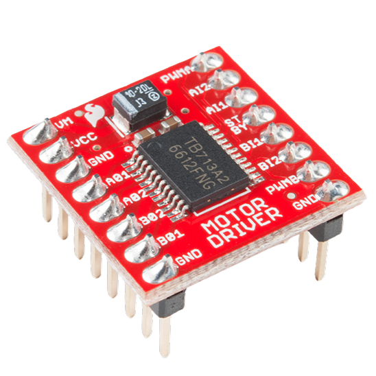
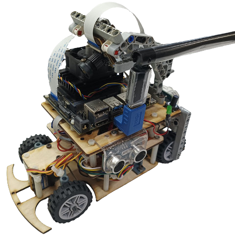
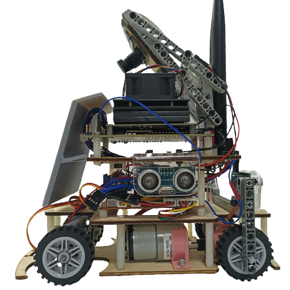
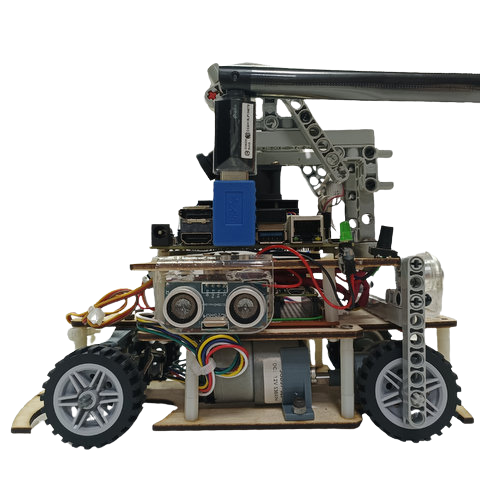

<div align="center"></div>

# <div align="center">Work Diary</div>

The following is a development record of the self-driving car model design and task-solving, covering mechanical design and manufacturing, circuit design and implementation, electronic device selection, programming and testing, and the overall problem-solving process.
以下是自駕車機型設計與任務解決的歷程紀錄，涵蓋了機構設計與製造、電路設計與實作、電子設備選型、程式設計與測試，以及問題解決的整體過程。
## 2024/03/04 ~ 2024/03/10  

**Member:** HU,SIAN-YI、LAI,MENG-CHENG、HUANG,KE-FU

**Content:**  

My partner, "HU, SIAN-YI," has participated in the Future Engineering Competition multiple times over the past few years, accumulating substantial experience in mechanical design and programming. However, since the competition themes change or introduce new challenges each year, we decided after discussion to use last year's models from our seniors and the design of last year's world champion team as references for this year's competition model.

我的夥伴"HU,SIAN-YI"在過去幾年中多次參加未來工程競賽，因此在機構設計和程式開發方面積累了豐富的經驗。然而，由於每年的比賽題目都會有所變化或增加新的挑戰，我們經過討論後，決定以去年學長姐們的機型及去年世界第一名隊伍的設計作為今年比賽機型的參考。

<div align="center">
<table>
<tr align="center">
<th colspan="2">Last year's senior's model</th>
</tr>
<tr align="center">
<td> </td>
<td></td>
</tr>
<tr align="center">
<th colspan="2">Refer to the seniors GitHub reports(參考學長姐們的Github報告)</th>
</tr>
<tr align="center">
<td> </td>
<td></td>
</tr>
</table>
</div>

## 2024/03/11 ~ 2024/03/17

**Member:** HU,SIAN-YI、LAI,MENG-CHENG、HUANG,KE-FU

**Content:**

- In order to smoothly advance the competition activities while balancing academic work, we have developed a work schedule to ensure the timely completion of each task, as detailed in the diagram below.
- We first familiarized ourselves with the model designed by our seniors and attempted to get the vehicle running smoothly. However, we found that there were still some technical details we were unfamiliar with, such as the calibration and use of LiDAR sensors, installation of the Raspberry Pi controller, and programming, which led to the self-driving car not yet operating successfully.

- 為了順利推進競賽活動並兼顧課業，我們制定了工作進度規劃，以確保各項任務如期完成，詳情如下圖所示。
- 我們首先熟悉了學長姐設計的機型，並嘗試讓車輛正常運行。然而，我們發現仍有一些技術細節不熟悉，例如光達感測的校正與使用、Raspberry Pi 控制器的安裝及程式設計等，這導致自駕車尚未能順利運作。

  **Completion Time Planning Table for Each Stage of the Competition Activities (Gantt Chart)**

  **競賽活動各階段工作完成時間規劃表(甘特圖)**

<div align="center" >
  
</div>

### Writing the program and adjusting the machine

<div align="center" >
<table >
<tr align="center">
<th>Writing the program</th>
<th>Adjusting the machine</th>
<tr align="center">
<td>
</td>
<td>
</td>
</tr>
</table>
</div>

## 2024/03/18 ~ 2024/03/24

**Member:** HU,SIAN-YI、LAI,MENG-CHENG、HUANG,KE-FU  

**Content:**  

#### Raspberry pi 4

- We began writing the code for the qualifying round, and with the assistance of our seniors, our progress accelerated significantly, allowing us to successfully complete the coding for the qualifying round.
- We started writing the obstacle avoidance program for the task competition and practiced techniques for adjusting the camera. Since the accuracy of the camera may shift after a few days, which can easily lead to misdetections, we placed particular emphasis on practicing adjustments in this area.

- 我們開始撰寫資格賽的程式，在學長姐們的協助下，我們的進度加快了許多，並順利完成了資格賽的程式撰寫。
- 我們開始撰寫任務賽的避障程式，並練習調整鏡頭的技巧。由於鏡頭的準度在幾天後可能會偏移，這容易導致誤測情況的發生，因此我們特別著重於這方面的調整練習。

#### Practice situation

<div align="center" >
<table >
<tr align="center">
<th>Adjust the camera</th>
<th>Write the program</th>
<tr align="center">
<td>
</td>
<td>
</td>
</tr>
</table>
</div>


## 2024/03/25 ~ 2024/03/31  

**Member:** HU,SIAN-YI、LAI,MENG-CHENG、HUANG,KE-FU

**Content:** 

- Since the model designed by our seniors used radar, we discovered during testing that the radar data was unstable, and we also faced challenges with camera control. Even after camera calibration, errors still existed. Therefore, we plan to redesign a new machine. To be prudent, we decided to continue developing and refining the Raspberry Pi system while designing the new machine, to ensure that we still have a reliable self-driving car available for the competition.
- After discovering issues with the Raspberry Pi system, we referred to the self-driving car used by the previous competition's champion, which utilized the Jetson Nano as the main controller. This significantly improved the efficiency of visual recognition and reduced reliance on less stable sensors such as LiDAR and color sensors. Therefore, we plan to use the Jetson Nano as the main controller to design a brand-new self-driving car.
- Currently, the self-driving car using the Raspberry Pi system is still being revised by MENG-CHENG, while the development of the new self-driving car is being designed and built by the experienced partners SIAN-YI and KE-FU.

- 由於學長姐們的機型使用了雷達，但我們在測試過程中發現雷達數據不穩定，加上相機控制方面也面臨挑戰。即使進行了鏡頭校正，仍然存在誤差。因此，我們計劃重新設計一台新機器。為了穩妥起見，我們決定在設計新機器的同時，繼續開發與修正樹莓派系統，以確保在比賽時仍有可靠的自駕車可以參賽。
- 在發現樹莓派系統存在問題後，我們參考了上一屆比賽冠軍的自駕車，其使用 Jetson Nano 作為主控制器，這大幅提高了視覺辨識的效率，並減少了對光達感測器、顏色感測器等不穩定感測器的依賴。因此，我們計劃以 Jetson Nano 作為主控制器，設計出一台全新的自駕車。
- 目前樹梅派系統的自駕車仍由孟承繼續去做修正，而開發新的自駕車則是由經驗豐富賢邑及科輔伙伴去設計及製作。
- 以下是 Nvidia Jetson Nano 與 Raspberry Pi 4B 的主控制器性能比較。結果顯示，Nvidia Jetson Nano 在視覺辨識運算效率方面表現更佳。

  <div align=center>
  <table>
  <tr>
  <th rowspan="2" width=300>Photo</th>
  <th>Nvidia Jetson Nano</th>
  <th>Raspberry Pi 4B</th>
  </tr><tr>
  <td><div align=center></td>
  <td><div align=center></td>
  </tr><tr>
  <th>Number of Pins</th>
  <td>40P</td>
  <td>40P</td>
  </tr><tr>
  <th>CPU</th>
  <td>Quad-core ARM® Cortex®-A57 MPCore</td>
  <td>1.5GHz 64-bit Quad-core ARM Cortex-A72 CPU</td>
  </tr><tr>
  <th>GPU</th>
  <td>NVIDIA Maxwell™ architecture with 128 NVIDIA CUDA®  cores</td>
  <td>Broadcom VideoCore VI<br> H.265 (4kp60 decode)<br> H264 (1080p60 decode, 1080p30 encode) OpenGL ES 3.1<br> Vulkan 1.0</td>
  </tr><tr>
  <th>Storage Spac</th>
  <td>4 GB 64-bit LPDDR4</td>
  <td>8GB LPDDR4-3200 SDRAM</td>
  </tr><tr>
  <th>Built-in Bluetooth and Wireless WiFi Connectivity</th>
  <td>Requires external Bluetooth and wireless WiFi connectivity</td>
  <td>Built-in</td>
  </tr><tr>
  <th>Gflops</th>
  <td>472</td>
  <td>13.5</td>
  </tr><tr>
  <th>Price</th>
  <td>Expensive</td>
  <td>Cheap</td>  
  </tr>
  </table>
  </div>

- **Supplementary Information**

  **Aspects of deep learning acceleration.深度學習加速方面**
   - Jetson Nano: Supports NVIDIA CUDA and cuDNN, which can accelerate deep learning workloads. For tasks like image classification and object detection, the GPU in Jetson Nano significantly enhances processing speed.
   - Raspberry Pi 4: Lacks a dedicated GPU and deep learning acceleration capabilities; image recognition tasks rely entirely on CPU processing, which is far less efficient than the GPU acceleration of Jetson Nano.
   - Jetson Nano：支援 NVIDIA CUDA 和 cuDNN，可以加速深度學習工作負載。對於影像分類和物件偵測等任務，Jetson Nano 中的 GPU 顯著提高了處理速度。
   - Raspberry Pi 4：缺乏專用GPU與深度學習加速能力；影像辨識任務完全依賴CPU處理，效率遠低於Jetson Nano的GPU加速。

## 2024/04/01 ~ 2024/04/07

**Member:** HU,SIAN-YI、LAI,MENG-CHENG、HUANG,KE-FU

**Content:**

- We decided to conduct tests separately, with one team continuing to test and refine the Raspberry Pi 4B, while the other began studying the Nvidia Jetson Nano.
- We started researching the Jetson Nano and began setting up its system environment.
- We documented the system installation process in <a href="../../src/System_Platform_Software/README.md">3-1 Software Platform Construction</a>.

- 我們決定分頭進行測試，一方面持續測試並修正 Raspberry Pi 4B，另一方面開始研究 Nvidia Jetson Nano。
- 我們開始研究 Jetson Nano，並著手進行其系統環境的建置工作。
- 我們將系統安裝過程紀錄在 <a href="../../src/System_Platform_Software/README.md">3-1 Software Platform Construction</a>中。


<div align="center" >
<table >
<tr align="center">
<th>Jetson nano environment setup</th>
<tr align="center">
<td></td>
</tr>
</table>
</div>

## 2024/04/08 ~ 2024/04/14

**Member:** HU,SIAN-YI、LAI,MENG-CHENG、HUANG,KE-FU  

**Content:**  
- After reviewing the I/O control aspects of the Jetson Nano, we identified the following drawbacks:

  - Processing Limitations: While the Jetson Nano excels in handling AI and machine learning tasks, its CPU is relatively limited and may face performance bottlenecks when performing extensive I/O control tasks, especially when handling complex computations and I/O operations simultaneously.
  - GPIO Latency: Compared to dedicated microcontrollers (such as Arduino, ESP32, etc.), the Jetson Nano may have higher latency when using Python or other high-level languages for GPIO control, which affects applications requiring high real-time performance.
  - Limited Hardware Interfaces: The number of GPIO pins provided by the Jetson Nano is relatively limited. If a large number of I/O interfaces are needed, expansion boards may be required, increasing development costs and complexity.
  - Software Driver Support Issues: Certain I/O devices may not be fully supported by the Jetson Nano’s drivers or may require additional development and debugging to communicate properly with specific peripherals.
  - Voltage Incompatibility: The GPIO on the Jetson Nano typically operates at 3.3V, which can be incompatible with some 5V I/O devices, necessitating the use of voltage converters for level matching.
- Due to the Jetson Nano's inability to handle too many sensors simultaneously, we need to use additional microcontrollers as extension boards to facilitate more efficient signal communication between the sensors and the Jetson Nano main controller.
- The Raspberry Pi Pico and ESP32 WiFi, two commonly used microcontroller boards in Taiwan, are well-equipped to handle sensor data and motor control tasks.
- To facilitate the selection of the optimal intermediate I/O controller for our autonomous vehicle, we will conduct a comparative analysis of the specifications and costs of these two options.
- The Raspberry Pi Pico  offers simplicity, low power consumption, and affordability, making it ideal for applications with low wireless demands. It also aligns well with the requirements of this competition. Therefore, we have chosen the Raspberry Pi Pico as a relay management controller for the Nvidia Jetson Nano, responsible for managing motors and sensors.


<div align=center>
<table>
<tr>
<th rowspan="2" width=300>Photo</th>
<th>Raspberry Pi Pico</th>
<th>Esp32 wifi</th>
</tr><tr>
<td><div align=center></td>
<td><div align=center></td>
</tr><tr>
<th>CPU</th>
<td>Dual-core ARM Cortex-M0+ @ 133 MHz</td>
<td>Dual-core Xtensa LX6 @ 160/240 MHz</td>
</tr>
<tr>
<th>RAM</th>
<td>264 KB SRAM</td>
<td>520 KB SRAM</td>
</tr>
<tr>
<th>WIFI</th>
<td>None</td>
<td>Wi-Fi 802.11b/g/n (2.4 GHz), Bluetooth (v4.2)</td>
</tr>
<tr>
<th>Storage</th>
<td>2 MB Flash</td>
<td>Supports external Flash (typically 4 MB to 16 MB)</td>
</tr>
<tr>
<th>GPIO</th>
<td>26 GPIO pins</td>
<td>34 GPIO pins</td>
</tr>
<tr>
<th>ADC</th>
<td>3-channel ADC (12-bit).</td>
<td>18-channel ADC (12-bit).</td>
</tr>
<tr>
<th>PWM</th>
<td>Configurable PWM output.</td>
<td>Supports multi-channel PWM</td>
</tr>
<tr>
<th>Data transmission interface</th>
<td>I2C, SPI, UART</td>
<td>I2C, SPI, UART, CAN, I2S</td>
</tr>
<tr>
<th>Voltage input</th>
<td>1.8V - 5.5V</td>
<td>2.2V - 3.6V</td>
</tr>
<tr>
<th>size</th>
<td>51 x 21 mm</td>
<td>18 x 25 mm</td>
</tr>
<tr>
<th>Price</th>
<td>cheap</td>
<td>Relatively expensive</td>
</tr>
<tr>
<th>Development environment</th>
<td>MicroPython、C/C++</td>
<td>Arduino IDE、MicroPython、ESP-IDF</td>
</tr>
</tbody>
</table>
</div>


## 2024/04/15 ~ 2024/04/21  

**Member:** HU,SIAN-YI、LAI,MENG-CHENG、HUANG,KE-FU  

**Content:**  

#### Raspberry pi 4

- We began adjusting the Raspberry Pi program for the final round of the obstacle-avoidance task. The first step is to fine-tune the P value for obstacle avoidance to optimize the control response. Once the machine operates stably, we will further adjust the lines on the camera display, fine-tuning the vehicle's response to the x-axis of the blocks. This will enhance the overall obstacle avoidance performance. These steps will progressively improve the system's stability and accuracy, ensuring the successful completion of the obstacle-avoidance task.

- 我們開始調整樹梅派的決賽閃避積木程式，首先會從閃避積木的P值入手進行調整，以優化控制反應。當機器運行穩定後，我們將進一步調整鏡頭螢幕上的線條，調整車輛與積木x軸的反應程度，從而提高整體的避障效能。這樣的步驟能夠逐步提升系統的穩定性和準確性，確保最終能夠順利完成閃避積木的任務。

#### Jetson nano

- Since we are using the Jetson Nano as the main controller and retaining the Ackermann mechanism components from the Raspberry Pi version of the self-driving car, we need to design a new vehicle chassis to meet our requirements. We used Onshape to draw the chassis sketch and attempted to cut the wooden board using a laser cutter, initiating the assembly process.
- For detailed information about the chassis construction process, please refer to <a href="../../models/Vehicle_2D_3D/README.md"> 1-1 Vehicle 2D/3D Models in CAD</a>.
- We ordered various sensor components online to be used with the Jetson Nano (such as a gyroscope and camera module), a 12V to 5V buck converter, motor driver board, motors, and a microcontroller board (Raspberry Pi Pico) to support the design and development of the vehicle.

- 由於我們使用 Jetson Nano 作為主控制器，並沿用 Raspberry Pi 版自駕車的阿克曼機構元件，因此需設計新的車輛底盤以符合需求。我們使用 Onshape 繪製底盤草圖，並嘗試使用雷射切割機切割木板，開始進行組裝工作。
- 有關底盤建置過程的詳細說明，請查閱  <a href="../../models/Vehicle_2D_3D/README.md"> 1-1 Vehicle 2D/3D Models in CAD</a>。
- 我們上網訂購了多種配合 Jetson Nano 使用的感測元件（如陀螺儀、鏡頭模組）、12V 轉 5V 降壓板、馬達驅動板、馬達以及微控制板（Raspberry Pi Pico）等，以便支持車輛的設計與開發。

<div align="center" width=100%>
<table >
<tr align="center">
  <th>Program adjustments</th>
  <th>board</th>
  <th>onshape <a href="https://www.onshape.com/en/" target="_blank">website</a></th>
  </tr>
<tr align="center">
  <td>  </td>
  <td>  </td>
  <td>
  </td>
  </tr>
</table>
</div>
 
## 2024/04/22 ~ 2024/04/28 

**Member:** HU,SIAN-YI、LAI,MENG-CHENG、HUANG,KE-FU  
**Content:**  

#### Raspberry pi 4

- This week, we have nearly finished adjusting the Raspberry Pi's obstacle-avoidance program. However, we noticed that during turns, the machine would often collide with nearby blocks. After identifying the issue, we first checked whether other blocks were in the line of sight, but no blocks were detected. Despite this, the problem persisted, so we shifted our focus to the timing of the turns. Eventually, we decided to have the machine travel a little further before making a turn. This adjustment successfully resolved the issue and prevented the machine from colliding with the nearby blocks.

- 這個禮拜我們已經將樹梅派的積木閃避調整得差不多了，但在進行迴轉時，機器很容易撞到旁邊的積木。在發現這個問題後，我們首先檢查了當時是否有看到其他積木，但經過檢查後並未發現積木。儘管如此，問題依然存在，因此我們將焦點轉向轉彎的時機。最終，我們決定在進行迴轉前，讓機器再多走一段距離，這樣就成功解決了這個問題，避免了機器撞到旁邊的積木。

<div align="center" width=100%>
<table >
<tr align="center">
  <th>Colliding with blocks</th>
  </tr>
<tr align="center">
  <td>  </td>
  </td>
  </tr>
</table>
</div>

#### Jetson nano

- We purchased DC motors with model numbers JGB37-520, MG513-P20, and MG513-P30 online to be used as the vehicle's rear-drive motors, and conducted actual tests on their rotational speed and torque.
- Through experiments, we learned that the speed and torque of the MG513-P30 (366 rpm/1 kg.cm) are more suitable for use as the rear-drive DC motor for this competition vehicle.
- When testing the motor operation, simply providing positive and negative terminals cannot effectively control the DC motor's movement or adjust its speed. Therefore, a motor controller is required to implement speed regulation. We have two options: the L293D chip, the L298N module, and the TB6612FNG. To reduce weight, we chose the smaller L293D chip. Its compact size allows us to install more sensors, save space, reduce weight, and enhance the robot's maneuverability.

- 我們在網路上購買了編號為 JGB37-520、MG513-P20 和 MG513-P30 的直流馬達，作為車輛的後驅馬達，並進行了實際的轉速和扭力測試。
- 經過實驗得知，MG513-P30的轉速和扭力(366rpm/1kg.cm)較適合當作本次競賽車輛的後驅直流馬達。
- 在測試馬達的作動方式時，單純提供正負極無法有效控制直流馬達的運行，且無法調節速度，因此需要使用馬達控制器來實現速度調節。我們有兩種選擇：L293D 晶片、L298N 模組和 TB6612FNG。為了減輕重量，我們選擇了體積較小的 L293D 晶片。其小巧的尺寸使我們能夠安裝更多的感應器，節省空間、減輕重量，並提升機器人的機動性。


### Rear-Drive DC Motor

<div align="center">
<table>
<tr ><th colspan="4">DC Motor Comparison</th></tr>
<tr align="center">
<th rowspan="2" >Model</th>
<th >MG513-P20</th>
<th >MG513-P30</th>
<th >JGB37-520</th>
</tr>
<tr align="center">
<td colspan="2"></td>
<td ></td>
</tr>
<tr align="center">
<td >Reduction ratio</td> 
<td >20</td>
<td >30</td>
<td >19</td>
</tr>
<tr align="center">
<td >Speed</td> 
<td >549rpm</td>
<td >366rpm</td>
<td >530rpm</td>
</tr>
<tr align="center">
<td>Torque</td>
<td>0.66kg.cm</td>
<td>1kg.cm</td>
<td>2.2kg.cm</td>
</tr>
</table>
</div>

### Motor Drive Controller

<div align="center">
<table>
<tr><th colspan="4">Motor Control Comparison</th></tr>
<tr align="center" >
<th rowspan="2">Model</th>
<th>L293D</th>
<th>L298N</th>
<th>TB6612FNG</th>
</tr>
<tr align="center">
<td> </td>
<td ></td>
<td ></td>
</tr>
<tr align="center">
<td>Occupied Area(mm)</td>
<td>29.5x8</td>
<td>43.5x43.5</td>
<td>20.5x20.4</td>
</tr>
<tr align="center">
<td>Output Voltage</td>
<td>4.5V to 36V</td>
<td>5V to 46V</td>
<td>2.5V to 13.5V</td>
</tr>
<tr align="center">
<td>Rated Power </td>
<td>5W</td>
<td>10W</td>
<td>1.36W</td>
</tr>
</table>
</div>


## 2024/04/29 ~ 2024/05/05

**Member:** HU,SIAN-YI、LAI,MENG-CHENG、HUANG,KE-FU

**Content:**  

#### Raspberry pi 4

- When the vehicle was operating, we found that it often misidentified pink and orange as red. Initially, we tried to solve this issue by adjusting the HSV values, but even after making adjustments, we were still unable to effectively filter out these two colors. Therefore, we decided to change the color recording method and switched to using YCrCb color space. This change allowed us to more accurately identify and filter out pink and orange, improving the accuracy of color recognition.

- 在車輛運行時，我們發現車輛容易將粉紅色和橘色誤測為紅色。最初，我們嘗試通過調整HSV的紀錄數值來解決這個問題，但即使進行了調整，仍然無法有效過濾掉這兩種顏色。因此，我們決定改變顏色記錄的方式，轉而使用YCrCb的顏色記錄方式。這樣的改變讓我們能夠更精確地識別和過濾粉紅色和橘色，從而提高顏色辨識的準確性。

- [References YCbCr and RGB Color Models](https://www.fuji.com.tw/posts/4934#google_vignette)

<div align="center" width=100%>
<table >
<tr align="center">
  <th>Adjusting YCrCb</th>
  </tr>
<tr align="center">
  <td>  </td>
  </td>
  </tr>
</table>
</div>


#### Jetson nano

- Since the vehicle needs to operate for long periods, we chose battery power. Considering that the motor requires a 12V voltage, we decided to use a 12V, 3A battery. We had two options: lithium-ion batteries (18650) and lithium polymer batteries (3S). However, since the 18650 battery is heavier and occupies more space, we chose the lithium polymer battery.

- The Jetson Nano supports a maximum voltage of only 5V, so we needed to use a buck converter to step down the voltage to protect the device. Initially, we planned to use the LM2596 DC-DC adjustable buck converter because it has a voltage display function. However, since its maximum supported current is only 3A, we opted for a constant voltage and constant current buck converter (ADIO-DC36V5A) that supports up to 5A. Although this module does not have a voltage display, we will install a low-voltage alarm to monitor the battery voltage and ensure it remains within a safe range.

- 由於車輛需要長時間持續運行，我們選擇了電池供電。考慮到馬達運作需要12V電壓，我們選擇了一個額定12V、3A的電池。經過比較，我們決定選用鋰聚合物電池（3S），而非鋰離子電池（18650），因為後者較重且佔用較多空間。

- 由於 Jetson Nano 只支持最大5V電壓，我們需要使用降壓模組將電壓降低，以保護設備。最初，我們計劃使用 LM2596 DC-DC 可調降壓模組，因為它具有電壓顯示功能。然而，由於其最大支持電流僅為3A，我們最終選擇了一個支持最大5A電流的恆壓恆流降壓模組（ADIO-DC36V5A）。儘管這個模組沒有電壓顯示功能，我們會額外安裝一個低電壓警報器來監控電池電壓，確保其保持在安全範圍內。


### Comparison between 3S Li-Polymer and 18650 Li-ion batteries

<div align="center" width=100%>
<table >
<tr>
  <th> 18650 lithium batteries </th> <th>Li-Polymer 3S Battery 
  </th>
</tr>
<tr>
  <td>
   </td>
  <td>
  
  </td>
</tr>
</table>
</div>

### Step-Down power supply Module Selection

<div align="center" width=100%>
<table >
<tr align="center">
  <th> 	LM2596 DC-DC Adjustable Buck Module LM2596 DC-DC </th>
  <th>5A Constant Voltage Constant Current Buck Power Supply Module ADIO-DC36V5A</th>
</tr>
<tr align="center">
  <td>    </td>
  <td>
  </td>
  </tr>
</table>
</div>

### Low Voltage Alarm

<div align="center" width=100%>
<table >
<tr align="center">
  <th> Low Voltage Alarm</th>
</tr>
<tr align="center">
  <td>    </td>

  </tr>
</table>
</div>

- We chose a lithium polymer battery (3S) as the power source for the vehicle, but an accidental charging error led to a fire and damage to the tabletop. Therefore, we must be extremely careful and cautious when using the lithium polymer battery (3S).
- 我們選用了鋰聚合物電池（3S）作為車輛的電源，但不小心發生了充電失誤，導致燃燒並損毀了桌面。因此，在使用鋰聚合物電池（3S）時，我們必須格外小心和謹慎。

  <div align=center>
  <table>
  <tr>
  <th>Photo of 3S Li-Polymer (LiPo) battery burnout during charging.</th>
  </tr><tr>
  <td></td>
  </tr>
  </table>
  </div>

## 2024/05/06 ~ 2024/05/12

**Member:** HU,SIAN-YI、LAI,MENG-CHENG、HUANG,KE-FU  

**Content:**  

#### Raspberry pi 4

- The evasion issues for the Open Challenge and traffic signal blocks have been resolved. Next, we will start writing the parking action program. We plan to use LiDAR to detect walls in front of the vehicle, and when the distance is less than 50 cm, the vehicle will begin to turn. As for accurately determining the location of the parking area, it remains a challenge. We are continuing to work on solving this problem, with the goal of accurately determining whether the vehicle has entered the parking area and successfully completed the parking maneuver.

- 資格賽及交通號誌積木的閃避問題已經解決，接下來，我們將著手撰寫停車動作程式。我們計劃使用光達來偵測前方的牆壁，當距離小於50公分時，車輛將開始轉彎。至於如何準確判斷停車區的位置，目前仍然是個挑戰，我們正持續努力解決這個問題，目標是能夠準確判斷車輛是否已進入停車區並順利完成停車動作。

<div align="center" width=100%>
<table >
<tr align="center">
  <th>Move forward until the wall is detected</th>
  </tr>
<tr align="center">
  <td>  </td>
  </td>
  </tr>
</table>
</div>

#### Jetson nano

- Next, we selected the servo motor for the front wheel steering mechanism. After researching online, we found that the MG90S and SG90 are common choices. The main difference between the two is the material of the gears; the MG90S uses metal gears, while the SG90 has plastic gears. Considering that our design requires the motor to perform frequent and continuous rotations, we chose the more durable MG90S to reduce the risk of damage.

- 接下來是選擇前輪轉向機構的伺服馬達。經過查詢網上資料，我們發現 MG90S 和 SG90 是常見的選擇。這兩者的主要差異在於前齒輪的材質，MG90S 採用金屬齒輪，而 SG90 則為塑料齒輪。考慮到我們的設計需要馬達進行頻繁且持續的旋轉，我們選擇了較為耐用的 MG90S，以減少損壞風險。

##### Front Steering Mechanism by Servo Motor

<div align="center">
<table>
<tr align="center">
<th rowspan="2">Model</th>
<th> MG90S</th>
<th >SG90</th>
</tr>
<tr align="center">
<td></td>
<td > </td>
</tr>
<tr align="center">
<td>Rotation angle</td>
<td>90° MAX</td>
<td>360° MAX</td>
</tr>
<tr align="center">
<td>Torque</td>
<td>2.0kg/cm</td>
<td>1.4 kg/cm</td>
</tr>
<tr align="center">
<td>Speed(轉速)</td>
<td>0.11s</td>
<td>0.1S</td>
</tr>
</table>
</div>

## 2024/05/13 ~ 2024/05/19

**Member:** HU,SIAN-YI、LAI,MENG-CHENG、HUANG,KE-FU  

**Content:**

#### Raspberry pi 4

- This week, we confirmed the national competition rules, determining that the parking zones are located on both sides of the starting area. Although we have a general idea of where the parking zone is, determining whether the parking zone is in the front or rear section after the vehicle enters the end zone remains a challenge. Currently, our preliminary approach is to use infrared sensors to detect the side walls of the parking zone, helping to identify the vehicle's position and determine the specific section of the parking zone.

- 這周我們確認了全國賽的比賽規則，確定停車區只會在出發區的兩邊位置。雖然已經知道了停車區的大致位置，但當車輛進入結束區後，要判斷停車區是在結束區的前段還是後段仍然是個問題。目前，我們的初步想法是使用紅外線來偵測停車區的邊牆，藉此確定車輛以及斷停車區的位置。


  <div align="center" width=100%>
  <table >
  <tr align="center">
  <td colspan="2">Infrared Sensor Placement Diagram for Vehicle Position(紅外線感測器放置車輛位置圖)</td>
  </tr>
  <tr>
    <td></td>
    <td></td>
    </tr>
  </table>
  </div>


#### Jetson nano

- Through experiments, we found that the LiDAR sensor was not easy to control, so we decided to try using an ultrasonic module (HC-SR04) as a replacement for the LiDAR sensor's functionality.
- Based on this, we decided to use the ultrasonic module (HC-SR04) to complete this year's new task (parking into a parking lot). We plan to install the ultrasonic module on both sides and the rear of the vehicle to detect the parking lot's side walls, avoiding collisions with the walls. Once the parking space is detected, the vehicle will reverse and park smoothly into the space.

- 透過實驗，我們發現光達感測器並不容易控制，因此決定嘗試使用超音波模組（HC-SR04）來替代光達感測器的功能。
- "基於此，我們決定使用超音波模組（HC-SR04）來完成今年的新任務（停進停車場）。我們計劃將超音波模組安裝在車輛的兩側及後方，用以偵測停車場的邊牆，避免撞擊牆壁。當偵測到停車場的位置後，車輛將通過後退的方式順利停入停車位。"

##### HC-SR04 ultrasonic distance sensor

<div align="center" width=100%>
<table >
<tr align="center">
<th colspan="3">HC-SR04 Ultrasonic Distance Sensor Placement Diagram on Vehicle</th>
</tr>
<tr align="center">
  <th>Left</th>
  <th>Right</th>
  <th>Right</th>
  </tr>
<tr>
  <td></td>
  <td></td>
  <td></td>
  </tr>
</table>
</div>

## 2024/05/20 ~ 2024/05/26

**Member:** HU,SIAN-YI、LAI,MENG-CHENG、HUANG,KE-FU  

**Content:**  

#### Raspberry pi 4

- This week, we revisited the plan of using infrared sensors. We found that for the infrared sensors to detect the side walls, the vehicle needs to be very close to the walls, which would make the vehicle's width larger. However, an overly wide vehicle could cause it to collide with traffic sign blocks during the task competition. Taking this into consideration, we ultimately decided to abandon the use of infrared sensors.

這周，我們重新審視了使用紅外線感測器的方案。發現為了讓紅外線能夠偵測到邊牆，車輛必須非常靠近牆壁，這樣會使車身變寬。然而，過寬的車身在執行任務賽時，可能會導致車輛擦撞到交通號誌積木。考慮到這一點，我們最終決定放棄使用紅外線感測器的方案。

#### Jetson nano

- This week, due to the change to using the MG513-P30 DC motor for the rear drive and modifications to the Ackermann steering components and bearing mounting brackets in the front steering mechanism, we used Onshape to redraw the revised part models. We then used an SLA (stereolithography) 3D printer to print these components to ensure precise dimensions and high quality.
- After printing, we needed to use a UV curing and cleaning machine to thoroughly remove any residual material, ensuring the parts were clean and ready for assembly.
- During the assembly process, we found that the photopolymer components were relatively brittle and prone to deformation. To address this issue, we performed a secondary UV curing, which effectively reduced deformation and improved the durability of these critical parts.

- 本週，由於後驅直流馬達改為使用 MG513-P30 直流馬達，並對前置轉向機構中的阿克曼轉向組件及軸承安裝支架進行修正，我們重新使用 Onshape 繪製了修正後的零件模型。隨後，我們利用立體光固化（SLA）3D列印機進行打印，以確保這些元件具備精確的尺寸和高品質。
- 打印完成後，我們需要使用光固化清洗機將殘餘材料徹底清除，確保零件乾淨並準備好進行組裝。
- 在組裝過程中，我們發現光敏聚合物部件較為脆弱，容易變形。為了解決這個問題，我們進行了紫外線二次固化，這有效減少了變形並提升了這些關鍵部件的耐用性。

- ##### Onshape Model Draft

<div align="center" width=100%>
<table >
<tr align="center">
<td>Draw parts</td>
<td>Onshape Model Draft</td>
<td>onshape 3D model CAD</td>
</tr>
<tr>
  <td></td>
  <td></td>
  <td></td>
  </tr>
</table>
</div>

- Stereolithography (SLA) 3D 列印機使用後需要定期清潔。於是，我們記錄了從前輩學到的清潔方法，並開始進行自己的清潔工作。清潔與維護的詳細說明已經記錄在 1-1 Vehicle 2D/3D Models in CAD。
- The stereolithography (SLA) 3D printer requires regular cleaning after use. Therefore, we documented the cleaning methods learned from our predecessors and began performing our own cleaning tasks. Detailed instructions for cleaning and maintenance have been recorded in <a href="../../models/Vehicle_2D_3D/README.md#supplementary-information" target="_blank">1-1 Vehicle 2D/3D Models in CAD</a>.
  

  - #####  Vehicle body support components produced with Stereolithography (SLA) 3D Printer
      <div align=center>
      <table>
      <tr>
      <th>Front Assembly</th>
      <th>Steering Knuckle</th>
      <th>Steering shaft holder</th>
      <th>Cross pin</th>
      </tr><tr>
      <td></td> 
      <td></td> 
      <td></td> 
      <td></td>
      </tr>
      </table>
      </div> 
      <div align=center>
      <table>
      <tr>
      <th>Bearing Holder</th>
      <th colspan="2">differential housing</th>
      <th>Motor Holder</th>
      </tr><tr>
      <td></td> 
      <td></td>
      <td></td>
      <td></td>
      </tr>
      </table>
      </div> 


## 2024/05/27 ~ 2024/06/02

**Member:** HU,SIAN-YI、LAI,MENG-CHENG、HUANG,KE-FU  
**Content:**  

#### Raspberry pi 4

- Since the infrared sensor solution was not feasible, we decided to switch to using LiDAR for wall-edge detection. The vehicle will only exit the loop when the distance between the LiDAR and the wall is less than 35 cm and the wall is detected twice; otherwise, it will continue moving forward. To prevent multiple detections of the wall within a short period from causing misjudgment, we added a delay after the detection to ensure the stability of the results. This adjustment helps improve the vehicle's accuracy in recognizing walls, avoiding unnecessary stops or erroneous operations.

- 由於紅外線感測器方案不可行，我們決定改用光達來進行邊牆偵測。當雷達與邊牆的距離小於35公分，並且偵測到牆壁的次數達到兩次時，車輛才會跳出迴圈，否則將繼續向前行駛。為了避免車輛在短時間內多次偵測到牆壁而產生誤判，我們在判斷後加入了延遲時間，以確保偵測結果的穩定性。這樣的調整有助於提升車輛對邊牆的準確識別，避免不必要的停頓或錯誤操作。

<div align="center" width=100%>
<table >
<tr align="center">
  <th>LiDAR wall detection code</th>
  </tr>
<tr align="center">
  <td>  </td>
  </td>
  </tr>
</table>
</div>

#### Jetson nano

- To enable the vehicle to correctly avoid various obstacles in complex environments, we decided to install a high-performance camera module. Considering that we are using the Jetson Nano as the controller, we selected a camera module that is highly compatible with it to ensure system stability. We ultimately chose the IMX477-160 12.3MP high-resolution camera module, which offers excellent resolution and image quality, providing clear image data. This choice not only enhances the vehicle's environmental recognition capability but also effectively improves obstacle avoidance, helping the vehicle more accurately perceive the position of obstacles during the competition.

- 為了讓車輛能夠在複雜環境中正確閃避各種障礙物，我們決定在車輛上安裝一個高效能的相機模組。考量到我們使用的控制器是 Jetson Nano，因此我們選擇了一款與之高度兼容的相機模組，以確保系統運行穩定。我們最終選擇了 IMX477-160 12.3MP 高解析度相機模組，該相機擁有卓越的解析度和影像質量，能夠提供清晰的影像資料。這樣的選擇不僅能提升車輛的環境辨識能力，還能有效提高避障效果，幫助車輛在比賽中更準確地感知障礙物的位置。

[IMX477-160 12.3MP Camera](https://shopee.tw/%E7%8F%BE%E8%B2%A8-SONY-IMX477-%E6%94%9D%E5%BD%B1%E9%8F%A1%E9%A0%AD%E6%A8%A1%E7%B5%84-1230%E8%90%AC%E5%83%8F%E7%B4%A0-160%C2%B0%E5%BB%A3%E8%A7%92-%E6%94%AF%E6%8F%B4%E6%A8%B9%E8%8E%93%E6%B4%BECM3-4%E3%80%81Jetson-Nano-i.10207300.8215149686?sp_atk=21737f61-91b3-4fa6-9e87-0f9a4884b88b&xptdk=21737f61-91b3-4fa6-9e87-0f9a4884b88b)

- ### Comparison of Camera Modules
    <div align="center">
    <table>
    <tr align="center" >
    <th rowspan="2">Model</th> 
    <th >SONY IMX219</th>
    <th >SONY IMX477</th>
    </tr>
    <tr align="center">
    <td></td>
    <td></td>
    </tr>
    <tr align="center">
    <td>Sensor</td>
    <td>SONY IMX 219</td>
    <td>SONY IMX 477</td>
    </tr>
    <tr align="center">
    <td>FOV</td>
    <td>160 MAX</td>
    <td>160 MAX</td>
    </tr>
    <tr align="center">
    <td>Resolution</td>
    <td>3280 × 2464 pix</td>
    <td>4056 × 3040 pix</td>
    </tr>
    </tr>
    </table>
    </div>

    __From this, it is clear that in terms of resolution, the SONY IMX 477 is our best choice for the competition environment.__


## 2024/06/03 ~ 2024/06/09  

**Member:** HU,SIAN-YI、LAI,MENG-CHENG、HUANG,KE-FU
**Content:**

### Raspberry pi 4

- This week, during practice, the vehicle's LiDAR sensor exhibited abnormal readings. Initially, we thought the LiDAR itself was damaged, so we replaced it with a new one, but the issue persisted. We then suspected that the adapter might be the problem and replaced it, but the issue still could not be resolved. Currently, we are continuing to investigate the cause of the problem and are striving to find the best solution.

- 這周，在練習時，車輛的光達感測器出現了數值異常的問題。起初，我們以為是光達本身損壞，因此更換了一顆新的光達，但問題依然存在。隨後，我們懷疑可能是轉接頭出了問題，於是進行了更換，但問題依然無法解決。目前，我們仍在持續排查問題的原因，並努力尋找最佳的解決方法。

### Jetson Nano

- We installed NoMachine on the Jetson Nano to facilitate remote operations and program adjustments. Through NoMachine, we can directly access and control the Jetson Nano from any device connected to the same network, without needing to connect an HDMI monitor, keyboard, or mouse. This setup not only improved work efficiency but also made the Jetson Nano more versatile, capable of adapting to testing requirements in different locations.

- Since using NoMachine requires being on the same network, we purchased a Wi-Fi receiver and installed it in the USB port of the Jetson Nano to enable wireless connections.

- During practical testing, we found that the Wi-Fi receiver (as shown in the bottom left image) tended to hit nearby traffic signal blocks. To solve this problem, we switched to a USB 3.0 90-degree adapter to shorten the receiver’s extension angle, making it easier to avoid obstacles and prevent collisions.

-  我們在 Jetson Nano 上安裝了 NoMachine，以便更方便地進行遠端操作和程式調整。透過 NoMachine 連接，我們可以從任何連接到同一網路的裝置直接存取並控制 Jetson Nano，而無需額外連接 HDMI 螢幕、鍵盤或滑鼠。這樣的設置不僅提高了工作效率，還使 Jetson Nano 更加靈活，能夠適應不同場地的測試需求。
- 由於使用 NoMachine 需要在同一網路上進行連接，我們購買了 Wi-Fi 接收器，並將其安裝在 Jetson Nano 的 USB 插槽中，以方便進行無線連接。
- 在實際測試中，我們發現 Wi-Fi 接收器（如左下圖所示）容易碰到附近的交通號誌積木。為了解決這個問題，我們改用了 USB 3.0 90 度轉接頭，縮短了接收器的延伸角度，這樣可以更輕鬆地避開障礙物，避免碰撞。


<div align="center" width=100%>
<table >
<tr align="center">
  <th>NoMachine IP address selection</th>
  <th>NoMachine login screen</th>
  <th>NoMachine connected screen</th>
  </tr>
<tr align="center">
  <td></td>
  <td></td>
  <td></td>
  </tr>
</table>
</div>
<div align="center" width=100%>
<table >
<tr align="center">
  <th>USB Horizontal 180°</th>
  <th>USB Vertical 90°</th>
</tr>
<tr align="center">
  <td align="center"></td>
  <td align="center"></td>
</tr>
</table>
</div>

<div align="center" width=100%>
<table >
<tr align="center">
  <th >Activity photo</th>
  <th >Activity photo</th>
</tr>
<tr>
  <td align="center"></td>
  <td align="center"></td>
</tr>
</table>
</div>

## 2024/06/10 ~ 2024/06/16

**Member:** HU,SIAN-YI、LAI,MENG-CHENG、HUANG,KE-FU  

**Content:**

### Raspberry pi 4

- This week, we encountered issues with abnormal LiDAR readings. Initially, we suspected a malfunction with the LiDAR sensor itself and replaced it with a new one, but the problem persisted. We then considered the adapter might be the cause, but replacing it also did not resolve the issue. We are currently continuing to investigate the root cause to identify the best solution.

- 這周，我們繼續針對光達的問題進行排查。排除硬體問題後，我們開始檢查軟體部分，懷疑是否是變數使用錯誤導致光達數值異常。我們仔細檢查了所有變數，並將其進行了統整和修改，但問題依然沒有得到解決。目前，我們還在進一步分析軟體層面的其他潛在原因。

### Jetson Nano

- When writing engineering documents, we chose to use VS Code along with Git. This approach not only provides a flexible editing environment but also offers powerful version control capabilities. VS Code supports multiple programming languages and plugins, allowing us to code and write documents simultaneously, while Git enables us to track changes and easily revert to previous versions. Through Git’s branching feature, each member can work on their own branch, avoiding direct impacts on the stability of the main document. When multiple people edit the same document simultaneously, Git highlights conflicts in real time, allowing the subsequent editor to compare and merge changes, thereby improving collaboration efficiency. Additionally, the Git plugin in VS Code simplifies the overall process, enabling us to complete version management directly within the editor, which greatly enhances team collaboration efficiency and document consistency.

- 在編寫工程文件時，我們選擇使用 VS Code 搭配 Git，這樣的方式不僅提供靈活的編輯環境，還具備強大的版本控制功能。VS Code 支援多種程式語言和插件，讓我們可以同時進行編碼和文件撰寫，而 Git 則使我們能夠追蹤每次變更並輕鬆回溯。透過 Git 的分支功能，每位成員可以在自己的分支上進行工作，避免直接影響主文件的穩定性。當多人同時修改同一文件時，Git 會即時標示衝突，讓後來上傳的編輯者能夠進行比較和合併，從而提高協作效率。此外，VS Code 的 Git 插件簡化了整體流程，使我們能夠直接在編輯器中完成版本管理，這大大提升了團隊合作的效率和文件的一致性。

 <div align="center">
  
  [Engineering Documentation - WRO2024_FE-Fire-On-All-Cylinders](../../README.md) 
  
 </div>

<div align="center">
<table>
<tr align="center">
<th>To edit in VSCode, simply install Git and enter git clone.</th>
<th>Click on the "Copy Repository" option.</th>
<th>Select the repository you want to clone for editing.</th>
</tr>
<tr>
<td align="center"></td><td>

</td>
<td></td>
</tr>
</table>
</div>

## 2024/06/17 ~ 2024/06/23

**Member:** HU,SIAN-YI、LAI,MENG-CHENG、HUANG,KE-FU  

**Content:**

### Raspberry pi 4

- Since we were unable to resolve the LiDAR issue, we began to suspect that there might be an error in the command used to call the LiDAR. However, as we were not familiar with modifying the calling program and with the competition deadline approaching, we decided to look for alternative solutions. Currently, we are considering switching to ultrasonic sensors for detection.

- 由於一直無法解決光達的問題，我們開始懷疑是否是呼叫光達的指令存在錯誤。然而，由於我們不熟悉如何修改呼叫程式，且比賽時間也迫在眉睫，我們決定尋找其他解決方法。目前，我們考慮改用超音波進行偵測。

#### Jetson nano

- During the hardware design process, we encountered several instances where the Jetson Nano failed to power on or the Raspberry Pi Pico was unable to receive signals from the Jetson Nano due to incorrect power connections or data line misplacements. Therefore, we decided to use dual-row female headers, dual-row male headers, and Dupont wires as the connection method between the two.

- 在硬體設計過程中，我們曾遇到幾次因電源接錯或資料線插錯，導致 Jetson Nano 無法開機，或是 Raspberry Pi Pico 無法接收到來自 Jetson Nano 的訊號。為了解決這些問題，我們決定使用雙排排針母座、雙排排針公座以及杜邦線，作為 Jetson Nano 和 Raspberry Pi Pico 之間的連接方式，從而避免線路接錯的問題再次發生。

<div align="center">
<table>
<tr  align="center">
<th></th>
<th></th>
</tr>
</table>
</div>


## 2024/06/24 ~ 2024/06/30  

**Member:** HU,SIAN-YI、LAI,MENG-CHENG、HUANG,KE-FU  

**Content:**

### Raspberry pi 4

- This week, we began using ultrasonic sensors to detect walls. During testing, we found that the vehicle often collided with obstacles while tracking, especially with blocks. Therefore, we decided to temporarily put the parking function development on hold and focus on perfecting the block avoidance function. Once the vehicle can reliably avoid obstacles, we will resume the development of the parking program.

- 這周，我們開始使用超音波來偵測牆壁。在測試過程中發現，機器在循跡時經常會撞到障礙物，尤其容易撞到積木。因此，我們決定暫時擱置停車功能的撰寫，先集中精力完善積木的閃避功能，確保車輛能穩定避障後，再繼續進行停車程式的開發。


### Jetson Nano

- Before avoiding blocks, we need to first complete three laps around the field. During this process, we found that the vehicle could potentially graze the wall when turning. Therefore, we decided to convert the captured camera images to grayscale and then apply binarization to identify the wall's position. Next, we used a PD control algorithm to keep the vehicle centered in the lane, ensuring it could steadily drive down the middle of the road.

- For detailed documentation on image recognition processing, please refer to 3-3-1 Image Recognition Processing.

- 在閃避積木之前，我們需要先完成基本的環繞場地三圈。在繞圈的過程中，我們發現機器在轉彎時有可能擦撞到牆壁，因此我們決定將鏡頭所擷取的影像轉換為灰度圖像，然後進行二值化處理，從中找出邊牆的位置。接著，我們使用 PD 控制算法，將車輛保持在車道的中間，確保車輛能夠穩定地行駛在道路中央。
- 有關影像辨識處理的詳細記錄，請參見<a href="../../src/Image_Recognition_Processing/README.md#adjust-floor-to-boundary-black-and-white-thresholdjetson_nano_binarizedpy" target="_blank"> 3-3-1 影像辨識處理</a>。

<div align="center">
<table>
<tr  align="center">
<th>Vehicle Collides with Side Wall</th>
<th>Highlight detection area in camera view</th>
</tr>
<tr align="center">
<td></td>
<td></td>
</tr>
</table>
</div>

## 2024/07/01 ~ 2024/07/07

**Member:** HU,SIAN-YI、LAI,MENG-CHENG、HUANG,KE-FU  

**Content:**

### Raspberry pi 4

- As the competition date approached, we decided to temporarily set aside the research on the Jetson Nano and focus on finalizing adjustments for the Raspberry Pi 4.
During this week’s testing, we found that the vehicle often detected traffic signal blocks that were too far ahead, causing it to start the avoidance maneuver prematurely and ultimately crash into the wall. To solve this issue, we added a black mask to the top of the image frame so that the vehicle would not detect traffic signal block colors that were too distant. After applying the mask, the vehicle no longer detected overly distant block colors, successfully reducing the chances of interference.

- 由於比賽日期接近，我們決定暫時擱置 Jetson Nano 的研究，先專注於完成 Raspberry Pi 4 的調整。

- 在這周的測試中，我們發現車輛容易偵測到過於前方的交通號誌積木，導致提前進行閃避動作，最終撞上邊牆。為了解決這個問題，我們在畫面上方增加了黑色遮罩，這樣車輛就無法偵測到過遠的交通號誌積木顏色。加上遮罩後，車輛不再偵測過遠的積木顏色，成功減少了干擾的機率。

<div align="center">
<table>
<tr align="center">
<th>Uses Black Mask to Block Out-of-Bounds Colors</th>
</tr>
<tr align="center">
<td></td>
</table>
</div>

## 2024/07/08 ~ 2024/07/14

**Member:** HU,SIAN-YI、LAI,MENG-CHENG、HUANG,KE-FU  

**Content:**

### Raspberry pi 4

- After completing the block avoidance program, we began testing the machine's success rate. Initially, we chose a speed of 50%, at which the machine was mostly able to respond smoothly. However, when we increased the speed to 70%, we found that the color sensor sometimes misinterpreted the line colors on the ground due to the higher speed. To solve this issue, we adjusted the program to use LiDAR for measuring left and right directions to identify turning directions, effectively reducing the chances of incorrect turns due to color misjudgment.

- 完成積木閃避程式後，我們開始進行機器的成功率測試。一開始，我們選擇了50%的速度，機器大多能夠順利反應。但當我們將速度提高到70%時，發現顏色感測器有時會因為速度過快而誤判地上的線條顏色。為了解決這個問題，我們調整了程式，改用光達測量左右方向來辨識轉彎方向，這樣可以有效減少因顏色誤判而轉錯方向的情況。

#### Detects Turning Direction

```
  if get_left_dis > 100:
      reverse = False
  else:
      reverse = True
  if get_mid_dis > 55:
      servo.angle(-40)
```

## 2023/07/15 ~ 2023/07/21

**Member:** HU,SIAN-YI、LAI,MENG-CHENG、HUANG,KE-FU  

**Content:**

### Raspberry pi 4

- We are now able to complete block avoidance and the third lap around the track. The next goal is to detect the blocks and perform a U-turn. The U-turn action only needs to be executed if the last block in the second lap is red, so we first need to detect the number of laps. We will use the color sensor to record the number of times the vehicle crosses the lines and determine whether the count has exceeded the set number.

- If the count has not reached the specified number, the system will continue recording the color of the nearest traffic signal until the line-crossing count is greater than or equal to the set number, at which point it will stop recording the color.

- Once the color of the nearest traffic signal is successfully recorded, the program will check whether it is red. If the color of the signal is red, the system will set the servo motor to the right-turn angle and keep turning until the vehicle completes the designated turn. If the color of the nearest traffic signal is not red, the vehicle will continue to move forward.

- 已經能夠完成閃避積木和繞場第三圈，接下來的目標是偵測積木並進行迴轉。迴轉的動作只有在第二圈的最後一個積木是紅色時才需要進行，因此我們首先需要偵測圈數。我們將利用顏色感測器來紀錄經過的線條次數，並判斷是否已經超過設定的次數。

- 如果未達到指定次數，系統將會持續紀錄距離最近的交通標誌顏色，直到經過的線條次數大於或等於設定次數，此時將不再繼續紀錄顏色。

- 當成功紀錄最近的交通標誌顏色後，程式將判斷該顏色是否為紅色。如果標誌顏色為紅色，系統會設定伺服馬達的角度為右轉角度，並持續轉動直到車輛完成指定的轉向。如果最近的交通標誌顏色不是紅色，車輛將繼續向前行駛。

<div align="center">
<table>
<tr align="center">
<th>Displays the Color of the Closest Traffic Sign and the Number of Lines</th>
<th>Adjusting Values</th>
</tr>
<tr align="center">
<td></td>
<td></td>
</table>
</div>

## 2024/07/22 ~ 2024/07/28  

**Member:** HU,SIAN-YI、LAI,MENG-CHENG、HUANG,KE-FU  
**Content:**

- Since the field tasks have been largely completed, we have started working on the technical report. Due to our lack of familiarity with the correct standards for technical reports, we referred to the official website's documentation and found that it needs to include the following sections:

  - module: This folder should contain files related to the vehicle model, such as files for laser cutters and 3D printers. 
  - other: This folder is for data that does not fall into other categories, such as communication protocols and engineering logs. 
  - schemes: This folder is for hardware descriptions, explaining the functions of electronic components and how they are connected. 
  - src: This folder should contain all code files. 
  - t-photos: This folder should contain team photos, including one formal photo and one funny photo. 
  - v-photos: This folder should contain photos of the machine, including six different views.
  - video: This folder should contain a video of the machine in operation, which must be over 30 seconds long.

- While writing the technical documentation, we switched to using a desktop computer to view the GitHub webpage and used a laptop to edit in VS Code, as it required toggling between VS Code and the GitHub webpage.

- 由於場地任務已經大致完成，我們開始著手撰寫技術報告。由於我們不清楚正確的技術報告標準，因此參考了官網的技術報告文件，發現需要包含以下部分：

  - module：此資料夾內需放入車輛模型的文件，例如雷射切割機、3D 列印機的檔案。
  - other：此資料夾用於放置不屬於其他分類的資料，如通訊協定、工程日誌等。
  - schemes：此資料夾用於硬體介紹，說明電子元件的作用與如何連接。
  - src：此資料夾需要放入所有程式碼文件。
  - t-photos：此資料夾需要放入團隊的合照，包括一張正式合照和一張搞笑照片。
  - v-photos：此資料夾需要放入機器的照片，包括六個不同方位的視圖。
  - video：此資料夾應該放入機器運作的影片，長度需超過30秒。
- 在撰寫技術文件時，由於需要在 VS Code 和 GitHub 網頁之間切換，我們改用了桌機來檢視 GitHub 網頁，並用筆電在 VS Code 上進行編輯。

<div align="center">
<table>
<tr align="center">
<th>Official Website's GitHub Examples</th>
<th>Adjustments for Laptop and Desktop Compatibility</th>
</tr>
<tr align="center">
<td></td>
<td></td>
</table>
</div>

## 2024/07/29 ~ 2024/08/04

**Member:** HU,SIAN-YI、LAI,MENG-CHENG、HUANG,KE-FU  

**Content:**

### Raspberry pi 4

- We have completed organizing and listing the parts inventory and uploaded it to the engineering documentation on GitHub. Additionally, we have finished the drawing work for the vehicle introduction diagram. Throughout this process, we gradually learned and became familiar with the use of GitHub syntax. Although our operation of GitHub is not yet very proficient, we have improved our skill level by consulting related information online. These advancements have provided valuable enhancements to our report.

- This week, as the task competition has been completed, we have started to continue addressing issues related to the parking area.

- 我們已經完成了將零件清單整理並列點，並將其上傳至 GitHub 的工程文件中。此外，我們也完成了車體介紹圖的繪製工作。在這個過程中，我們逐步學習並熟悉了 GitHub 語法的使用。儘管對 GitHub 的操作還不是非常熟練，但我們通過查詢網上相關資訊，逐步提高了技能水平。這些進展對我們的報告有了寶貴的提升。

- 本週，由於任務賽的處理已經完成，我們開始繼續處理停車區的相關問題。

### Team Members' Practice Status(隊員練習狀況)

<div align="center">
<table>
<tr  align="center">
<td></td>
<th></th>
</tr>
</table>
</div>

## 2024/08/05 ~ 2024/08/11

**Member:** HU,SIAN-YI、LAI,MENG-CHENG、HUANG,KE-FU  

**Content:**  

### Raspberry pi 4

- This week, we completed the handling of the parking function. Although the vehicle can park smoothly, accurately projecting and parking in the lot remains a challenge.

- As the technical documentation is due next week, we began revising the content of the report and adjusting the webpage according to the official scoring criteria, while continuing to supplement the technical report and work logs.

- We recorded videos of various task solutions and uploaded them to YouTube for easy linking and referencing in the technical report.

- 在這個禮拜，我們完成了停車功能的處理，雖然車輛能夠順利進行停車，但要正確地投影並停入停車場仍然是個挑戰。

- 由於下星期就要提交技術文件，我們開始修改技術報告的內容，並根據官方評分標準調整網頁，同時持續補充技術報告和工作日誌的內容。

- 我們錄製了各種解題任務的影片，並將其上傳至 YouTube，便於製作連結並在技術報告中引用。
<div align="center">
<table>
<tr align="center">
<th>The directory of engineering documentation on GitHub</th>
</tr>
<tr align="center">
<td> </td>
</tr>
</table>

</div>

  **Open Challenge videos**

- [Open Challenge Full Width 60% Speed](https://www.youtube.com/watch?v=kdZ8KoKKiUw)
 

**Team Members' Practice Status**

<div align="center">
<table>
<tr align="center">
<th>Report writing</th>
<th>Mechanism adjustment</th>
</tr>
<tr align="center">
<td></td>
<td></td>
</table>
</div>

## 2024/08/12 ~ 2024/08/18

**Member:** HU,SIAN-YI、LAI,MENG-CHENG、HUANG,KE-FU  

**Content:**

### Raspberry pi 4

- This week, as our machine has successfully been adjusted to operate basic task competitions on the field smoothly, we began filming the task competition videos.

- 這星期，由於我們的機器已經成功將數值調整到能夠正常運行場地上的基本任務賽，我們開始拍攝任務賽的影片。

<div align="center">
<table>
<tr align="center">
<th>Modify the program and test the vehicle</th>
<tr align="center">
<td></td>
</table>
</div>

**Open Challenge videos**

- [Open Challenge videos](https://www.youtube.com/watch?v=n0Pp--26QGQ)

## 2024/08/19 ~ 2024/08/25

**Member:** HU,SIAN-YI、LAI,MENG-CHENG、HUANG,KE-FU  

**Content:**

### Raspberry pi 4

- Since the competition is scheduled to take place this week, we have already started intensive practice, trying different tasks and adjusting the program to adapt to most scenarios. The benefit of trying different tasks is that it helps us identify potential challenges the machine may face and make necessary adjustments in advance. Here is our practice method:
- We labeled the pathways as A, B, C, and D, with each pathway divided into three zones, each containing two inner and outer block placement points. Red blocks indicating turning conditions are placed sequentially, while other blocks are adjusted randomly.

We believe that this approach will help prepare our machine for various situations, ensuring that we are well-prepared for the competition.

- 由於比賽即將在本週舉行，我們已經開始加強練習，嘗試不同的題目並調整程式，以適應大多數的情況。嘗試不同的題目有一個好處，就是能幫助我們找出機器可能遇到的挑戰，並提前進行必要的調整。以下是我們的練習方式：

- 我們將走道編號為 A、B、C、D，每個走道分為三個區域，每個區域都有內外兩個放置方塊的點。指示轉彎條件的紅色方塊會按順序放置，其他方塊則會隨機調整。

  我們相信，這種做法將幫助我們的機器準備應對各種不同的情況，確保我們在比賽中做好充分的準備。

- The competition day was August 25th. In the morning qualifiers, our vehicle successfully completed all laps in the first round and achieved full marks; however, in the second round, we had to request repairs due to abnormal radar readings. After the repairs were completed, there was only one minute left before the end of the competition, which allowed us to complete only two laps. Nevertheless, we advanced smoothly to the obstacle Challenge in the afternoon.

- In the first obstacle Challenge, the vehicle collided with a wall due to excessive evasion maneuvers, resulting in the race being halted. After adjustments, the second obstacle Challenge was completed with successful obstacle avoidance. However, the vehicle stopped without entering the finish zone, preventing us from achieving an ideal score. Fortunately, due to an opponent's mistakes, we still managed to advance.

- 比賽日是8月25日。在上午的資格賽中，我們的車輛在第一場順利完成所有圈數並獲得滿分；但在第二場，由於雷達讀數異常，我們不得不申請維修。修復完成後，距離比賽結束僅剩一分鐘，這使得我們只能完成兩圈。不過，我們仍然順利晉級到下午的障礙賽。

- 在第一場障礙賽中，車輛因閃避幅度過大撞牆，導致比賽中止。經過調整後，第二場障礙賽順利完成避障，然而，由於未能進入結束區而停止，未能取得理想分數。幸運的是，由於對手出現失誤，我們仍然成功晉級。

<div align="center">
<table>
<tr align="center">
<th>Waiting for test</th>
<th>Competition photo</th>
<th>Award-winning photo</th>
</tr>
<tr align="center">
<td></td>
<td></td>
<td></td>
</tr>
</table>
</div>

## 2024/08/26 ~ 2024/09/01

**Member:** HU,SIAN-YI、LAI,MENG-CHENG、HUANG,KE-FU  
**Content:**

- Since our team successfully advanced and has the opportunity to participate in the international competition, we began making improvements to the self-driving car to achieve better results. We started testing the Raspberry Pi 5 and Jetson Nano separately, planning to choose one as the new controller.

  - The Raspberry Pi 5's processor speed is 2 to 3 times that of the Raspberry Pi 4, with GPU performance being twice as strong, and the memory and I/O bandwidth also doubling that of the previous generation. It also has lower power consumption for the same tasks.
  - Compared to our original controller, the Raspberry Pi 4, the Jetson Nano has significantly higher performance and a more powerful GPU (Graphics Processing Unit), showing superior performance in camera recognition.

- 由於我們隊伍順利晉級並有機會參加國際賽，為了爭取佳績，我們開始對自駕車進行改進。我們分別開始測試 Raspberry Pi 5 和 Jetson Nano，計劃從這兩者中選擇一種作為新的控制器。

  - Raspberry Pi 5 的處理器速度是 Raspberry Pi 4 的 2 到 3 倍，GPU 效能也為上一代的兩倍，記憶體和 I/O 頻寬也是上一代的兩倍，且在相同任務下具有較低的功耗。
  - 相較於我們的原控制器 Raspberry Pi 4，Jetson Nano 的性能高出許多，並且擁有比 Raspberry Pi 4 更強大的 GPU（圖形處理單元），在鏡頭辨識方面表現較為優越。


<div align="center">
<table>
<tr align="center">
<th>Raspberry pi 4</th>
<th>Raspberry pi 5</th>
<th>Jetson nano</th>
</tr>
<tr align="center">
<td></td>
<td></td>
<td></td>
</table>
</div>

#### Raspberry pi 5

- Currently, we are unsure which has better recognition performance, Raspberry Pi 5 or Jetson Nano. To verify this, we assembled a machine identical to the one with Raspberry Pi 4 and replaced the controller with Raspberry Pi 5, then started testing the functionality of the Raspberry Pi 5.

- When we attempted to insert the SD card used on the Raspberry Pi 4 into the Raspberry Pi 5, we found that it could not boot successfully. Therefore, we formatted the backup SD card from the Raspberry Pi 4 and burned the Raspberry Pi 5 image onto it, which finally allowed it to boot successfully.

- Next, we began the environment setup process. We first chose to install VNC so that we could operate the Raspberry Pi 5 from a computer for subsequent operations. Then, we installed the software OpenCV and ROS. OpenCV is used for processing camera images, while ROS is needed for handling radar data.

- 目前我們不確定 Raspberry Pi 5 和 Jetson Nano 哪一個的辨識效能較好，為了驗證這一點，我們組裝了一臺與 Raspberry Pi 4 相同的機器，將控制器更換為 Raspberry Pi 5，並開始測試 Raspberry Pi 5 的功能。

- 在嘗試將我們在 Raspberry Pi 4 上的 SD 卡插入 Raspberry Pi 5 時，我們發現無法順利開機。於是，我們將原本備用的 Raspberry Pi 4 SD 卡格式化，並將 Raspberry Pi 5 的映像檔燒錄進去，才成功開機。

- 接下來，我們開始進行環境設置工作。首先選擇安裝 VNC，這樣我們就能從電腦操作 Raspberry Pi 5 進行後續的操作。然後，我們安裝了 OpenCV 和 ROS 這兩個軟體，OpenCV 用來處理鏡頭影像，而 ROS 則是處理雷達所需的軟體。

<div align="center">
<table>
<tr align="center">
<th>SD card settings</th>
<th>VNC remote connection installation</th>
<th>OpenCV installation</th>
<th>ROS installation</th>
</tr>
<tr align="center">
<td></td>
<td></td>
<td></td>
<td></td>
</table>
</div>

#### Jetson nano

We have assembled an additional machine specifically for use with the Jetson Nano and have begun delving into its functionalities and applications. This machine will serve as our experimental platform to explore the computational capabilities and hardware integration of the Jetson Nano, laying the groundwork for future development.

- We continued restoring the self-driving car that previously used the Jetson Nano as the main controller and added the capability to recognize blue and orange lines on the field to serve as the basis for determining clockwise or counterclockwise turns.

- Therefore, we must use OpenCV to convert the captured images from RGB to HSV to correctly identify colors. The method for converting to HSV is detailed in section <a href="../../src/Image_Recognition_Processing/README.md">3-3-1 Image Recognition Processing</a>.

- 我們持續恢復之前使用 Jetson Nano 作為主控制器的自駕車，並增加了場地上藍色和橘色線條的辨識判斷，以便用來作為車輛順逆時針轉彎的依據。- 

- 因此，我們必須將擷取的影像，使用 OpenCV 進行 RGB 到 HSV 的轉換，以便正確判斷顏色。轉換成 HSV 的方式詳細紀錄在<a href="../../src/Image_Recognition_Processing/README.md">3-3-1 Image Recognition Processing</a>中。

##### The detection status of the side walls and the blue and orange lines on the field after image processing.
<div align="center">
<table>
<tr align="center">
<th>Detect walls</th>
<th>Detect ground line (counterclockwise)</th>
</tr>

<tr align="center">
<td></td>
<td></td>
</table>
</div>

- We determine the position of the walls by detecting the inverted white blocks on the left and right sides of the camera feed.。
- The camera detects the blue and orange y-axis to determine the vehicle's distance from the line, which helps in deciding the turning direction.。

#### Raspberry pi 4

We began addressing the issues that occurred during the national competition, using them as preparations for the future.

- In the first round of the mission race, we encountered a failure in the turning maneuver. We adjusted the turning speed and angle to ensure successful turns.

- During both mission races, the parking maneuver could not be executed as planned. Therefore, we decided not to perform parking in the mission races. Now, we are exploring alternative methods for parking.

- At the same time, we made corrections to the self-driving car with the Raspberry Pi 4 as the main controller, aiming to use it as a backup for future competitions.
  - In the first round of the task competition, we encountered a failure in making a U-turn. To address this issue, we adjusted the speed and angle of the U-turn so that the vehicle could complete it smoothly.
  - In both rounds of the task competition, the vehicle's parking actions did not proceed as expected. Therefore, we decided not to perform parking maneuvers during the task competition and plan to try other methods to achieve parking.

## 2024/09/02 ~ 2024/09/08

**Member:** HU,SIAN-YI、LAI,MENG-CHENG、HUANG,KE-FU  
**Content:**

#### Raspberry pi 5

We continued trying to transfer the functions installed on the Raspberry Pi 4 to the Raspberry Pi 5 but found that some functions could not be installed or run. For example, ROS, which is needed for running the radar, and GPIO for reading pins could not be installed and used. Only the VNC system and OpenCV for camera use were successfully installed. After researching online, we discovered that these issues might be due to version incompatibility or unsuitability, preventing us from running the main program and likely unable to be resolved in the short term. Due to these issues, we decided to temporarily pause our research on Raspberry Pi 5 and prioritize optimizing the Raspberry Pi 4 to ensure stable system operation.

我們繼續嘗試將 Raspberry Pi 4 上已安裝的功能轉移到 Raspberry Pi 5 上，然而發現有些功能無法安裝和運行。例如，執行雷達所需的 ROS 和讀取腳位的 GPIO 都無法安裝使用，只有 VNC 系統和鏡頭用的 OpenCV 成功安裝。我們在網上查詢後發現，這些問題可能是由於版本不相容或不適用所導致，結果使我們無法執行主程式，且短時間內應該也無法解決。基於這些問題，我們決定暫時擱置 Raspberry Pi 5 的研究，並優先將 Raspberry Pi 4 調整至最佳狀態，以確保系統運行穩定。

<div align="center">
<table>
<tr align="center">
<th>Methods for finding solutions online.</th>
</tr>

<tr align="center">
<td></td>
</table>
</div>

#### Jetson nano

- We use a camera module for recognition and a gyroscope for navigation during vehicle operation. We found that the camera module uses a 160-degree wide-angle lens, which, while expanding the field of view, also causes distortion during image capture. Therefore, we need to perform distortion correction for the wide-angle lens on the Nvidia Jetson Nano. A common correction method is using the correction function in the OpenCV library, with the detailed correction method outlined in section <a href="../../schemes/Camera/README.md#wide-angle-lens-distortion-correction"> 2-4-3 Camera Selection</a>.

- After the camera module was corrected, we combined it with the gyroscope and successfully completed the qualification test.

- 我們透過鏡頭模組辨識與陀螺儀導航進行車輛行駛，發現鏡頭模組使用的是160度的廣角鏡，雖然可以擴大視野範圍，但也造成影像擷取時的變形。因此，我們需要在 Nvidia Jetson Nano 上對廣角鏡頭進行畸變校正。常用的校正方法是利用 OpenCV 函式庫中的校正函數，具體的校正方法記錄在<a href="../../schemes/Camera/README.md#wide-angle-lens-distortion-correction"> 2-4-3 Camera Selection</a>中。

- 鏡頭模組經過校正後，我們配合陀螺儀，順利完成了資格賽的測試。
<div align="center">
<table>
<tr align="center">
<th>Adjust camera angle</th>
<th>Take photos</th>
</tr>

<tr align="center">
<td></td>
<td></td>
</table>
</div>

## 2024/09/09 ~ 2024/09/15

**Member:** HU,SIAN-YI、LAI,MENG-CHENG、HUANG,KE-FU  
**Content:**

#### Raspberry pi 4

- Our Raspberry Pi 4 unexpectedly burned out for unknown reasons. To find the cause, we started by checking the power supply from the Lipo battery, using a multimeter to measure conductivity. Next, we inspected the step-down converter and used the multimeter to measure the output voltage and current of the converter, confirming that the voltage was 5V and the current was 3A. After ensuring the converter was functioning normally, we checked the circuit board wiring to see if there was a reversed polarity issue. Since we had replaced the connection cables between the circuit board and the Raspberry Pi a few days earlier, we could not be sure if the cables had caused a short circuit. After a final inspection, no abnormalities were found. Ultimately, believing that a circuit board malfunction was the most likely cause, we decided to solder a new circuit board to avoid impacting competition timing.

- 在不清楚原因的情況下，我們的 Raspberry Pi 4 發生了燒毀。為了找出原因，我們首先從 Lipo 電池供電開始檢查，使用三用電表測量是否有導通。接著，我們檢查了降壓板，並使用三用電表測量降壓板輸出端的電壓和電流，確認電壓為 5V，電流為 3A。確保降壓板運行正常後，我們轉而檢查電路板的線路，查看是否存在正負接反的情況。由於幾天前我們更換了電路板和樹莓派的連接線，我們無法確定是否是連接線引起的短路。經過最終檢查後，我們並未發現任何異常。最終，因為我們認為電路板故障的可能性較大，我們決定重新焊接一塊新的電路板，以免影響比賽時間。

<div align="center">
<table>
<tr align="center">
<th>Testing the buck board</th>
<th>Testing circuit board</th>
</tr>

<tr align="center">
<td></td>
<td></td>
</table>
</div>

#### Jetson nano

- Our self-driving car encountered some issues, and errors occurred when running the program. Upon inspecting the circuit board, we discovered that some pins on the Raspberry Pi Pico board were malfunctioning, which prevented the program from running properly. To resolve this issue, we decided to redesign the circuit diagram. Considering that the computational performance of the Jetson Nano main controller is superior to that of the Raspberry Pi Pico microcontroller, we connected the gyroscope (BNO055) sensor circuitry to the Jetson Nano controller and assigned the numerical processing tasks to the Jetson Nano. This adjustment is expected to allow for faster control of the servo motors and the front steering mechanism.

- 我們的自駕車遇到了一些問題，執行程式時出現異常。在檢查電路板時，我們發現 Raspberry Pi Pico 板的一些腳位異常，這導致我們無法正常執行程式。為了解決這個問題，我們決定重新規劃電路圖。考慮到 Jetson Nano 主控制器的運算效能優於 Raspberry Pi Pico 微控制器，我們將電路板上的陀螺儀 (BNO055) 感測器線路連接至 Jetson Nano 控制器，並將數值運算部分交由 Jetson Nano 處理，期望能夠更快速地控制伺服馬達和前轉向機構。

<div align="center">
<table>
<tr align="center">
<th>Remove circuit board</th>
<th>Plan route</th>
</tr>
<tr align="center">
<td></td>
<td></td>
</table>
</div>

## 2024/09/16 ~ 2024/09/22

**Member:** HU,SIAN-YI、LAI,MENG-CHENG、HUANG,KE-FU  
**Content:**

#### Raspberry pi 4

- 我們在這幾天已經完成了用於 Raspberry Pi 4 控制器的新電路板焊接，同時也重新規劃了電路板的線路，避免線路過於雜亂，並使整體電路板看起來更加整潔。

- Over the past few days, we have completed soldering the new circuit board for the Raspberry Pi 4 controller and have also redesigned the circuit board layout to avoid excessive clutter and make the overall circuit board look more organized.

<div align="center">
<table>
<tr align="center">
<th>soldering circuit board</th>
</tr>

<tr align="center">
<td></td>
</table>
</div>

#### Jetson nano

- Since the self-driving car encounters misdetections during visual recognition due to the color of the vehicle's own signal wires, we decided to first use Onshape to design a cover plate model. We then used photopolymer 3D printing technology to create a cover plate that can fit precisely onto the F-shaped structure at the front of the vehicle. This cover plate effectively blocks the signal wires in front of the vehicle, thereby preventing misdetections during the camera recognition process.

- 由於自駕車在進行視覺辨識時，會因為車輛本身訊號線的顏色導致誤測，我們決定先使用 Onshape 設計一個蓋板模型，並利用光固化列印技術製作出一個可以精確鑲嵌在車輛前方 F 型結構的蓋板。這樣，蓋板能有效遮擋車輛前方的訊號線，從而避免在鏡頭辨識過程中造成誤測。

<div align="center">
<table>
<tr align="center">
<th>Isometric View</th>
<th>Bottom View</th>
<th>Right View</th>
</tr>
<tr align="center">
<td></td>
<td></td>
<td></td>
</table>
</div>

## 2024/09/23 ~ 2024/09/29

**Member:** HU,SIAN-YI、LAI,MENG-CHENG、HUANG,KE-FU  
**Content:**

#### Raspberry pi 4

- This week, we found that using ultrasonic sensors did not allow the vehicle to stop accurately at the designated position, so we decided to revert to using radar for detection. After revising and optimizing the logic, we successfully resolved the previous issue of lidar data irregularities. Next, we will continue developing and refining the parking functionality.

- 本周，我們發現使用超音波無法讓車輛準確停在預定位置，因此決定回歸使用雷達來進行判斷。在重新修改和優化邏輯後，我們成功解決了先前光達數值錯亂的問題。接下來，我們將繼續進行停車功能的開發和完善

#### Jetson nano

- We back up the Jetson Nano's SD card daily because there was an incident where the SD card was damaged, preventing the Jetson Nano from booting. Although the cause of the damage is still unknown, fortunately, we had previously backed up the data, so we didn't need to start from scratch and only had to restore the lost data. This backup habit effectively mitigates the risk of data loss and ensures the continuity of our development work.

- 我們每天會對 Jetson Nano 的 SD 卡進行備份，因為曾經發生過 SD 卡損毀導致 Jetson Nano 無法開機的問題。雖然目前不確定損毀的原因，但幸好我們之前有進行備份，因此不需要從頭開始，只需將遺失的資料補齊即可。這樣的備份習慣有效避免了資料遺失的風險，保證了開發工作的連貫性。
<div align="center">
<table>
<tr align="center">
<th>Backup using balenaEtcher software</th>
<th>Activity photo</th>
</tr>

<tr align="center">
<td></td>
<td></td>
</table>
</div>

## 2024/09/30 ~ 2024/10/06

#### Raspberry pi 4

- This week, we successfully got the vehicle to drive to the area in front of the parking zone. However, when turning into the parking area, relying on the lidar sensor to detect the side wall resulted in a noticeable delay in the response to the controller, causing the vehicle to miss the intended parking spot and significantly increasing the difficulty of parking. We are currently working on finding a solution to optimize the response speed in this part, aiming to improve the vehicle's parking accuracy.

- 本周我們成功讓車輛駛至停車區前，但在轉彎進入停車區時，由於依賴光達感測器偵測邊牆後，反應到控制器有明顯延遲，導致車輛無法停在預期位置，這使得停車的難度大幅增加。目前，我們正努力尋找解決方案來優化這部分的反應速度，進一步提升車輛的停車準確度。

#### Jetson nano

- Since we found that the cover plate used to shield the front wires was causing the wires to be compressed, requiring additional side connections, we made modifications to the cover plate. We added a rectangular hole in the middle partition, making it easier to organize the wiring and preventing the wires from being strained, thereby enhancing the overall design's stability and convenience.

- 由於我們發現前面遮線的蓋板會讓線路受到擠壓，導致需要額外將線路從旁邊連接，因此我們對蓋板進行了修正。在中間的隔板上開了一條長方形的洞，這樣不僅方便我們進行線路整理，也能避免線路受到拉扯，提升整體設計的穩定性與便捷性。

<div align="center">
<table>
<tr align="center">
<th>Cover plate without holes.</th>
<th>Cover plate for digging.</th>
</tr>
<tr align="center">
<td></td>
<td></td>
</table>
</div>


## 2024/10/07 ~ 2024/10/13

**Member:** HU,SIAN-YI、LAI,MENG-CHENG、HUANG,KE-FU  
**Content:**

- 這週經過團隊討論後，由於使用 Raspberry Pi 4 控制器的自駕車經常出現顏色誤判、光達感測器測距不穩定及視覺辨識反應慢等問題，無法順利解決此次競賽任務的要求，我們決定放棄使用 Raspberry Pi 4，轉而選擇以 Jetson Nano 控制的自駕車作為主要競賽車型。

- After team discussions this week, we decided to abandon using the Raspberry Pi 4 as the controller due to frequent issues with color misjudgment, unstable distance measurement by the lidar sensor, and slow response in visual recognition, which hindered our ability to meet the requirements of this competition's tasks. Instead, we chose to use the Jetson Nano-controlled self-driving car as our main competition vehicle.

- This week, we completed filming the demonstration videos for GitHub and tested various combinations in the videos to see if the machine could adapt to different placements. In the qualification round, we tested four different lane width combinations; in the task competition, we tested three different placement positions for the last traffic signal block in the second lap and four different positions for the parking lot along different straight paths. The links to these videos have been recorded in sections <a href="../../video/Open_Challenge/video.md"> 5-1 Open Challenge </a> and <a href="../../video/Obstacle_Challenge/video.md">5-2 Obstacle Challenge</a>.

- 在這週，我們完成了 GitHub 示範影片的拍攝，並在影片中測試了多種組合，以檢視機器是否能適應各種擺放方式。在資格賽中，我們測試了四種不同車道寬窄組合；在任務賽中，我們測試了第二圈最後一個交通號誌積木的三種不同放置位置，以及停車場放置在四種不同直線路徑的位置。這些影片的連結已經記錄在<a href="../../video/Open_Challenge/video.md"> 5-1 Open Challenge </a>和 <a href="../../video/Obstacle_Challenge/video.md">5-2 Obstacle Challenge</a> 中。

## 2024/10/14 ~ 2024/10/20

**Member:** HU,SIAN-YI、LAI,MENG-CHENG、HUANG,KE-FU  
**Content:**

- To address the space shortage issue with the USB version of the WiFi adapter, we added two 7mm holes in the wooden top layer of the vehicle, moving the mounting hole for the wired WiFi adapter from the middle layer to the top layer. This not only prevents the machine from becoming too bulky but also effectively utilizes the internal space of the vehicle. Additionally, since we added an HC-SR04 ultrasonic module at the rear of the middle layer for auxiliary detection during parking maneuvers, moving the WiFi adapter to the top layer frees up enough space for the HC-SR04 module's installation, further enhancing the vehicle's functional layout.


- 為了解決 USB 版本的 WiFi 連接器空間不足的問題，我們在車輛頂層的木板上新增了兩個 7mm 的孔洞，將有線 WiFi 連接器的固定孔從車輛中層移至頂層。這樣一來，不僅能避免機器過於臃腫，還能有效利用車體內部空間。此外，由於我們在車輛中層尾部新增了一顆 HC-SR04 超音波模組，專門用於停車動作的輔助偵測，因此將 WiFi 連接器移至頂層能夠空出足夠的空間給 HC-SR04 超音波模組進行安裝，進一步提升車輛的功能布局。

<div align="center"> 

 #### Vehicle Top Deck
<table>
<tr align="center">
<th>Before modification</th>
<th>After modification</th>
</tr>
<tr align="center">
<td></td>
<td></td>
</table>

##### Vehicle Mid-Deck

<table>
<tr align="center">
<th>Before modification</th>
<th>After modification</th>
</tr>
<tr align="center">
<td></td>
<td></td>
</table>
</div>


## 2024/10/21 ~ 2024/10/27

**Member:** HU,SIAN-YI、LAI,MENG-CHENG、HUANG,KE-FU  
**Content:**


- This week, we started drafting the script for the vehicle introduction. Before writing, we divided the script structure into three parts: the first part is an introduction to the vehicle's main structure, followed by an introduction to the program structure, and finally, a demonstration and explanation of the vehicle's operation video. After completing the script, we plan to finish filming this introduction video within approximately two weeks while continuing to test the vehicle's performance.
- 在這個禮拜，我們開始撰寫車輛介紹的劇本。在撰寫之前，我們將劇本的架構分為三個部分：第一部分是車輛本體結構的介紹，接下來是程式架構的介紹，最後則是展示車輛運行影片並進行說明。劇本完成後，我們計劃在大約兩個禮拜內完成此介紹影片的拍攝，同時繼續檢測車輛的運作狀況。


<div align="center">
<table>
<tr align="center">
<th>writing script</th>
<th>script content</th>
</tr>
<tr align="center">
<td></td>
<td></td>
</table>
</div>


## 2024/10/28 ~ 2024/11/03

**Member:** HU,SIAN-YI、LAI,MENG-CHENG、HUANG,KE-FU  
**Content:**

- We discovered that during the competition, the self-driving car needs to be started by shutting down and rebooting. However, each time the Jetson Nano is turned off and restarted, a password is still required to log in, which would disrupt the competition process. Therefore, we decided to disable the login requirement to ensure smooth competition.

- The method to disable the login function on the Jetson Nano controller is as follows: go to System Settings on the Jetson Nano controller, click "User Accounts," then click "Unlock," and switch "Automatic Login" to "ON." This way, logging in will no longer be required during startup, achieving the desired effect.

- 我們發現，在比賽時，自駕車需要以關機再開機的方式啟動車輛進行競賽，但每次將 Jetson Nano 關機並重新開機後，仍需要輸入密碼才能登入，這樣會影響比賽的進行。因此，我們決定關閉登入功能，以確保競賽能夠順利進行。

- 關閉 Jetson Nano 控制器登入功能的方法是：進入 Jetson Nano 控制器的系統設定後，點擊 "User Accounts"，接著點擊 "Unlock"，然後將 "Automatic Login" 切換至 "ON"。這樣，開機時就不需要再進行登入，達到我們預期的效果。


<div align="center">
<table>
<tr align="center">
<th>User Adminstrator</th>
<th>Unlock</th>
<th>Automatic Login</th>
</tr>
<tr align="center">
<td></td>
<td></td>
<td></td>
</table>
</div>

## 2024/11/04 ~ 2024/11/10

**Member:** HU,SIAN-YI、LAI,MENG-CHENG、HUANG,KE-FU  
**Content:**

- During the testing process, we found that the camera's position was too high. When the vehicle approached the center wall, the camera would capture images of the ground inside the center, which interfered with accurate obstacle recognition. To solve this issue, we replaced the original plastic screws with flat-headed iron screws. The flat screw heads of the iron screws provided more room for downward adjustment, allowing the circuit board to be lowered and the camera's height to be adjusted. This adjustment not only improved the camera's viewing angle but also enhanced overall stability, enabling the machine to detect obstacles more accurately and avoid capturing irrelevant ground images, thus reducing the possibility of misjudgments.

- 在測試過程中，我們發現鏡頭的位置過高，當車輛靠近中心牆壁時，鏡頭會捕捉到中心內側地面影像，這會干擾障礙物的正確識別。為了解決這個問題，我們將原本的塑膠螺絲更換為平頭的鐵製螺絲。由於鐵製螺絲的平坦螺絲頭提供了更多向下調整的空間，使得電路板的位置得以降低，從而調整了鏡頭的高度。這樣的調整不僅改善了鏡頭的視角，也增強了整體穩定性，使機器能夠更精確地偵測前方的障礙物，避免捕捉到無關的地面影像，從而減少誤判的可能性。


<div align="center">
<table>
<tr align="center">
<th>Plastic screws</th>
<th>Flat-headed iron screws</th>
</tr>
<tr align="center">
<td></td>
<td></td>
</table>
</div>

<div align="center">
<table>
<tr align="center">
<th></th>
<th>Before modification</th>
<th>After modification</th>
</tr>
<tr align="center">
<th>Isometric view</th>
<td></td>
<td></td>
</tr>
<tr align="center">
<th>Side view</th>
<td></td>
<td></td>
</tr>
</table>
</div>

## 2024/11/11 ~ 2024/11/17

**Member:** HU,SIAN-YI、LAI,MENG-CHENG、HUANG,KE-FU  
**Content:**

#### Jetson nano
補前蓋板的差異比較及設計圖
# <div align="center">[Return Home](../../)</div>
