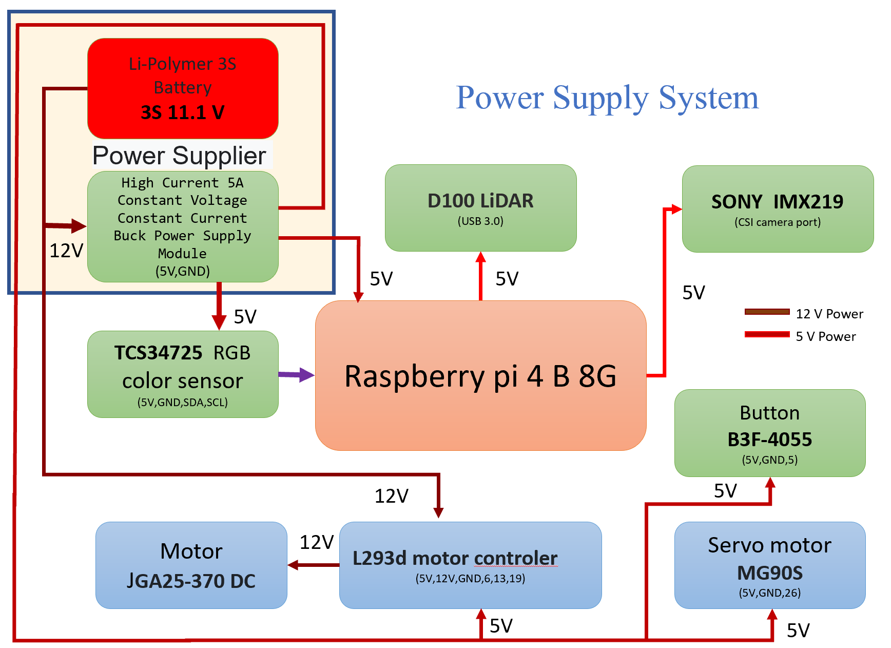
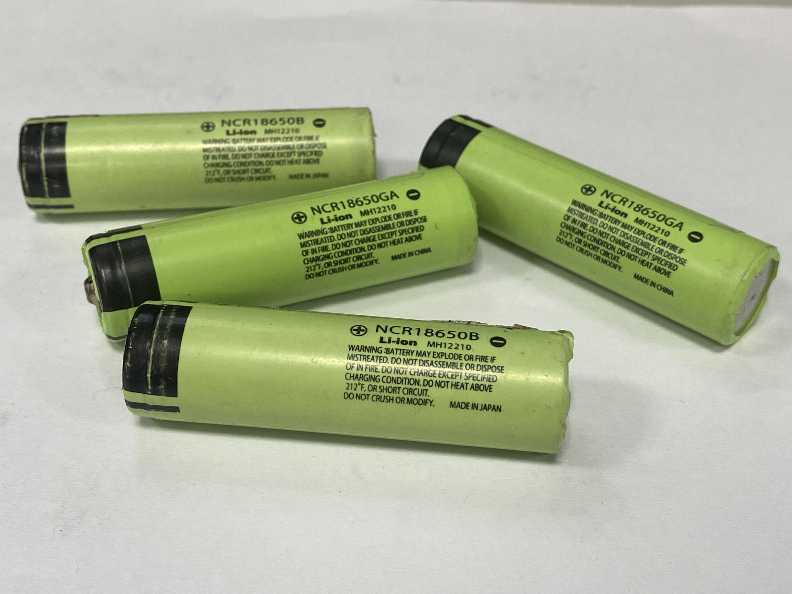
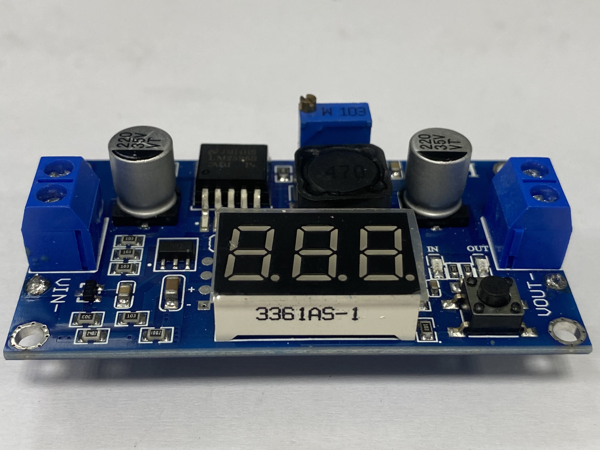
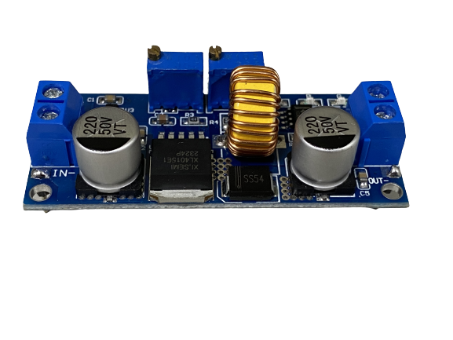

# 
Vehicle Power Supply System Introduction(車輛電源供應系統介紹)
 
- ###  Power Supply Operation System Overview Diagram(電源供應運作系統概要圖) 

- ###  Physical Connection Diagram of Power Supply System(電源供應系統實體連線圖) 

- ### Power Supply System Operation Instructions 電源供應系統運作說明
  Each type of device operates at its respective working voltage, as explained below:
  - Powered by a lithium-polymer battery, it provides 11.1V, simultaneously serving as the working voltage for the 12V-to-5V step-down power supply module and the L293D motor control chip to drive the 12V DC motors.
  - The step-down power supply module reduces 11.1V to 5V, supplying the working voltage to the 5V Raspberry Pi, 5V color sensor, 5V L293D motor controller, and 5V servo motors.
  - The Raspberry Pi, in turn, supplies 5V as the working voltage for the Lidar and camera module.  
  每一種設備都有各自的工作電壓，方能正常運作，其說明如下：
  - 由鋰聚合物電池提供11.1V同時提供給12轉5V降壓板的工作電壓及L293D馬達控制晶片來驅動12V直流馬達。
  - 降壓版將11.1V降壓成5V，提供給5V樹梅派、5V顏色感測器、5VL293D馬達控制器及5V伺服馬達的工作電壓。
  - 樹梅派則提供5V給光達和鏡頭模組的工作電壓。

- ###  Battery Selection 電池選擇
  - As the vehicle requires continuous movement, it was necessary to switch the power source to batteries. Considering that the motors require a voltage of 12V to operate, we chose a 12V battery with a current rating of 3A.
  - There are two common battery options: lithium-ion batteries (18650) and lithium-polymer batteries (3S). However, due to the heavier weight and larger size of 18650 batteries, we opted for the compact and lightweight lithium-polymer battery.
    
  - 由於車輛需要不斷的移動，因此需要將電力來源改成電池。考慮到馬達需要12V的電壓才能使用，我們選擇了電壓為12V、電流為3A的電池。
  - 常見的電池有兩種選擇：鋰離子電池(18650)和鋰聚合電池(3S)。然而，由於18650電池重量較重且佔據空間較大，因此我們選擇了體積小、重量輕的鋰聚合電池。

  - #### Battery Comparison (電池比較)

<table>
<tr align="center">
  <th> 18650 Lithium Batteries(18650充電電池) </th> <th>Li-Polymer 3S Battery (鋰聚合物電池 3S)
  </th>
</tr>
<tr align="center">
  <td>
   </td>
  <td>
  
  </td>

</tr>
</table>

 - ### Step-Down power supply Module  Selection(降壓模組選擇)
    - The Raspberry Pi can only operate at a voltage of up to 5.2V, so we need to use a 12V-to-5V step-down power supply module to lower the voltage and prevent damage to the Raspberry Pi.
    - Initially, we used the LM2596 DC-DC adjustable step-down module because it had a digital display that could show the current output voltage. However, its maximum output current was only 3A, which couldn't meet the device's operating current, so we didn't use it.
    - Therefore, we opted for a constant voltage and constant current step-down power supply module with a maximum output current of 5A, which allows the self-driving car to operate normally. While it lacks a digital display, we can determine the current battery voltage through a low-voltage alarm, ensuring that the battery voltage is sufficient.
    - 樹梅派工作電壓只能到5.2V，因此我們需要使用12V轉5V降壓模組來將電壓降低，以避免樹梅派受損。
    - 最初我們使用LM2596 DC-DC可調降壓模組，因為它有數值顯示，可以顯示目前輸出電壓的大小。然而，它的最大輸出電流只有3A，不能滿足設備的工作電流,故不使用。
    - 因此我們選擇了一個最大5A輸出電流的恆壓恆流降壓電源模組，則可使自駕車正常運作，儘管沒有數值顯示，可以透過電池電壓的低電壓警報器，就可以確定目前電池電壓是否足夠。
  
    - #### Step-Down power supply Module Comparison(降壓模組)

<table with=100%>
<tr align="center">
<th> LM2596 DC-DC Adjustable Buck Module LM2596 DC-DC可調降壓模組 </th>
<th>5A Constant Voltage Constant Current Buck Power Supply Module 5A恆壓恆流降壓電源模組</th>
</tr>
<tr align="center">
  <td>  </td>
  <td> 
  </td>

</tr>
</table>

# 
[Return Home](../../)
  

