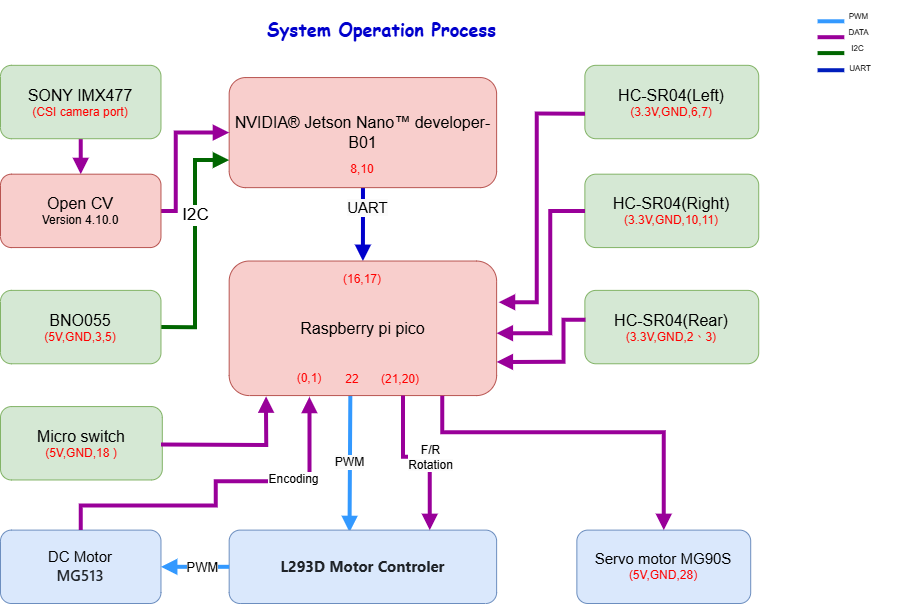
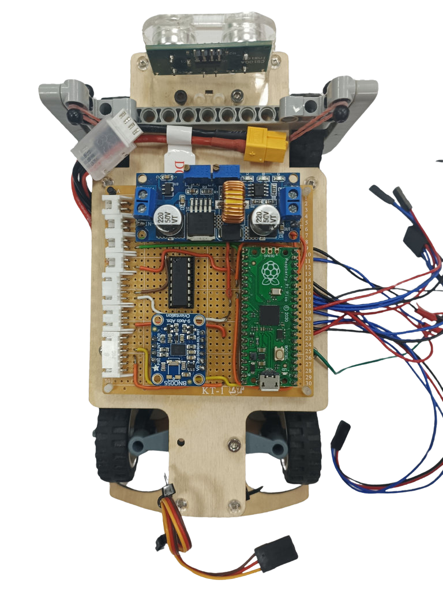
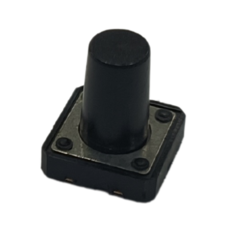

## 
Hardware Assembly Instructions & Wiring diagram(硬體組裝說明)

- ### Hardware Configuration of Electronic Equipment  (電子設備硬體配置)
  - 電子設備配置加上車輛底盤結構，即可組成一台自駕車。
  - 下圖為電子設備在車輛上配置情形。
  - The combination of electronic equipment configuration with the vehicle chassis structure forms a self-driving car.
  - The diagram below illustrates the placement of electronic equipment on the vehicle.
  

- ### System Operation Process (系統運作流程)
    

- The battery provides 12V power to the motor controller (L293D) and the voltage regulator. The voltage regulator steps down the voltage from 12V to 5V before supplying power to the Raspberry Pi and various sensors as their power source.  
- The LiDAR sensor detects distance values between the vehicle and walls in a 360-degree range. These values are transmitted to the Raspberry Pi via ROS for computation. The control signals are then sent to the front wheel servo motor (MG90S) to control the direction of movement.  
- The Sony IMX219 camera transmits images to the Raspberry Pi, which then uses OpenCV for image recognition. The control signals are then sent to the front wheel servo motor (MG90S) to control the direction of movement for obstacle avoidance.  
- The color sensor is used to identify the blue, orange, and white areas on the track. It reads the color values and transmits them to the Raspberry Pi for computation. This information is used to count the laps of the vehicle on the track.

- 電池會將12V電力輸出到馬達控制器(L293D)和降壓板，藉由降壓板將12V降壓至5V之後再提供給樹梅派和各感測器作為電力來源。
- LiDAR sensor 將偵測到360度車輛與牆的距離數值，ROS傳輸給樹梅派運算，將控制信號傳送至前輪伺服馬達(MG90S)用於控制行進方向。
- 鏡頭(Sony IMX219)將影像傳輸樹梅派再利用OPENCV 進行影像辨識，再將控制信號傳送至前輪伺服馬達(MG90S)用於控制行進方向，以躲避障礙物。
- 馬達控制器(L293D)用於控制直流馬達正反轉，利用PWM訊號來控制輸出給馬達的電流，決定車輛的行駛速度。
- 顏色感測器用於辨識場地上的藍、橘線及白色區域，並將讀取顏色數值，傳送樹梅派運算，以作為車輛場地繞圈計數。

- ### Vehicle Body Structure Display Diagram (車輛機體結構展示圖)

<table>
  <tr>
      <th>Top View of the Overall Apparatus(整體機體結構上視圖)</th>
      <th>Middle Layer Structure Top View(中層機體結構上視圖)</th>
      <th>Top View of Vehicle Chassis(車輛底盤上視圖)</th>
      <th>Bottom View of Vehicle Chassis(車輛底盤下視圖)</th>
  </tr>
  <tr align="center">
     <td>   </td><td></td><td></td>
     <td></td>
  </tr>
</table>

- ### Circuit Board (電路板)

<table>
  <tr align="center">
      <th> Circuit Board of Top View(電路板上視圖) </th><th>Circuit Board of Button View(電路板背面視圖)</th>
  </tr>
  <tr align="center">
     <td>  </td><td></td>
  </tr>
</table>

- ### Overview of Important Parts List (重要零件清單概述)
  - #### Raspberry Pi 4B 8G (樹梅派4B 8G )
    <table border=0 width=100% >
      <tr>
      <td >

    __Specification:__ 
    - Processor: Broadcom BCM2711, Quad-core Cortex-A72, 64-bit SoC, 1.5GHz
    -  Memory: 8GB LPDDR4 SDRAM
    -   Connectivity: Dual-band IEEE 802.11ac wireless + Bluetooth 5.0, Gigabit Ethernet, 2×USB 3.0, 2×USB 2.0 ports
    -   GPIO: Forward-compatible with Raspberry Pi's standard 40-pin GPIO
    -   Dimensions: 85.6×56.5×17.8mm
    -   Weight: 45 grams

    __Uses in Competition:__ 
    - Responsible for receiving data from color sensors, LiDAR, and images, processing recognition, and controlling the vehicle's direction and movement.
    </td>
       <td >
       
        </td>
      </tr>
    </table>

      __規格:__  
      - 處理器：博通 BCM2711，四核 Cortex-A72，64 位 SoC，主頻 1.5GHz
      - 記憶體：8GB LPDDR4 SDRAM
      - 連接性：雙頻 IEEE 802.11ac 無線 + 藍牙 5.0，千兆乙太網，2×USB 3.0、2×USB 2.0 端口
      - GPIO：向前兼容樹莓派的標準 40 針引腳
      - 尺寸：85.6×56.5×17.8mm
      - 重量：45 克

      __在競賽中的用途:__  
      - 負責接收顏色感測器、LiDAR及影像並運算辨識並控制車輛方向移動。

  - #### JGA25-370B DC Reduction Motor (JGA25-370B 直流減速馬達) 
    <table border=0 width=100% >
      <tr>
        <td > 

    __Specifications:__  
    - No-load Speed: 463 rpm  
    - Reduction Ratio: 1:34  
    - Operating Voltage: 6 - 12V  

    __Uses in Competition：__
    - Responsible for rotating the vehicle's rear wheels to enable it to move forward and backward.
    </td>
        <td >
       
        </td>
      </tr>
    </table>

      __規格:__  
      - 無負載轉速：640 rpm
      - 減速比：1:34
      - 工作電壓：6 - 12V  

      __競賽用途:__ 
      - 負責車輛後輪轉動，讓車輛可以前進與後退。

  - ### MG90S Servo Motor(MG90S伺服馬達)
    <table border=0 width=100% >
      <tr>
        <td>  

    __Specifications:__ 
    - Controllable Rotation Angle: 0-180°  
    - Maximum Torque: 2.0 kg/cm (at 4.8V)  
    - Fastest Rotation Speed: 0.11 seconds (at 4.8V)  
    - Operating Voltage: 4.8V - 7.2V  

    __Uses in Competition：__
    - Control the front wheel steering of the vehicle to enable it to turn while in motion. 
    </td>
        <td>
      
        </td>
      </tr>
    </table>

    __規格:__ 
    - 可控制轉動角度：90°
    - 最大扭力：2.0 kg/cm（在4.8V時）
    - 最快轉動速度：0.11秒（在4.8V時）
    - 工作電壓：4.8V - 7.2V  

    __競賽用途:__
    - 控制車輛前輪轉向，讓車輛可以在行駛中轉彎。    

  - #### Dual H-bridge DC motor driver IC - L293D (雙 H 橋直流馬達驅動 IC– L293D)

    <table border=0 width=100% >
      <tr>
        <td>  

    __Specifications:__ 
    - 293D is a dual H-bridge DC motor driver IC that can be used to control two DC motors.
    - Wide operating voltage range: 4.5V to 36V.
    - Output current: 600 mA (continuous) and 1.2 A (peak) per channel.
    - Output voltage range: 3 V to 36 V.
    __Uses in Competition：__  
    - Drive the vehicle forward and backward by controlling the JGA25-370 DC gear motor
    </td>
        <td>
      
        </td>
      </tr>
    </table>

    __規格:__
    - L293D 是一種雙 H 橋直流馬達驅動 IC，可用於控制兩個直流馬達。
    - 寬電源電壓範圍：4.5V 至 36V
    - 輸出電流：每通道 600 mA（連續），1.2 A（峰值）
    - 輸出電壓範圍：3 V 至 36 V

    __競賽用途:__
    - 驅動JGA25-370直流減速電達控制車輛前進後退。    

  - #### Li-Polymer 3S Battery (鋰聚合物電池 3S)
    <table border=0 width=100% >
      <tr>
        <td> 

    __Specifications:__
    - Maximum Current: 45.5A  
    - Net Weight: Approximately 107g  
    - Rated Voltage: 11.1V  

    __Uses in Competition：__  
    - Supply power to the vehicle for use.  
    </td>
        <td>
      
        </td>
      </tr>
    </table>

    __規格:__
    - 最大電流：45.5A
    - 淨重：約107g
    - 額定電壓：11.1V  

    __競賽用途:__ 
    - 提供電力給車輛使用。

 - #### Button (B3F-4055 微動輕觸開關)

    <table border=0 width=100% >
      <tr>
        <td>

    __Specifications:__ 
    - Operating Voltage: 3.3V - 5.0V  
    - Number of Pins: 3  
    - Output Signal: Digital  

    __Uses in Competition：__
    - Control the vehicle's start and drive switch.
    </td>
        <td>
       
        </td>
      </tr>
    </table>

    #### 中文  
    __規格:__ 
    - 工作電壓：3.3V – 5.0V
    - 引腳數量：3個
    - 輸出信號：數字（Digital）

    __競賽用途:__ 
    - 控制車輛啟動行駛的開關。

- #### High Current 5A Constant Voltage Constant Current Buck Power Supply Module (大電流5A恆壓恆流降壓電源模組)  

    <table border=0 width=100% >
      <tr>
        <td> 

    __Specifications:__ 
    - Input Voltage: 4.0V - 38.0V  
    - Output Voltage: 1.25V - 36.0V  
    - Operating Frequency: 180Hz  

    __Uses in Competition：__  
    - Step down the battery voltage from 11.1V to 5V to provide the required voltage for the vehicle's electronic devices.
    </td>
        <td>
       
        </td>
      </tr>
    </table>

    __規格:__  
    - 輸入電壓：4.0V - 38.0V
    - 輸出電壓：1.25V - 36.0V
    - 工作頻率：180Hz

    __競賽用途:__  
    - 將電池提供11.1V降壓成5V電壓，提供車輛電子設備所需之電壓。
  

- #### TCS34725 RGB Color Sensor (TCS34725 顏色感測器)
    <table border=0 width=100% >
      <tr>
        <td > 

    __Specifications:__  

    - Operating Voltage: 3.3V - 5.0V 
    - Output resolution: 16 bits
    - Dynamic range: 3.8M:1
    - Sensitivity: 100 μV/lux
    - Interface: I2C interface  

    __Uses in Competition：__  
    - Responsible for detecting the blue and orange lines as well as the white areas on the field.

    </td>
        <td>
       
        </td>
      </tr>
    </table>

    __規格:__
    - 工作電壓：3.3V – 5.0V
    - 輸出解析度：16 位
    - 動態範圍：3.8M:1
    - 光敏度：100 μV/lux
    - 接口：I2C接口
    __競賽用途:__ 
    - 負責偵測場地上的藍、橘線及白色區域。

- #### SNOY IMX 219 Camera Module  (Sony IMX 219-160度鏡頭)  
    <table border=0 width="100%" >
      <tr>
        <td> 

    __Specifications:__ 
    - Viewing Angle: 160 degrees  
    - Effective pixels: 3280 x 2464
    - Total pixels: 3296 x 2512
    - Maximum aperture: F2.0
    - Focal length: 2.96mm
    - Interface: CSI (Camera Serial Interface)  

    __Uses in Competition：__  
    - Collecting images for image recognition. Responsible for collecting images and transmitting them to the Raspberry Pi for image recognition.
    </td>
       <td >
        
        </td>
      </tr>
    </table>

    __規格:__  
    - 可見角度：160度
    - 有效像素：3280 x 2464
    - 總像素：3296 x 2512
    - 最大光圈：F2.0
    - 焦距：2.96mm
    - 接口：CSI (相機串行接口，Camera Serial Interface)

    __競賽用途:__ 
    - 負責收集影像傳送至樹莓派進行影像辨識。

    - ### D100 LiDAR (D100 光達)
    <table border=0 width=100% >
      <tr>
       <td> 

    __Specifications:__  
    - The D100 Developer Kit is built around the LiDAR LD14 as its core, complemented by related accessories.
    - It employs triangulation technology for a simple 360-degree full scan.
    - Angular Resolution: 1 degree.
    - Maximum measurement distance is 8 meters.
    - Detection frequency: 2300 Hz.
    - Dimensions: 96.3 x 59.8 x 38.8 mm.

    __Uses in Competition：__  
    - Used to detect obstacles in front and on the left and right sides, as well as to keep the vehicle centered in its lane. 
      </td>
      </td>
        <td>
          
        </td>
      </tr>
    </table>

    __規格：__  
    - D100 開發者套裝是以光達 LiDAR LD14為核心再搭配相關零配件組合而成。  
    - 採用三角測距技術，簡易360度全掃描。
    - Angular Resolution: 1 degree.
    - 最大測距為8公尺。  
    - 偵測頻率 2300 HZ，外觀尺寸 96.3*59.8*38.8 mm  

    __競賽用途：__
    - 用於偵測前方及左右兩側牆壁以及使車輛維持在車道中央 

    - ### HC-SR04  (超音坡感測器)
    <table border=0 width=100% >
      <tr>
       <td> 

    __Specifications:__  
    - Operating Voltage: DC 5V
    - Sensing Angle: No greater than 15 degrees
    - Detection Distance: 2cm – 450cm
    - High Precision: Up to 3mm

    __Uses in Competition：__  
    - Used to detect obstacles in front and on the left and right sides, as well as to keep the vehicle centered in its lane. 
      </td>
      </td>
        <td>
          
        </td>
      </tr>
    </table>

    __規格：__  
    - 使用電壓：DC5V.
    - 感應角度：不大於15 度
    - 探測距離：2cm – 450cm.
    - 高精度：可達3mm.  

    __競賽用途：__
    - 用於偵測前方及左右兩側牆壁以及使車輛維持在車道中央 

        

# 
[Return Home](../../)
 
