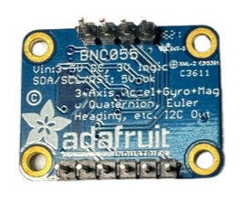

，

## 
Gyroscope orientation sensor Introduction
 

- ### __BNO055 Gyroscope orientation sensor Introduction__
    

    <table>
    <tr>  
    <td>
    <ol>
        <li>The BNO055 gyroscope orientation sensor is a high-precision nine-axis absolute orientation sensor developed by Bosch Sensortec. It integrates an accelerometer, gyroscope, and magnetometer and has a built-in microprocessor for sensor fusion algorithms, providing real-time attitude and orientation information. Its primary feature is automatic sensor calibration, enabling it to directly output absolute orientation data in three-dimensional space.
        </li>
        <li>The BNO055 gyroscope orientation sensor can provide data on azimuth, tilt angle, acceleration, angular velocity, and magnetic field strength, making it ideal for applications that require precise attitude and orientation sensing, such as autonomous driving, robotic navigation, virtual reality (VR) devices, and various industrial control systems. With its built-in sensor fusion technology, the BNO055 gyroscope orientation sensor simplifies system design, relieving developers from handling complex data fusion.
        </li>
        <li>This sensor supports multiple interfaces (e.g., I2C, UART), allowing for easy integration into different embedded systems. The BNO055 gyroscope orientation sensor’s built-in algorithm automatically adjusts to provide stable readings across different environments, making it suitable for applications requiring high stability and accuracy.
    </ol>
    </td>
    <td width=300 align="center">
      
      

    </td>
    </tr>
    </table>
    

    We installed the BNO055 gyroscope orientation sensor on the vehicle and connected it to the Nvidia Jetson Nano controller, using I2C mode for data transmission. This setup is used to read the vehicle's current orientation, and the obtained orientation data is transmitted to the main program for calculation and analysis, serving as a basis for the vehicle's steering decisions.
 
   
- The following is __Python__ code that implements orientation detection functionality from the __BNO055 gyroscope sensor__ on an __Nvidia Jetson Nano__ using a class-based approach.

    - ####  Python code

            import time
            from Adafruit_BNO055 import BNO055
            class BNO055Sensor:
                def __init__(self, i2c_address=0x28):
                    # Initialize BNO055 sensor with the specified I2C address
                    self.bno = BNO055.BNO055(i2c_address=i2c_address)
                    
                    # Check if the sensor was initialized successfully
                    if not self.bno.begin():
                        raise RuntimeError("Failed to initialize BNO055. Please check the connection.")
                    else:
                        print("BNO055 initialized successfully.")

                def get_orientation(self):
                    # Read orientation (Heading, Roll, Pitch) from the sensor
                    heading, roll, pitch = self.bno.read_euler()
                    return {
                        "heading": heading,
                        "roll": roll,
                        "pitch": pitch
                    }

                def get_calibration_status(self):
                    # Retrieve calibration status for the system, gyroscope, accelerometer, and magnetometer
                    sys, gyro, accel, mag = self.bno.get_calibration_status()
                    return {
                        "system": sys,
                        "gyroscope": gyro,
                        "accelerometer": accel,
                        "magnetometer": mag
                    }

    - #### Example usage
            sensor = BNO055Sensor()
            while True:
                # Get orientation data
                orientation = sensor.get_orientation()
                print("Orientation - Heading: {heading}°, Roll: {roll}°, Pitch: {pitch}°".format(**orientation))

                # Get calibration status
                calibration_status = sensor.get_calibration_status()
                print("Calibration Status:", calibration_status)

                time.sleep(1)

   - #### Explanation    
        

        <ol>
        <li><strong>__init__ method:</strong> Initializes the BNO055 Gyroscope orientation Sensor class, setting the I2C address and verifying the sensor connection. If the connection fails, it raises an error.</li>
        <li><strong>get_orientation method:</strong> Retrieves orientation data from the sensor (Heading, Roll, and Pitch) and returns them in a dictionary.
        get_calibration_status method: Returns the calibration status for the system, gyroscope, accelerometer, and magnetometer, which is useful for ensuring accurate measurements.</li>
        </ol>

      __This code reads and prints the BNO055 Gyroscope orientation sensor's orientation data and calibration status every second.__

# 
[Return Home](../../)
  