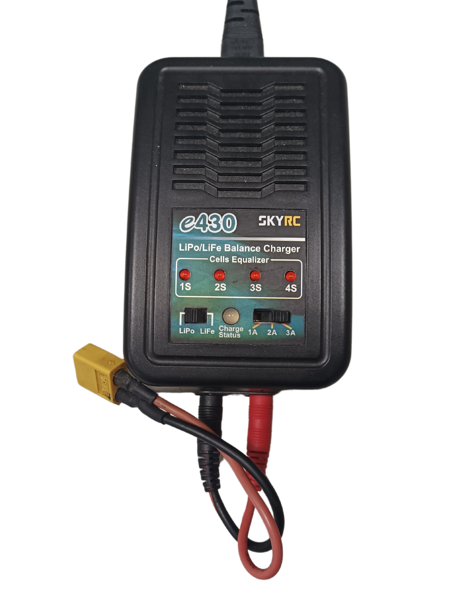

## 
Battery choice for self-driving cars
 
 At last year's international competition, our coach observed that most teams were using 18650 batteries to power their vehicles. He tasked us with comparing the differences between 3S Lithium Polymer (LiPo) and 18650 batteries to determine the optimal battery type for our competition vehicle this year.
### Comparison between 3S Li-Polymer and 18650 Li-ion batteries
  - The following is a comparison of the advantages and disadvantages of 3S Li-Po batteries and 18650 Li-ion batteries with the same voltage configuration.
  <table border="1">
    <thead>
      <tr>
        <th>Item</th>
        <th>3S LiPo Battery</th>
        <th>18650 Battery</th>
      </tr>
    </thead>
    <tbody>
      <tr>
        <td>photo</td>
        <td></td>
        <td></td>
      </tr>
      <tr>
        <td>Voltage Range</td>
        <td>11.1V (nominal), up to 12.6V (fully charged)</td>
        <td>11.1V (nominal), up to 12.6V (fully charged)</td>
      </tr>
      <tr>
        <td>Energy Density</td>
        <td>Higher energy density compared to the same weight</td>
        <td>Higher capacity per unit volume compared to LiPo</td>
      </tr>
      <tr>
        <td>Weight</td>
        <td>Lighter, good for reducing load</td>
        <td>Relatively heavier</td>
      </tr>
      <tr>
        <td>Output Current</td>
        <td>Supports high discharge rates (C-Rate), can provide high current instantaneously</td>
        <td>Lower discharge rates, suitable for stable power output</td>
      </tr>
      <tr>
        <td>Charging Time</td>
        <td>Supports fast charging but requires a dedicated charger</td>
        <td>Relatively slower charging time</td>
      </tr>
      <tr>
        <td>Safety</td>
        <td>More susceptible to physical damage or overcharging, risk of fire</td>
        <td>Relatively safer, resistant to overcharge and overdischarge</td>
      </tr>
      <tr>
        <td>Shape and Flexibility</td>
        <td>Can be made in various shapes and sizes, high flexibility in fitting space</td>
        <td>Fixed cylindrical shape, less adaptable to different spaces</td>
      </tr>
      <tr>
        <td>Internal Resistance and Efficiency</td>
        <td>Lower internal resistance, suitable for high current discharge, high efficiency</td>
        <td>Relatively higher internal resistance, slightly lower efficiency</td>
      </tr>
      <tr>
        <td>Lifecycle</td>
        <td>Shorter lifespan, fewer charge cycles (typically 300-500 cycles)</td>
        <td>Longer lifespan, more charge cycles (typically 500-1000 cycles)</td>
      </tr>
      <tr>
        <td>Application Scenarios</td>
        <td>Used in drones, RC vehicles, and applications requiring high output</td>
        <td>Used in laptops, power banks, and applications needing stable power supply</td>
      </tr>
      <tr>
        <td>Cost</td>
        <td>Relatively more expensive, requires dedicated charging equipment</td>
        <td>Relatively cheaper</td>
      </tr>
    </tbody>
  </table>

   - As shown in the table above, the 3S Li-Polymer (LiPo) battery has advantages of high output current, high energy density, and a lightweight design, making it particularly suitable for applications that require high instantaneous current, such as drones and RC vehicles. Therefore, we decided to select the __3S Li-Polymer battery (LiPo)__ as the power source for the autonomous vehicle in this competition.
   - Our experience with 3S Li-Po batteries has shown that their safety is a significant concern. Improper charging practices have led to battery fires, and incorrect storage has resulted in battery damage. These incidents underscore the importance of following strict guidelines for handling these batteries.
  

  <table>
  <tr>
  <th>Photo of 3S Li-Polymer (LiPo) battery burnout during charging.</th>
  </tr><tr>
  <td></td>
  </tr>
  </table>
  

 
### Charging/Discharging Equipment and Li-Polymer Battery Low Voltage Alarm.
  - To protect the 3S Li-Polymer (LiPo) battery from damage during use and storage and to extend its lifespan, we implemented the following strategies:
    - __Use a Dedicated Charger:__ Choose a balanced charger suitable for LiPo batteries to ensure each cell’s voltage remains balanced, preventing damage due to overcharging or unbalanced charging.
    

    <table>
    <tr align="center">
    <th colspan="3">Dedicated Charger(Charging/Discharging Equipment)</th>
    </tr>
    <tr align="center">
    <th>Skyrc E430</th>
    <th>Skyrc Imax B6C2 v2</th>
    <th>HOTA D6 Pro</th>
    </tr>
    <tr>
    <td></td>
    <td></td>
    <td></td> 
     </tr>
     </table>
     
      

    - __Monitor the Charging Process:__ Supervise the battery during charging, avoiding extended periods without monitoring to quickly detect and resolve any charging abnormalities.

    - __Control Charging Voltage and Current:__ Keep the charging voltage below the standard 4.2V per cell and maintain an appropriate charging current to prevent damage from fast charging.

    - __Avoid Over-Discharge:__ During use, ensure each cell’s voltage does not drop below 3.0V to prevent over-discharge, which could damage the battery and reduce its lifespan.

    - __Safe Storage:__ When not in use, store the battery in a fireproof bag or a dedicated safety container to avoid damage from external pressure or high temperatures.

    - __Storage Voltage:__ For long-term storage, charge the battery to around 50% (3.7V-3.85V per cell) to extend its lifespan and reduce the risk of self-discharge.

    - __Keep Away from High Temperatures:__ Avoid using or storing the battery in high-temperature environments, as heat accelerates aging and increases the risk of damage and fire.

    - __Regular Battery Checks:__ Inspect the battery regularly for appearance and voltage. If swelling, cracking, or voltage abnormalities are detected, immediately stop using and dispose of it safely.

  - #### Low Voltage Alarm       
      
      

       <table>
       <th>Li-Polymer Battery Low Voltage Alarm </th>
       <tr>
       <td>Installing a low-voltage alarm on the battery can emit an audible warning when the voltage falls below a set value, alerting the user to monitor or replace the battery in time. This effectively prevents insufficient power issues during competitions and protects the battery from damage due to over-discharge.</td>
        <td></td>
       </tr>
       </table>
       

     
 
# 
[Return Home](../../)
 
