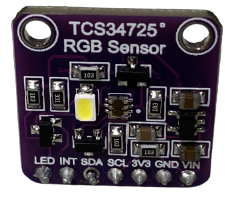
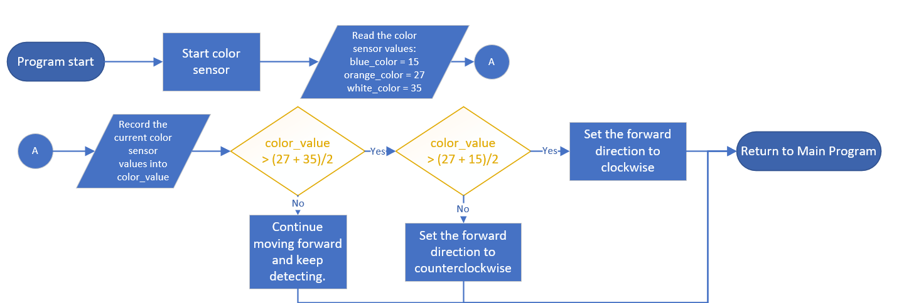

<div align="center"></div>

# <div align="center">Color Sensor Introduction</div> 
- __TCS34725 Color Sensor 顏色感測器__
<div align="center">
<table>
<tr>  
<td>
  <ul>
  <li>The TCS34725 color sensor has been chosen because it meets all the requirements of this competition. Firstly, it possesses outstanding sensing capabilities, allowing it to quickly and accurately identify the colors of the ground lines. Secondly, the sensor is thin and compact, enabling it to be placed close to the ground without interfering with the vehicle's movements.</li>
  <li>The TCS34725 color sensor has two primary functions on the vehicle:</li>
     <ol>
     <li>It can count laps around the track by detecting the blue and orange lines on the field.</li>
     <li>By detecting the sequence of blue and orange lines through the color sensor, it can determine whether the vehicle is currently moving in a clockwise or counterclockwise direction. This information is used by the program to calculate the number of clockwise and counterclockwise turns, ensuring that the vehicle can smoothly return to the starting area after completing 3 laps.</li>
   </ol>

  <li>TCS34725 顏色感測器被選中是因為它滿足了此次競賽的所有要求。首先，它具有出色的感測功能，可以快速而準確地辨識地面線條的顏色。其次，這款感測器相當薄且小巧，這意味著它可以輕鬆貼近地面，不會對車輛的運行造成任何干擾。</li>
   <li>TCS34725 顏色感測器在車輛上的主要功能有二：</li>
   <ol>
     <li>可藉由偵測場地上的藍、橘線，可做作為場地繞圈的計數。</li>
     <li>藉由顏色感測器偵測到藍、橘線的順序，可判斷目前車輛正處於順、逆時針中的那一個狀況，以便程式計算順、逆時針的轉彎次數，讓車輛可在行駛3圈後，順利回到出發區。</li>
   </ol>
</ul>
</td>
 <td width=250 > 
</td>
</tr>
</table> 
</div>  

We encountered a bottleneck when using the color sensor to detect lines because I was unsure how to write a Python program to detect the values of blue and orange lines.

With the guidance of my teacher, we successfully completed it.  
  __The partial code is as follows:__


  在使用顏色感測器偵測線時遇到瓶頸，因為不知道如何使用python撰寫程式來偵測藍、橘線的數值，經過老師指導，成功完成，片段程式如下。


  #### Function
```
class TCS34725():
    def __init__(self):
        self.enable_selection()
        self.time_selection()
        self.gain_selection()
    def enable_selection(self):
        """Select the ENABLE register configuration from the given provided values"""
        ENABLE_CONFIGURATION = (TCS34725_REG_ENABLE_AEN | TCS34725_REG_ENABLE_PON)
        bus.write_byte_data(TCS34725_DEFAULT_ADDRESS, TCS34725_REG_ENABLE | TCS34725_COMMAND_BIT, ENABLE_CONFIGURATION)
    def time_selection(self):
        """Select the ATIME register configuration from the given provided values"""
        bus.write_byte_data(TCS34725_DEFAULT_ADDRESS, TCS34725_REG_ATIME | TCS34725_COMMAND_BIT, TCS34725_REG_ATIME_2_4)
        """Select the WTIME register configuration from the given provided values"""
        bus.write_byte_data(TCS34725_DEFAULT_ADDRESS, TCS34725_REG_WTIME | TCS34725_COMMAND_BIT, TCS34725_REG_WTIME_2_4)
    def gain_selection(self):
        """Select the gain register configuration from the given provided values"""
        bus.write_byte_data(TCS34725_DEFAULT_ADDRESS, TCS34725_REG_CONTROL | TCS34725_COMMAND_BIT, TCS34725_REG_CONTROL_AGAIN_1)
    def readluminance(self):
        """Read data back from TCS34725_REG_CDATAL(0x94), 8 bytes, with TCS34725_COMMAND_BIT, (0x80)
        cData LSB, cData MSB, Red LSB, Red MSB, Green LSB, Green MSB, Blue LSB, Blue MSB"""
        data = bus.read_i2c_block_data(TCS34725_DEFAULT_ADDRESS, TCS34725_REG_CDATAL | TCS34725_COMMAND_BIT, 8 )        
  # Convert the data
        cData = data[1] * 256 + data[0]
        red = data[3] * 256 + data[2]
        green = data[5] * 256 + data[4]
        blue = data[7] * 256 + data[6]        
  # Calculate luminance
        luminance = (-0.32466 * red) + (1.57837 * green) + (-0.73191 * blue)
        return {'c' : cData, 'r' : red, 'g' : green, 'b' : blue, 'l' : luminance}
``` 
  #### Snippet of Code  
```
data = bus.read_i2c_block_data(TCS34725_DEFAULT_ADDRESS, TCS34725_REG_CDATAL | TCS34725_COMMAND_BIT, 8 )        
        # Convert the data
        cData = data[1] * 256 + data[0]
        red = data[3] * 256 + data[2]
        green = data[5] * 256 + data[4]
        blue = data[7] * 256 + data[6]        
# Calculate luminance
        luminance = (-0.32466 * red) + (1.57837 * green) + (-0.73191 * blue)
        return {'c' : cData, 'r' : red, 'g' : green, 'b' : blue, 'l' : luminance}
```

- #### Algorithm for Detecting Blue and Orange Lines Using a Color Sensor 使用顏色感測器偵測藍、橙色線之程式判斷流程

  1. After the program is started, it will first read the three original values of the field lines: blue (blue_color = 15), orange (orange_color = 27), and white (white_color = 35).
  2. Then, the light sensor will read the current color value of the field and record it in the variable color_value. If the detected color value is greater than white (35), the vehicle can move forward directly. Otherwise, it indicates that it may be one of the blue (15) or orange (27) lines.
  3. Next, the program will add the color values of blue (15) and orange (27) and then divide them by 2 to obtain the middle value of the color value.
  4. Finally, the program will use the value of color_value to determine which line it is. If color_value is lower than the middle value, it indicates that it is a blue line (15); if color_value is higher than the middle value, it indicates that it is an orange line (27). When the blue and orange lines are known first, the vehicle can be determined to go clockwise or counterclockwise.
  <br>

  1. 程式啟動後，首先會讀取場地線條的三種原始值：藍色 (blue_color = 15)、橘色 (orange_color = 27) 以及白色 (white_color = 35)。<br>
  2. 然後，光感傳感器會讀取當前場地的顏色數值，並將其記錄到變數 color_value 中。如果檢測到的顏色數值高於白色 (35)，代表車輛可以往前直走，否則表示它可能是藍線 (15) 或橘線 (27) 之一。  <br>
  3. 接下來，程式會將藍色 (15) 和橘色 (27) 的顏色數值相加，然後除以 2，以獲得顏色數值的中間值。  <br>
  4. 最後，程式會根據 color_value 的數值來判斷它是哪條線。如果 color_value 低於中間值，則表示為藍線 (15)；如果 color_value 高於中間值，則表示為橘線 (27)，當得知先測得藍、橘線為何時，則可以決定車輛是要順時針或逆時針。  <br>
<div align=center></div>

# <div align="center">[Return Home](../../)</div>  

