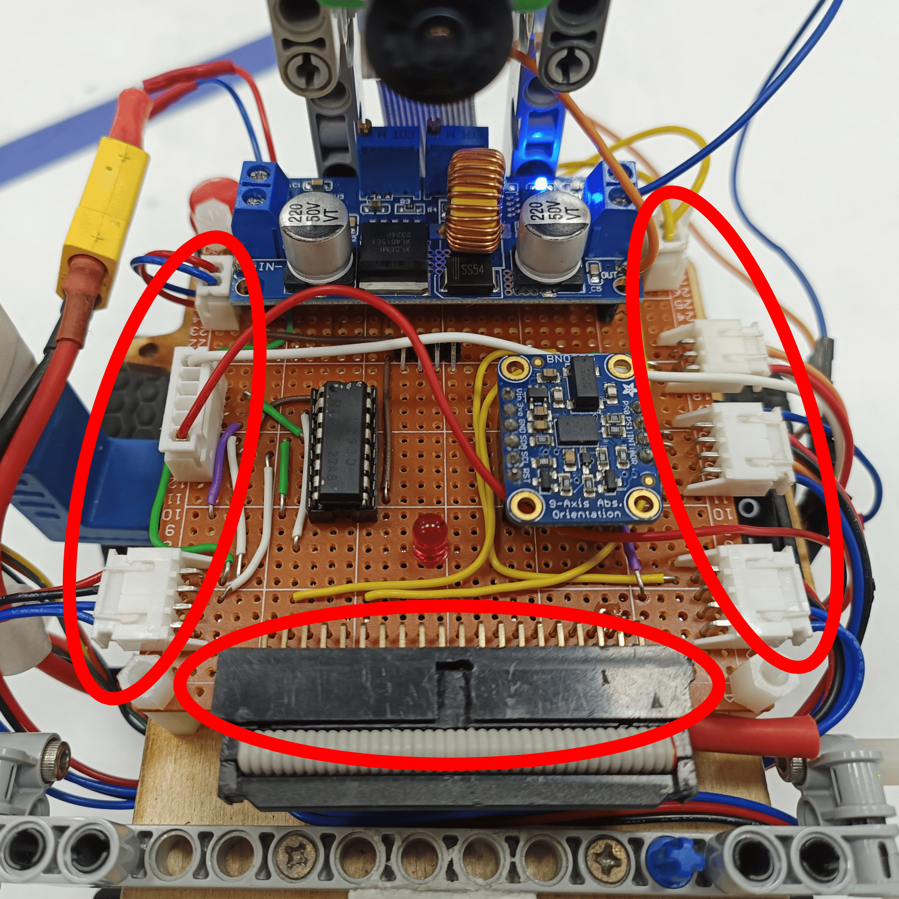

## 
Hardware Fool-Proof Design(硬體防呆設計)

- In the process of hardware design, there have been several cases of damage to Raspberry Pi controllers or ICs due to incorrect power connections or data cable insertion. To avoid this problem, we adopted a solution of using male and female sockets for power supply and data transmission. Through male and female sockets, the correct wiring is ensured, effectively avoiding the risk of Raspberry Pi or IC burning. This design improvement has increased the stability of the hardware system, improved the overall reliability and service life of the product.
- In the process of hardware design, we initially used breadboards to connect circuits, but unfortunately encountered some cases of burning or poor contact, which led to abnormal function operation or potential problems that were difficult to find. To improve this situation, we decided to use soldering to fix the circuit on a PCB. This change has significantly reduced the risk of burning or poor contact, while ensuring a stable and reliable connection. Through this improvement, we have successfully improved the overall reliability of the hardware system and ensured the normal operation of the function.

- 在硬體設計過程中，遇到過幾次因電源接錯或資料線插錯而導致樹莓派控制器或IC損壞的情況。為了避免這樣的問題，我們採用了使用公母插座進行電源供應及資料傳輸的解決方案。透過公母插座，確保了正確的接線，有效地避免了樹莓派或IC燒毀的風險。這樣的設計改進增加了硬體系統的穩定性，提高了整體產品的可靠性和使用壽命。
- 在硬體設計過程中，我們最初使用麵包板連接電路，但不幸遇到了一些燒毀或接觸不良的現象，這導致功能運作不正常或存在潛在問題，且很難發現。為了改善這種情況，我們決定改用銲接方式將電路固定在電木板上。這樣的改變明顯地降低了燒毀或接觸不良的風險，同時確保了穩定可靠的連接。透過這項改進，我們成功地提高了整體硬體系統的可靠性，並確保了功能的正常運作。

# 
[Return Home](../../)
  
