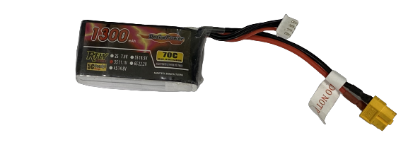
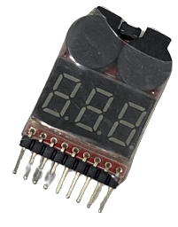
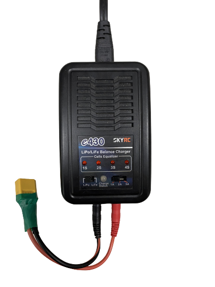
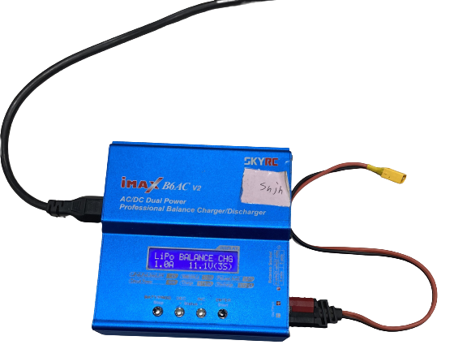
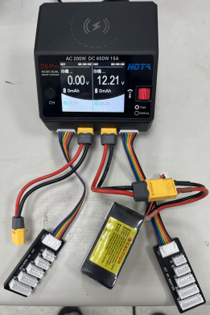

# 
Li-Polymer battery Safety Notice(鋰聚電池安全事項)
 
- ### Li-Polymer Battery: Hazards, Maintenance, and Composition(鋰聚電池的危險、保養及成分) 
  ## English
    - Hazards
        - Flammable
        - Contains toxic substances
        - Improper handling may lead to electronic device damage or combustion
    - Maintenance
        - Avoid charging in direct sunlight or high-temperature environments.
        - Keep away from flammable materials in the vicinity.
        - Remember to unplug the charging power source after completing the charging process to avoid overcharging.
        - Do not excessively discharge during use to prevent reducing battery lifespan.
        - Strictly prohibit tapping, dropping, or impacting the battery.
    - Composition
        - Polymer Electrolyte: Lithium polymer batteries use a polymer as the electrolyte, replacing the organic solvent electrolyte found in traditional lithium-ion batteries. This polymer electrolyte exhibits high ionic conductivity and chemical stability, effectively facilitating lithium-ion conduction and preventing internal short-circuits within the battery.  
        - Polymer Thin Film Separator: Lithium polymer batteries typically utilize a polymer thin film as the separator, which separates the anode and cathode to prevent direct contact.  
        - Anode: The anode is usually made of carbon materials such as graphite or other carbon compounds. During charging, lithium ions are released from the anode, and during discharge, they return to the anode.  
        - Cathode: The cathode is one of the essential components in lithium polymer batteries and is typically made of lithium-containing metal oxides or phosphate materials, similar to the cathode in traditional lithium-ion batteries.  
        - Lithium Salt: The electrolyte of lithium polymer batteries contains lithium salt, which enhances the electrolyte's conductivity.  
        - Electrode Connectors: The internal electrodes of lithium polymer batteries are often made of thin, sheet-like lithium alloy materials, and they are connected to the external circuit of the battery using connectors.   
           <small>Source of Information :[Tainan City Government Fire Bureau](https://119.tainan.gov.tw/News_Content.aspx?n=25497&s=7743170) </small>  

  ## 中文
    - 危險  
        - 可燃燒  
        - 內容物有毒  
        - 操作不當會使電子物件燒毀  
    - 保養  
        - 避免在陽光直射、高溫等環境充電  
        - 周遭避免放置可(易)燃物。  
        - 完成充電時記得移除充電電源，避免過充。   
        - 使用時勿過度放電，以免降低電池壽命。  
        - 嚴禁敲打、摔碰及撞擊。  
    - 成分  
        - 聚合物電解質：鋰聚合物電池使用聚合物作為電解質，取代了傳統鋰離子電池中的有機溶劑電解質。這種聚合物電解質具有高離子導電性和化學穩定性，能夠有效地傳導鋰離子並防止電池內部短路。  
        - 聚合物薄膜隔離層：鋰聚合物電池通常使用聚合物薄膜作為隔離層，用於隔開陽極和陰極，防止直接接觸。  
        - 陽極（Anode）：陽極通常由碳材料製成，例如石墨或其他碳化合物。當充電時，鋰離子會從陽極釋放出來，並在放電時返回陽極。 
        - 陰極（Cathode）：陰極是鋰聚合物電池中最重要的成分之一，它通常由含有鋰的金屬氧化物或磷酸鹽材料製成，類似於傳統鋰離子電池的陰極。  
        - 鋰鹽：鋰聚合物電池的電解質中包含鋰鹽，用於增加電解質的導電性。  
        - 電極連接器：鋰聚合物電池內部的電極通常由薄片狀的鋰合金材料製成，並使用連接器連接到電池的外部電路。  
    <small>資料來源:[台南市政府消防局](https://119.tainan.gov.tw/News_Content.aspx?n=25497&s=7743170) </small>  
    - Battery Photo  
      
 
- ### Li-Polymer Battery Low Voltage Alarm and Charging/Discharging Equipment.(鋰聚合電池低電壓警報器及充放電的設備)  
    - #### Low Voltage Alarm(低電壓警報器)
        
      Li-Polymer Battery Low Voltage Alarm 

        

        <table>
        <tr>
        <td>The primary purpose of installing a low voltage alarm is to prevent the battery from reaching a critically low voltage, thereby avoiding abnormal vehicle operation or battery damage. Therefore, when the battery voltage drops below a specific threshold, the low voltage alarm will sound an alert, reminding the user to take notice or promptly replace the battery to prevent any disruptions to the ongoing race."
        
      裝設低電壓警報器的主要目的是為了預防電池電量過低，進而防止車輛運作出現異常情況或造成電池損壞。因此，當電池的電壓降至某個特定閾值以下時，低電壓警報器會發出聲音警示，提醒用戶注意，或及時進行電池更換，以免擔誤比賽的進行。</td>
        <td></td>

        </tr>

        </table>
        

    - #### Battery Charging/Discharging Equipment(充放電設備)
      - In general, rechargeable batteries, such as nickel-metal hydride (NiMH) and nickel-cadmium (NiCd) batteries, can be stored directly for long periods of time without any problem. However, Li-Polymer batteries should not be stored directly for long periods of time. If they are, the internal charge will gradually decrease, which can lead to a loss of capacity and even the inability to use the battery.
      - The long-term storage method for Li-Polymer batteries is as follows:
        1. Charge the battery to around 50% of its capacity.
        2. Use a charge/discharge device to discharge the battery to approximately 3.2V.
        3. Store the battery in a cool, dry place.  
            This approach can help extend the lifespan of lithium polymer batteries.
      - The following are the reasons for the deterioration of lithium polymer batteries when left unused for an extended period:
        1. Insufficient internal battery charge, leading to the inability of chemical reactions within the battery to proceed normally, resulting in a loss of battery capacity.
        2. Excessive internal battery charge, causing the breakdown of the battery's electrolyte and, in turn, damaging the battery.
        3. Storing the battery in a high-temperature or high-humidity environment, accelerating the chemical reactions within the battery and causing damage to the battery.

      - 一般的充電電池，如鎳氫電池、鎳鎘電池等，在長期不用時，可以直接放置，等下次要用再充電即可。但鋰聚合電池在長期不用時，如果直接放置，則會導致電池內部的電量逐漸下降，最終導致電池容量損失，甚至無法使用。
      - 鋰聚合電池的長期保存方法是：
        1. 將電池充至 50% 左右的電量。
        2. 使用充/放電設備將電池放電至 3.2V 左右。
        3. 將電池放置在陰涼乾燥的地方。  
        這樣可以延長鋰聚合電池的使用壽命。
        
      - 以下是鋰聚合電池長期不用時損壞的原因：  
        1. 電池內部的電量過低，導致電池內部的化學反應無法正常進行，從而導致電池容量損失。  
        2. 電池內部的電量過高，導致電池內部的電解液分解，從而導致電池損壞。  
        3. 電池被放置在高溫或高濕的環境中，導致電池內部的化學反應加速，從而導致電池損壞。  
      

      <table>
        <tr align="center">
        <th>Skyrc E430</th>
        <th>Skyrc Imax B6C2 v2</th>
        <th>HOTA D6 Pro</th>
        </tr>
        <tr>
        <td></td>
        <td></td>
        <td></td>        

        </tr>

</table>

      
     
 
# 
[Return Home](../../)
 
