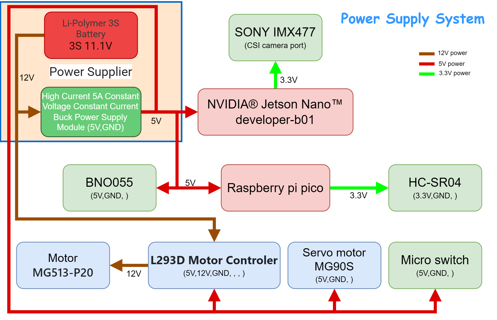
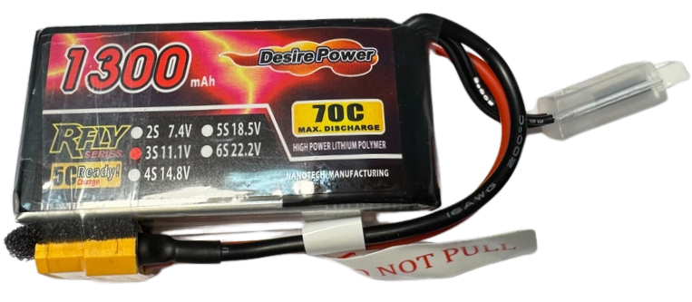
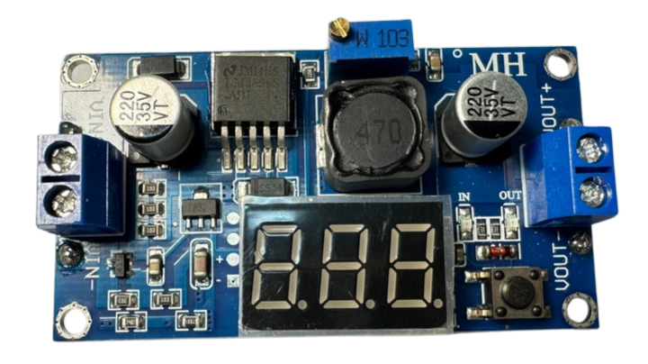

## 
Vehicle Power Supply System Introduction
 
- ###  Power Supply Operation System Overview Diagram
  

- ###  Physical Connection Diagram of Power Supply System
  

- ### Power Supply System Operation Instructions
  Each electronic component requires a specific operating voltage to function properly, and the configuration is as follows:
    - The 3S Li-Polymer battery provides 11.1V, which powers the buck converter module and the L293D motor control chip to drive the 12V DC motor.
    - The 5A constant voltage and constant current buck power module steps down the 11.1V to 5V, supplying power to components requiring a 5V operating voltage, including the Nvidia Jetson Nano, Raspberry Pi Pico, L293D dual H-bridge DC motor driver IC, SBNO055 gyroscope orientation sensor, and the MG90S front steering servo motor.
    - The Nvidia Jetson Nano control board further supplies 3.3V to the camera module.
    - The Raspberry Pi Pico control board provides 3.3V to the VHC-SR04 ultrasonic distance sensor.
  
  This configuration ensures all components operate stably at their required working voltages.

- ###  Comparison between 3S Li-Polymer and 18650 Li-ion batteries
  - At last year's international competition, our coach observed that most teams were using 18650 batteries to power their vehicles. He tasked us with comparing the differences between 3S Lithium Polymer (LiPo) and 18650 batteries to determine the optimal battery type for our competition vehicle this year.
  - The following is a comparison of the advantages and disadvantages of 3S Li-Polymer batteries and 18650 Li-ion batteries with the same voltage configuration.
 
  <table >
      <thead>
      <tr align="center">
      <th>Item</th>
      <th>3S Li-Polymer Battery</th>
      <th>18650 Battery</th>
      </tr>
      </thead>
      <tbody>
      <tr>
      <th align="center">photo</th>
      <td></td>
      <td></td>
      </tr>
      <tr>
      <th align="center">Voltage Range</th>
      <td>11.1V (nominal), up to 12.6V (fully charged)</td>
      <td>11.1V (nominal), up to 12.6V (fully charged)</td>
      </tr>
      <tr>
      <th align="center">Energy Density</th>
      <td>Higher energy density compared to the same weight</td>
      <td>Higher capacity per unit volume compared to LiPo</td>
      </tr>
      <tr>
      <th align="center">Weight</th>
      <td>Lighter, good for reducing load</td>
      <td>Relatively heavier</td>
      </tr>
      <tr>
      <th align="center">Output Current</th>
      <td>Supports high discharge rates (C-Rate), can provide high current instantaneously</td>
      <td>Lower discharge rates, suitable for stable power output</td>
      </tr>
      <tr>
      <th align="center">Charging Time</th>
      <td>Supports fast charging but requires a dedicated charger</td>
      <td>Relatively slower charging time</td>
      </tr>
      <tr>
      <th align="center">Safety</th>
      <td>More susceptible to physical damage or overcharging, risk of fire</td>
      <td>Relatively safer, resistant to overcharge and overdischarge</td>
      </tr>
      <tr>
      <th align="center">Shape and Flexibility</th>
      <td>Can be made in various shapes and sizes, high flexibility in fitting space</td>
      <td>Fixed cylindrical shape, less adaptable to different spaces</td>
      </tr>
      <tr>
      <th align="center">Internal Resistance and Efficiency</th>
      <td>Lower internal resistance, suitable for high current discharge, high efficiency</td>
      <td>Relatively higher internal resistance, slightly lower efficiency</td>
      </tr>
      <tr>
      <th align="center">Lifecycle</th>
      <td>Shorter lifespan, fewer charge cycles (typically 300-500 cycles)</td>
      <td>Longer lifespan, more charge cycles (typically 500-1000 cycles)</td>
      </tr>
      <tr>
      <th align="center">Application Scenarios</th>
      <td>Used in drones, RC vehicles, and applications requiring high output</td>
      <td>Used in laptops, power banks, and applications needing stable power supply</td>
      </tr>
      <tr>
      <th align="center">Cost</th>
      <td>Relatively more expensive, requires dedicated charging equipment</td>
      <td>Relatively cheaper</td>
      </tr>
    </tbody>
  </table>

  - As shown in the table above, the 3S Li-Polymer (LiPo) battery has advantages of high output current, high energy density, and a lightweight design, making it particularly suitable for applications that require high instantaneous current, such as drones and RC vehicles. Therefore, we decided to select the 3S Li-Polymer battery (LiPo) as the power source for the autonomous vehicle in this competition.
  - Our experience with 3S 3S Li-Polymer batteries has shown that their safety is a significant concern. Improper charging practices have led to battery fires, and incorrect storage has resulted in battery damage. These incidents underscore the importance of following strict guidelines for handling these batteries.

 - ### Step-Down power supply Module  Selection
   
   - The working voltage of controllers like the Nvidia Jetson Nano and Raspberry Pi Pico is 5V, while the 3S Li-Polymer battery we selected has a voltage of 12V. Therefore, a 12V to 5V step-down module is needed to reduce the voltage and protect the control board from high voltage damage.

   - Initially, we chose the LM2596 DC-DC adjustable step-down module because it displays output voltage values, which makes monitoring easier and ensures stable voltage throughout the competition. However, the module’s maximum output current is only 3A, which is insufficient for all devices.

   - As a result, we found the 5A Constant Voltage Constant Current Buck Power Supply Module online, with a maximum output current of 5A, which is sufficient to support the normal operation of the autonomous vehicle. Although this module does not have a voltage display function, a battery low-voltage alarm can be used to monitor the battery voltage, ensuring adequate power levels.
  
    - #### Step-Down power supply Module Comparison
    

    <table with=100%>
    <tr align="center">
    <th rowspan="2">Photo</th>
    <th> LM2596 DC-DC Adjustable Buck Module LM2596 DC-DC </th>
    <th>5A Constant Voltage Constant Current Buck Power Supply Module ADIO-DC36V5A</th>
    </tr>
    <tr align="center">

      <td>  </td>
      <td> 
      </td>

    </tr>
    <tr >
      <th>Specification</th>
      <td>
      
      - Module Type: Non-isolated Buck (Step-down)
      - Input Voltage Range: 3.2V - 40V
      - Output Voltage Range: 1.25V - 35V, with a maximum output current of 3A
      - Maximum Output Current: 3A
      - Voltage Regulation: Input voltage range of 4V - 40V
       
      <a href="https://shop.playrobot.com/products/lm2596-dc-buck-converter-step-down-power-module" target="_blank">website</a>  
      
      </td>
      <td>
      
      - Input Voltage Range: 4 - 38V
      - Output Voltage Range: 1.25 - 36V, continuously adjustable
      - Output Current Range: Adjustable, maximum of 5A
       
      <a href="https://shop.cpu.com.tw/product/57434/info/" target="_blank">website</a>

      </td>
    </tr>
    </table>
    

# 
[Return Home](../../)
  

