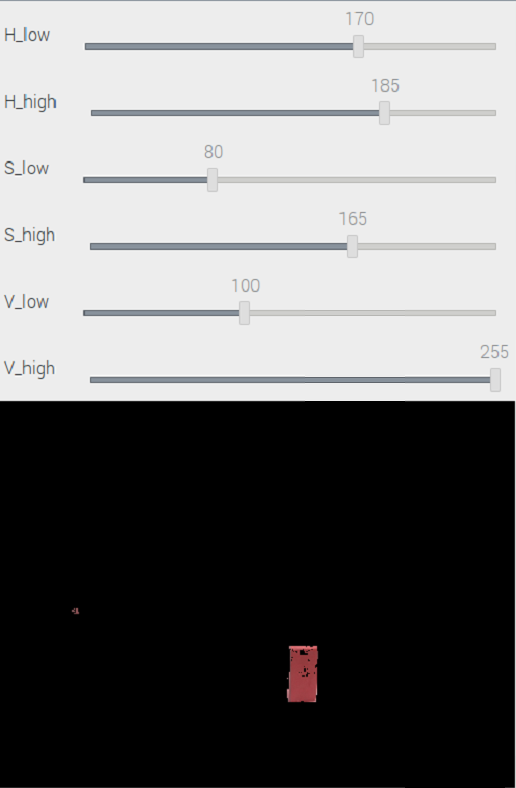
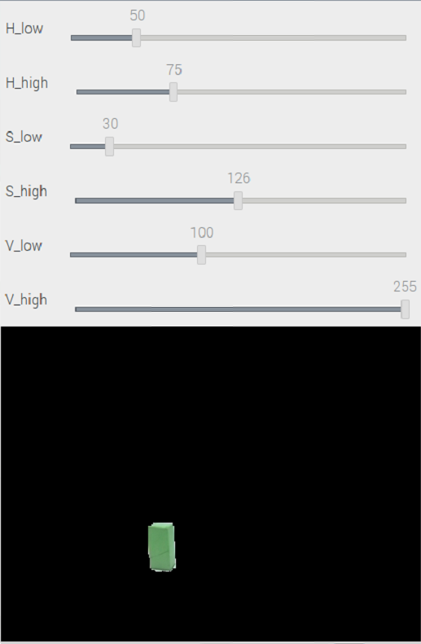
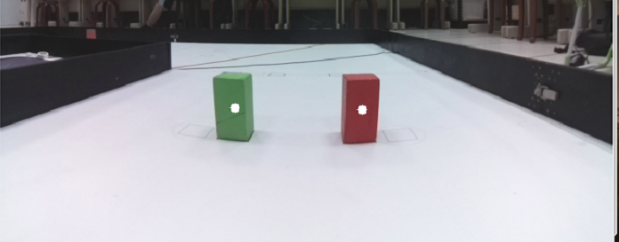

## 
Image_Processing
 

 - #### Image processing 圖像處理
   __All image filtering functions  code can be found in the vehicle_function.py file.__
    - When processing images, it is necessary to convert them to different color spaces for more efficient handling of specific tasks.  
    - We use the __cv2.cvtColor__ function to convert the original RGB image to the HSV (Hue, Saturation, Value) color space.  
    - After the image is converted, we use the cv2.inRange function, where we set six HSV values: redMax, redMin, greenMin, greenMax, blueMin, and blueMax, to define the color ranges. The cv2.inRange function compares each pixel value in the HSV image with the specified HSV ranges. If the pixel value falls within this range, it will be retained; otherwise, it will be filtered out. This process allows us to obtain a filtered image.  
  
    - 處理圖像時，需要將其轉換到不同的色彩空間，以便更有效地進行特定任務。  
    - 我們使用cv2.cvtColor函數將原始的RGB圖像轉換為HSV（色調、飽和度、明度）色彩空間。  
    - 轉換圖像後使用cv2.inRange函數，我們會設定六個HSV值，即redMax、redMin、greenMin、greenMax，設定顏色範圍。cv2.inRange函數比較HSV圖像中的每個像素值與指定的HSV範圍，如果像素值在這個範圍內，則將保留這個像素，否則將其過濾掉。這樣我們就可以得到一個經過過濾的圖像。  

    |Adjusting the HSV Range values for Red Color (調整紅色HSV數值範圍)|Adjusting the HSV Range Values for Green Color (調整綠色HSV數值範圍)|
    |:----:|:----:|
    |||

    |Obstacle Detection in Images(影像辨識障礙物)|
    |:----:|
    ||

# 
[Return Home](../../)
  
