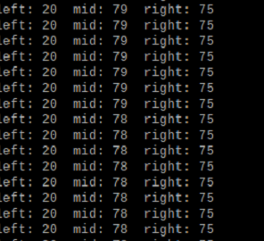
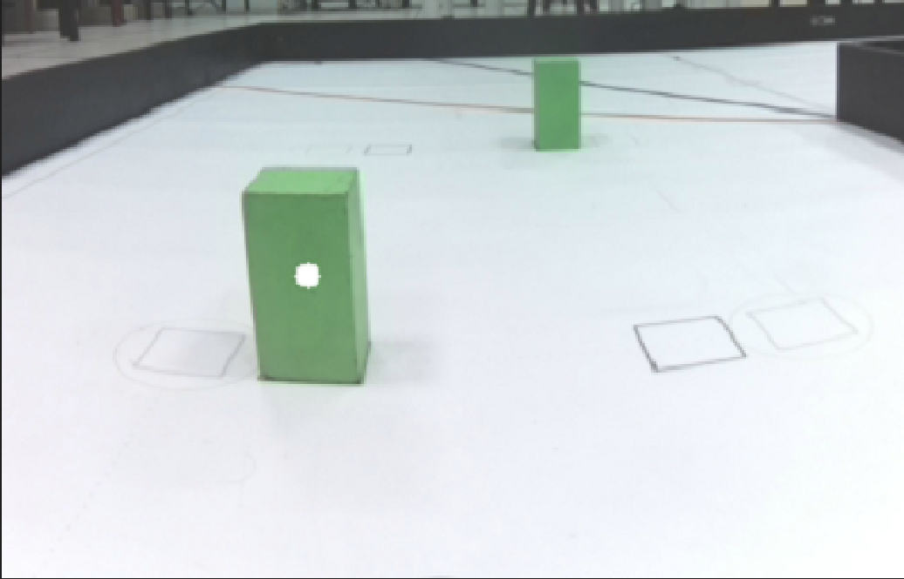
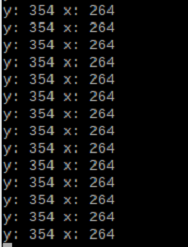
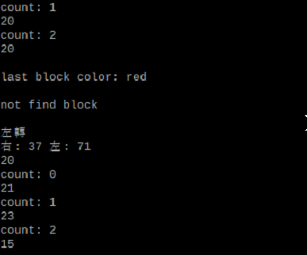
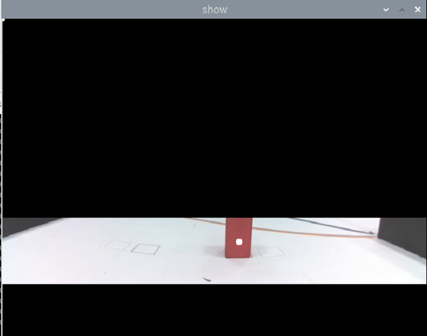

<div align="center"></div>

## <div align="center">Steering Overview 轉向概述</div> 

 ### Wall Steering
  - While the vehicle is moving, it reads whether one side of the LiDAR walls is more than 100 cm away. If the right LiDAR reads a distance exceeding 100 cm, it indicates clockwise motion; otherwise, it is counterclockwise, and the vehicle performs a steering maneuver.
  - After determining the travel direction, read the distance between the LiDAR and the wall ahead. When the distance between the LiDAR and the wall is less than 55 cm, execute the turning action.
  - program code:
        ```
        if get_left_dis > 100:
            reverse = False
        else:
            reverse = True
        if get_mid_dis > 55:
            servo.angle(-40)
        ```


  - 車輛行駛中，會讀取光達兩側牆壁其中一邊是否有>100公分，如果右邊光達讀取到的距離是超過100公分代表是順時針行駛，否則是逆時針行駛，進行車輛轉向。
  - 判斷完行駛方向後，會讀取光達前方距離牆壁幾公分，當光達與牆壁距離小於55公分，會執行轉彎動作。
  - 程式碼:  
    ```
    if get_left_dis > 100:
        reverse = False
    else:
        reverse = True
    if get_mid_dis > 55:
        servo.angle(-40)
    ```

    |LiDAR readings(光達讀取數值)|
    |:---:|
    |<div align="center"> </div>|

 ### Obstacle Avoidance 
  - While the vehicle is in motion, the camera lens transmits the video to the controller (Raspberry Pi), which performs calculations to obtain the X and Y coordinates and area of the objects in the image.
  - We will complete the avoidance of traffic signs through the following steps:  
    1. Use the Y coordinates to determine which block has a larger Y coordinate, indicating that it is closer.  
    2. Determine the color of the closer traffic sign and obtain its X coordinate.  
    3. Subtract the desired avoidance coordinate from the X coordinate of the closer  traffic sign and then multiply it by the avoidance coefficient to calculate the error value.  
    4. Set the steering angle of the servo motor to turn in the direction of the error value, completing the avoidance of the traffic sign.


 - 車輛行駛中，攝影鏡頭會將影片傳給控制器(Raspberry Pi)經過運算獲得，獲得圖像積木在畫面中的X、Y座標與面積。  
 - 我們將透過以下步驟來完成交通標誌的閃避：  
    1.用Y座標判斷哪一個積木的Y座標較大，Y座標較大的代表距離較近。  
    2.判斷較近的的交通標誌顏色，並取得其X座標。  
    3.將較近的交通標誌的X座標減去我們所欲閃避的座標再乘上閃避係數計算出誤差值。  
    4.設定伺服馬達轉向角度，使其轉向誤差值的方向，完成交通標誌閃避。

  |Recognize Obstacles that are Closer in Distance(辨識距離較近的障礙物)|XY Coordinates of Obstacles(障礙物的XY座標)|
  |:---:|:---:|
  |<div align="center"> </div>|<div align="center"> </div>|

 ### Slalom Steering
  - We will use a color sensor to count the number of times the track lines are passed, to determine if it has entered the last area of the second lap.
  - Therefore, if the count reaches 7 times, it means that the car has entered the last area of the second lap.
  - If the car reaches the last area of the second lap, the system will use the camera to continuously record the color of the nearest traffic sign until the car leaves the area. At this point, the traffic sign color will no longer be recorded.
  - If the color of the last traffic sign in the last area of the second lap is green, the car will continue to go straight. If the color of the sign is red, the car will turn around in the next area (starting area).
  
  - 我們會使用顏色感應器來計算場地線條的通過次數，以判斷是否已經進入第二圈的最後一個區域。
  - 因此計數次數達7次則代表，代表進入到第二圈的最後一個區域。
  - 如果到達第2圈最後一道區域，系統將會使用鏡頭持續紀錄距離最近的交通標誌顏色，直到離開區域，此時將不再紀錄交通標誌顏色。
  - 若第2圈最後一道區域最後一個交通標誌的顏色是綠色則繼續直行，若標誌顏色為紅色，則會在下一區域(出發區)進行迴轉。
 
 <div align="center">

|Display the number of lines and the color of the nearest traffic sign(顯示線條次數與最近的交通標誌顏色)|Camera detects the color of the nearest traffic sign(鏡頭偵測最近的交通標誌顏色)|
|:---:|:---:
|<div align="center"> </div>|<div align="center"> </div>|

</div>

# <div align="center">[Return Home](../../)</div>  


