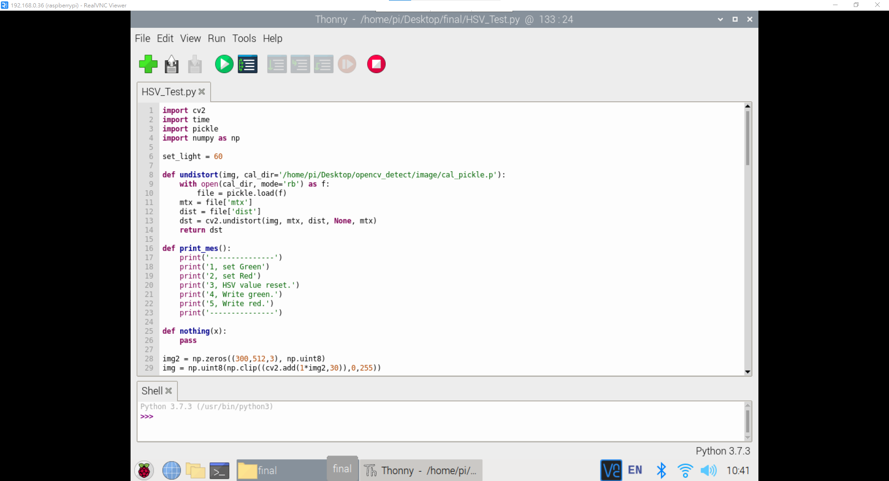
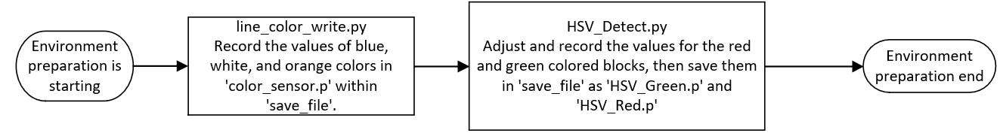
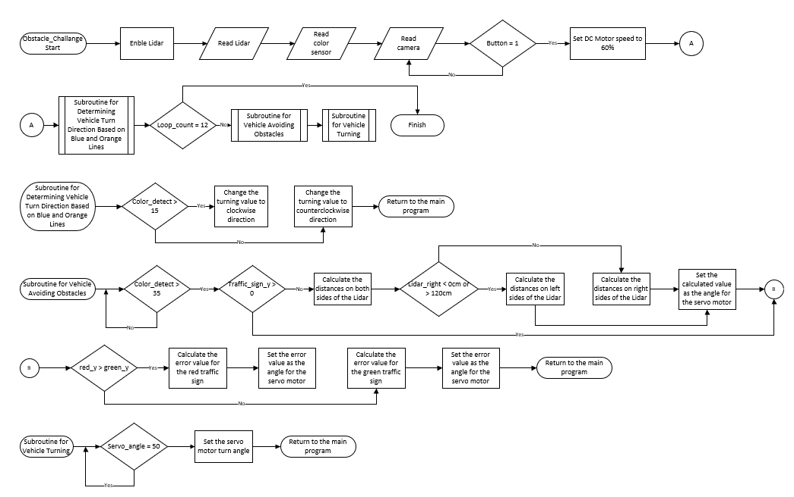

<div align="center"></div>

## <div align="center">Obstacle Challenge Code Overview(任務賽程式概述)</div>
 - In the competition, vehicle control involves complex operations such as image recognition, color identification, distance detection, motor rotation, and vehicle steering. All of these are implemented using the __Python__ programming language.
 - Through the built-in SSH or VNC functionality in Mobaxterm or using RealVNC, we can easily connect to the Raspberry Pi, access its editor interface, carry out programming tasks, and perform real-time execution tests.
 - The libraries introduced in this competition program are as follows.
 - 在競賽活動中，車輛行進的控制包含影像辨識、顏色判別、距離偵測、馬達轉動以及車輛轉向等複雜操作，均透過 __Python__ 程式語言設計來實現。
 - 透過Mobaxterm工具內建的SSH或VNC功能或RealVNC，讓我們能夠輕鬆地連線到樹莓派，進入其編輯器界面，開展程式撰寫的工作並即時進行執行測試。
 - 本次競賽程式所引入的程式庫如下：  
```
   #Import the required modules
   import pigpio       #Raspberry Pi I/O Control Function Library
   import time         #Time Module
   import smbus        #I2C Manage  Module
   import struct       #Binary Data Packing and Unpacking Modul
   import os           #System Information Reading Module 
   import math         #Mathematical Calculation Module
   import cv2          #OpenCV  Module
   import threading    #Multithread Management  Module
   import pickle       #Serialization/Deserialization Modul
   import rospy        #ROS Python Commands Module
   import numpy as np  #Multidimensional Arrays and Matrix Operations Module
   import signal       #Exception Handling Module
   from sensor_msgs.msg import LaserScan  #ROS Data Structure Definitions
```
<div align="center">
</div>
 <table>
 <tr align="center">
 <th> Edit python of  Mobaxterm_SSH  
 </th>
 <th> Edit python of  Mobaxterm_VNC
 </th>
 <th>Edit python of RealVNC
 </th>
 </tr>
 <tr align="center" > 
 <td> </td>
 <td> </td>
 <td> </td>
 </tr>
 </table>
 </div>
 
 - ### Introduction to the Required Module Programs in the Operating Software:
 - ### 運作程式中所需要的模組程式介紹：
   - #### Field Environment Value Recording Configuration Workflow(場地環境值記綠設定運作流程圖)
   
     - #### [line_color_write.py](./line_color_write.py)
       - The main functionality of the "line_color_write.py" program is to read the color values of white areas, orange lines, and blue lines, and save these values to a file named "color_sensor.p". Additionally, the program stores this file in the "save_file" directory.       
       - "line_color_write.py" 這個程式主要功能是用來讀取場地中白色區域、橘色線條和藍色線條的顏色數值，並保存到名為color_sensor.p檔案並存入到"save_file"的資料夾中。
     - #### [HSV_Detect.py](./HSV_Detect.py)
       - The main purpose of the 'HSV_Detect.py' program is to adjust HSV range values for color filtering. Users can configure the HSV range values for green and red and save these settings in files named 'HSV_Green.p' and 'HSV_Red.p,' which are stored in the 'save_file' folder.
       - HSV_Test.py 這個程式主要功能在於調整HSV範圍值，以進行顏色篩選的工作。使用者可以設定綠色和紅色的HSV範圍值，並將這些設定數值紀錄到名為HSV_Green.p與HSV_Red.p檔案並存入到"save_file"的資料夾中。
     - #### [save_file](./save_file)
       - The function of the 'save_file' folder is to store color values related to the white area of the field, orange lines, and blue lines.
       - These numerical data are used for image processing, image recognition, and determining whether the next turn is reached or whether to walk forward or backward.
       - save_file 資料夾的功能是用於儲存場地白色區域、橘色線條和藍色線條相關的顏色數值。  
       - 這些數值資料則用於圖像處理、影像辨識及判斷是否到逹下一個彎道或順逆行走的判斷依據。
    - #### Obstacle Challenge Flow Chart(任務賽程式流程)
     

    - #### [vehicle_function.py](./vehicle_function.py)
       - "vehicle_function.py," which is the program library used in this competition, provides custom functions for vehicle movement, image recognition, color recognition, and controlling servo motors. These custom functions simplify complex procedures into subroutines for ease of debugging. 
       - "vehicle_function.py"，它是本次競賽所使用的程式函式庫，提供車輛移動、影像辨識、顏色辨識和操控伺服馬達等自定義函式程式，將複雜程序簡化成副程式概念，方便除錯。 
    - #### [Obstacle_Challenge.py](./Obstacle_Challenge.py)  
      - "Obstacle_Challenge.py" is the main program responsible for controlling the self-driving car. It reads the values detected by the color sensor, LIDAR sensor, and image recognition technology to drive the car's motors and achieve the goal of avoiding obstacles and completing specific tasks.
      - "Obstacle_Challenge.py"，它是執行自駕車控制的主程式，讀取顏色感測器、光達感測器和影像辨識技術所偵測的數值，來驅動車輛的馬達，以達成車輛避開障礙物並完成特定任務的目標。        - 
- ### 任務賽程式運作流程流程圖說明   Obstacle Challenge Program Operation Flowchart Description
  - After the vehicle starts, the program reads values from the LiDAR, color sensor, and captures images from the camera. Once the button is pressed, the program sets the DC motor speed to 60% and the vehicle continues moving forward. It keeps moving forward until the color sensor detects a line, at which point it initiates a turn. The program then checks whether it has completed 12 turns; if it has, the program ends. If not, it continues repeating the cycle of moving forward, avoiding obstacles, and turning when a wall is detected.  [Wall-Steering@Steering_overview](../../Image_Processing_and_Steering/Steering_overview#wall-steering) 
  - During the course of driving, the images captured by the camera undergo processing to obtain the X and Y coordinates, as well as the area of objects within the frame.  [Image_Processing](../../Image_Processing_and_Steering/Image_Processing/)   
  - Subsequently, by subtracting the X-coordinate of the nearer traffic sign from the X-coordinate of our intended target to avoid, we calculate an error value. Finally, we set this error value as the angle for the servo motor to turn, completing the avoidance maneuver around the traffic sign.  [obstacle-avoidance@Steering_overview](../../Image_Processing_and_Steering/Steering_overview#obstacle-avoidance) 
  - When the vehicle is in its second lap and encounters a green traffic signal at the end, it continues to proceed according to the regulations.
  - When the vehicle is in its second lap and encounters a red traffic signal at the end, it will turn around in the starting area, and then follow the regulations, completing 12 wall-turns before ending the program.  [slalom-steering@Steering_overview](../../Image_Processing_and_Steering/Steering_overview#slalom-steering)


  - __Subroutine Description:__   

    __1. Determining Vehicle Turn Direction Based on Blue and Orange Lines Subroutine：__  
    While the vehicle is in motion, if the color sensor detects a value lower than white (35), it indicates that it has detected a blue (15) or orange line (27). Next, the program calculates the midpoint between the two values (15+27)/2 to determine the color of the line. If the value is below 21, it signifies a blue line, and the turning direction is set counterclockwise. If the value is higher than 21, it indicates an orange line, and the turning direction is set clockwise.

    
    __2. Vehicle Lane Centering Subroutine：__    
    While driving, it continuously checks whether the value read by the color sensor is greater than that of white (35). If it is, the vehicle continues moving forward. It also checks for the presence of obstacles in front. If an obstacle is detected, it performs the action to avoid the obstacle. If no obstacle is detected, it proceeds to center the Lidar. Lidar centering involves calculating the values on the left and right sides, subtracting the right value from the left value, and passing it to the servo motor to control the direction.

    __3. Vehicle Avoiding Obstacles Subroutine:__  
    It determines which has a larger area, the red block or the green block. If the red block is larger, it controls the servo motor to steer to the right and avoid the red block. If the green block is larger, it controls the servo motor to steer to the left and avoid the green block.
    
    __4. Vehicle Turning Subroutine：__ Continue turning until the specified angle is reached.
    
    
  - 當車輛啟動後，程式會讀取光達、顏色感測器的數值和鏡頭拍攝的影像，按鈕按下之後會將直流馬達速度設為60%，會持續直走，直到顏色感測器測到線，執行轉彎，判斷是否轉彎了12次，如果是直接結束程式，如果不是就持續重複直行避障、測到牆轉彎。 
  - 在行駛過程中，鏡頭拍攝的影像經過處理後，可獲得圖像在畫面中的X、Y座標與面積。  
  - 接著，我們透過將較近交通標誌的X座標減去我們所欲閃避的目標X座標，計算出誤差值。最後，我們將這個誤差值設定為伺服馬達轉向的角度，完成繞過交通標誌的閃避動作。
  - 當車輛行駛在第二圈最後一個交通號誌是綠色的，則持續往前依規定行駛。
  - 當車輛行駛在第二圈最後一個交通號誌是紅色的，則在出發區回轉，並依規定行駛，在完成遇牆轉彎12次，結束程式。

  - __副程式描述:__  
    __1. 判斷藍橘線決定車輛轉向副程式:__   
    在車輛行駛中，如果顏色感測器測到低於白色的數值(35)就表示測到藍(15)或橘線(27)，再來就是利用兩條線的中間值(15+27)/2，來判斷何種顏色的線，若數值低於21代表測到藍線，要將轉彎方向設為逆時針，若高於21表示測到橘線，要將轉彎方向設為順時針。  
    __2. 車輛行駛車道置中副程式:__  
    行駛中重覆判斷顏色感測器讀取的數值是否大於白色(35)，如果是就繼續直行，並判斷是否有積木在前方，如果有積木就直行閃避積木的動作，如果沒有就進行光達置中，光達置中會計算左右兩邊的數值，將右邊的數值剪掉左邊的數值再丟入伺服馬達，讓伺服馬達控制方向。     
    __3. 車輛閃避積木副程式:__  
    判斷紅色積木、綠色積木面積誰比較大，若是紅色則控制伺服馬達向右閃過積木，若是綠色則控制伺服馬達向左閃過積木。  
    __4. 車輛轉彎副程式:__  持續轉彎直到轉到指定角度。  

# <div align="center">[Return Home](../../../)</div>  
