<div align=center>  </div>

## <div align="center">Software Platform Construction </div> 

- ### 安裝自動駕駛汽車所需的系統軟體

#### 1.準備一張空的sd卡或按以下步驟格式化
開啟終端機，輸入diskpart
```
diskpart
```
<td>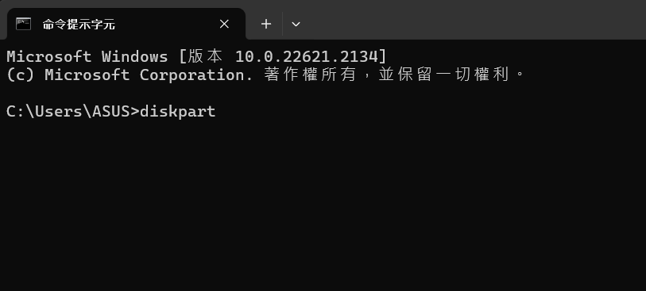</td>  

進入diskpart
<td>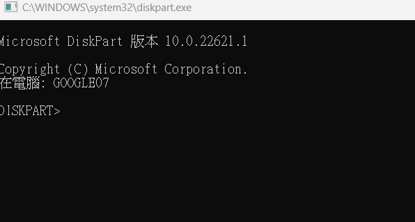</td>

輸入list disk
```
list disk
```
<td>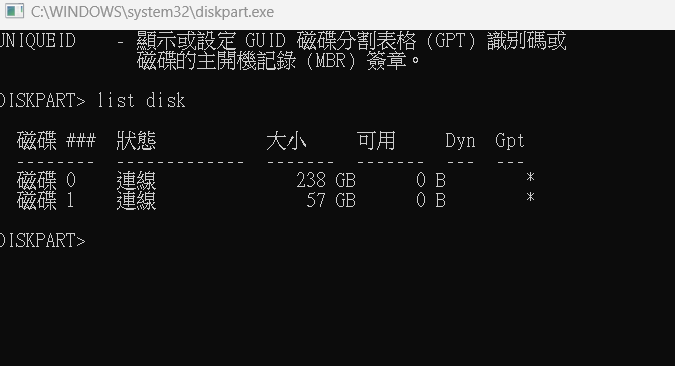</td>

輸入select disk ?

問號填入磁碟序，這裡以磁碟一為例
```
select disk ?
```
<td>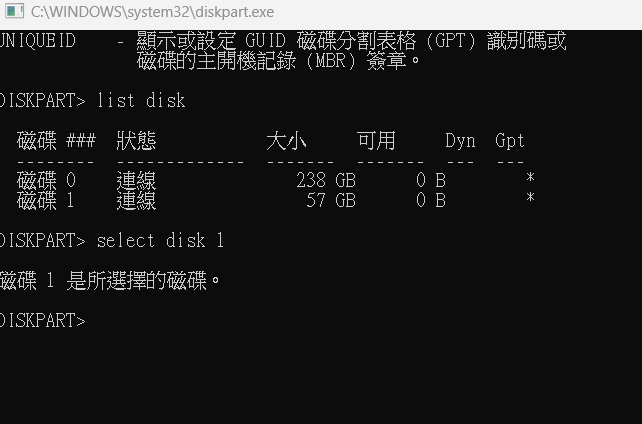</td>

接著輸入clean，如果出現成功清理磁碟就完成了
```
clean
```
<td>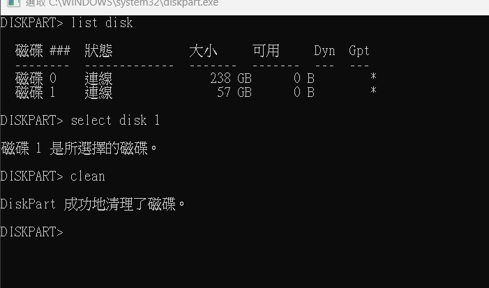</td>

下載並安裝[SD Memory Card Formatter](https://www.sdcard.org/downloads/formatter/sd-memory-card-formatter-for-windows-download/)

完成後會看到以下圖片
<td>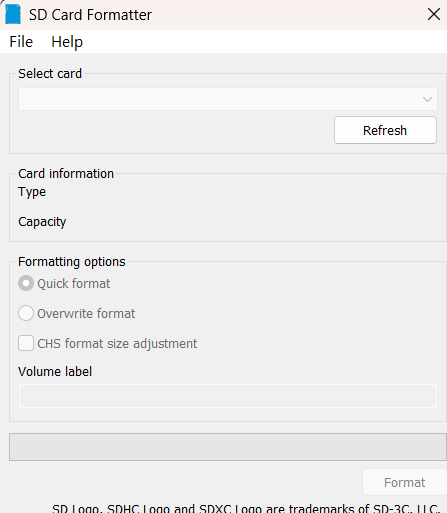</td>

選擇你的SD卡後按下Formatter就完成了
### 2.安裝映像檔

至[NVIDIA官網](https://developer.nvidia.com/embedded/learn/get-started-jetson-nano-devkit#write)下載映像檔

<td>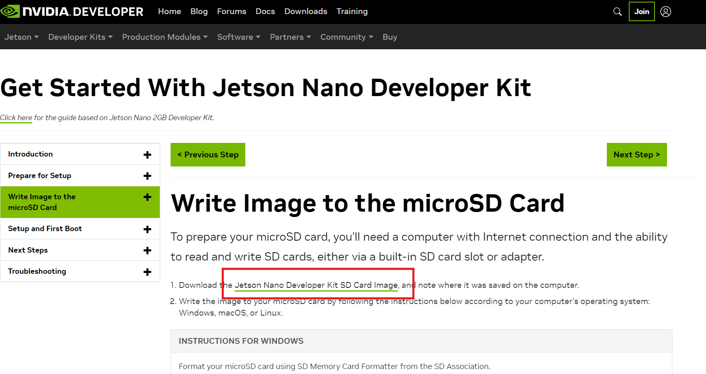</td>

接著下載[Etcher](https://etcher.balena.io/)以安裝映像檔

<td>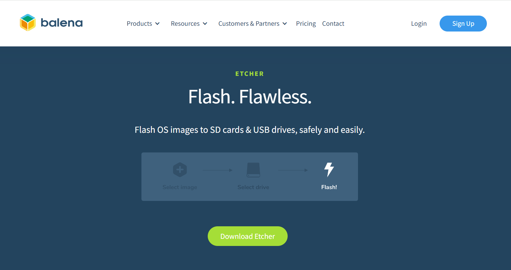</td>

選擇印象檔及SD卡並開始燒錄
<td>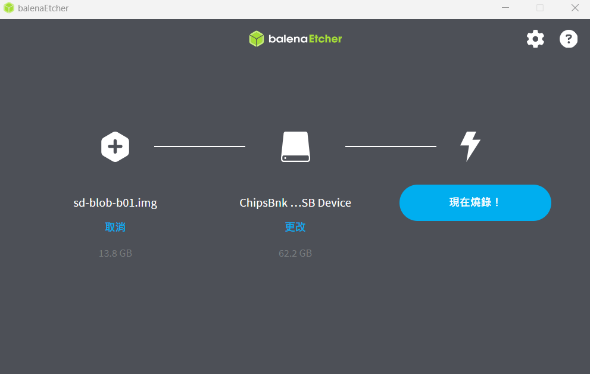</td>

資料參考:https://developer.nvidia.com/embedded/learn/get-started-jetson-nano-devkit#write

### 3.jetson nano環境配置
#### 1.將SD卡插入jetson nano 並完成基礎設定進入主畫面

<td>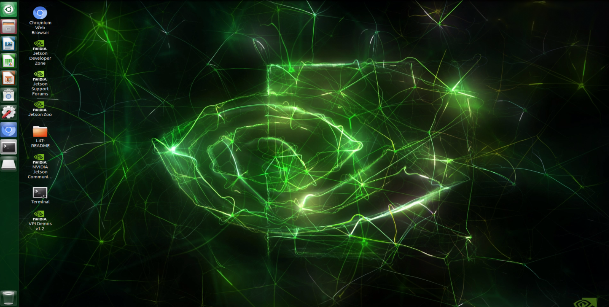</td>

#### 2.基礎架設
更新目錄
```
sudo apt-get update
```
更新系統
```
sudo apt-get upgrade
```
安裝或更新pip指令
```
sudo apt-get install python3-pip 
```
```
pip3 install --upgrade pip
```
安裝cython(將Python與C結合使用)
```
pip3 install Cython
```
安裝 i2c-tools 與 smbus 庫
```
sudo apt update 
```
```
sudo apt install -y i2c-tools  
```
```
sudo i2cdetect -y -r 1 
```
```
sudo i2cdetect -y -r 7 
```
更新所有系統
```
sudo apt full-upgrade
```
### 安裝 Adafruit-BNO055 陀螺儀模組
```
sudo -H python3 -m pip install Adafruit-BNO055
```

- ### Installing the Necessary Software for Autonomous Car System

#### 1.Prepare an Empty SD Card or Format it by Following the Steps Below
Open the terminal and enter diskpart.
```
diskpart
```
<td></td>  

Enter the diskpart interface.

<td></td>

Type list disk.

```
list disk
```
<td></td>

Type select disk ?

Replacing the question mark with the disk number (for example, Disk 1).
```
select disk ?
```
<td></td>

Next, type clean. If you see a "disk cleaned successfully" message, you’re done.
```
clean
```
<td></td>

Download and Install Software[SD Memory Card Formatter](https://www.sdcard.org/downloads/formatter/sd-memory-card-formatter-for-windows-download/)

After installation, you should see the following image.

<td></td>

Select your SD card, then press "Formatter" to complete the formatting.

### 2.Install the Image File

Go to the[NVIDIA website.](https://developer.nvidia.com/embedded/learn/get-started-jetson-nano-devkit#write)

Download the image file.

<td></td>

Next, download[Etcher](https://etcher.balena.io/)to install the image file.

<td></td>

Select the image file and SD card, then start the flashing process.

<td></td>

Reference Link :https://developer.nvidia.com/embedded/learn/get-started-jetson-nano-devkit#write

### 3.Set Up Jetson Nano
#### 1.Insert the SD card into Jetson Nano, complete the basic setup, and enter the main screen.

<td></td>

#### 2.Basic Setup Steps
Update the directory.
```
sudo apt-get update
```
Update the system.
```
sudo apt-get upgrade
```
Install or update pip.
```
sudo apt-get install python3-pip 
```
```
pip3 install --upgrade pip
```
Install Cython (to use Python in combination with C)
```
pip3 install Cython
```
Install i2c-tools and smbus libraries.
```
sudo apt update 
```
```
sudo apt install -y i2c-tools  
```
```
sudo i2cdetect -y -r 1 
```
```
sudo i2cdetect -y -r 7 
```
Update all system packages.
```
sudo apt full-upgrade
```
### Install the Adafruit-BNO055 gyroscope module. 
```
sudo -H python3 -m pip install Adafruit-BNO055
```

---

- ### Record Field Environment Values
  - In practice, we pre-record the color values of the blue, orange lines, white areas, and block colors in the field into the 'color_sensor.p' file. This is done to facilitate the use of these values during the actual competition, enhancing recognition accuracy and saving preparation time for the official race.  
  - #### Field Environment Value Recording Configuration Workflow
      
  - #### [line_color_write.py](../Programming/Open_Challenge/line_color_write.py)
    - "The 'line_color_write.py" program is primarily designed to read the color values of white, orange, and blue colors in the competition field and record these values into the 'color_sensor.p' file within the 'save_file' data.
    - When the program is running, use the button on the vehicle to aim the color sensor at the blue, orange lines, and white areas on the field, moving back and forth. Press the button to record the lowest value in that area and save it in the 'color_sensor.p' file.
    - The 'color_sensor.p' file records the values of various colors in the competition field, and through program calculations, these values can be utilized in the official competition, making it convenient for retrieval and saving preparation time.

      |The Color Values of the Field in the 'color_sensor.p' File|
      |:---:|
      |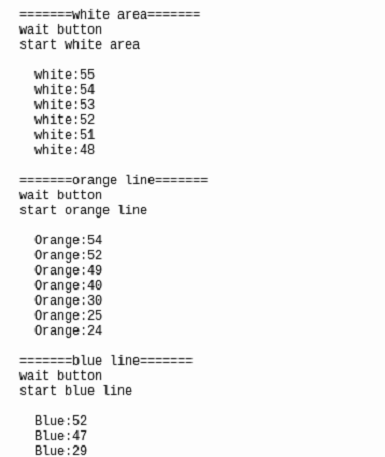|

  - #### [HSV_Detect.py](../Programming/Obstacle_Challenge/HSV_Test.py)
    - The "HSV_Detect.py" program primarily reads the color values of the blocks on the field and records these values in the "HSV_Green.p" and "HSV_Red.p" files within the "save_file" data directory.  
    - The "HSV_Green.p" and "HSV_Red.p" files contain the recorded color values of the blocks on the competition field. These values can be used during the official competition, making it easier to read and saving preparation time.  
    - When the HSV_Detect.py program is executed, the camera will be aligned with the block, and the following functions will be displayed on the computer screen, corresponding to the keyboard number keys 1~5:  
      - Number 1: Display the last recorded green threshold value.  
      - Number 2: Display the last recorded red threshold value.  
      - Number 3: Reset the currently adjusted threshold values to default.  
      - Number 4: Record the adjusted green threshold value to the HSV_Green.p file.  
      - Number 5: Record the adjusted red threshold value to the HSV_Red.p file.  
    - When adjusting the threshold values for recognizing the blocks, we place a block both at a distance and up close to ensure that the adjusted thresholds can identify blocks at any distance. After the adjustments, press either the number 4 or 5 to save the threshold values to the HSV_Green.p or HSV_Red.p files.  
    - After completing the adjustment and recording, you can press the number 1 or 2 to display the previously recorded threshold values for further adjustments.  


<div align="center">
 
|Adjust the Green Color Threshold Value|Adjust the Red Color Threshold Value|Display Button Functionality|
|:---:|:---:|:---:|
|<div align="center"> 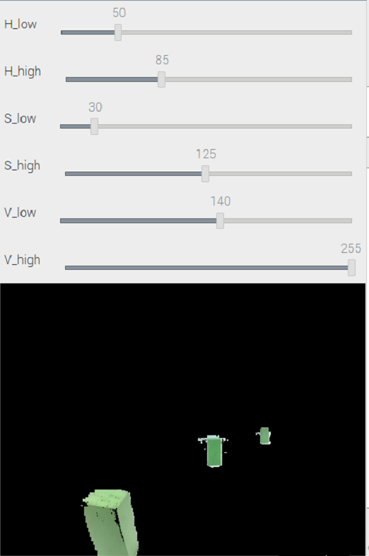</div>|<div align="center"> 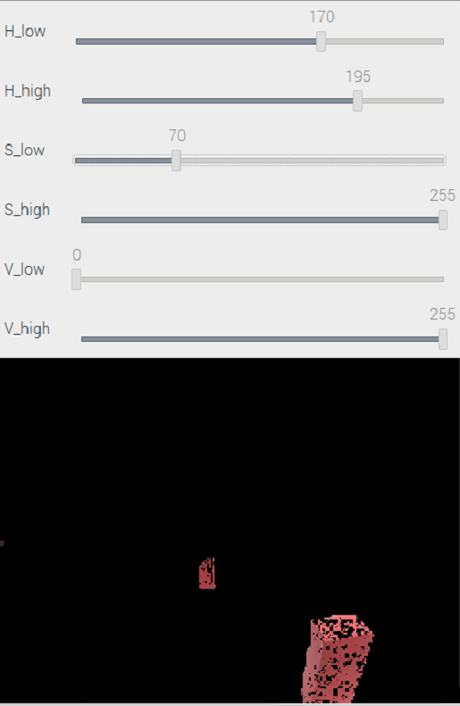</div>|<div align="center"> 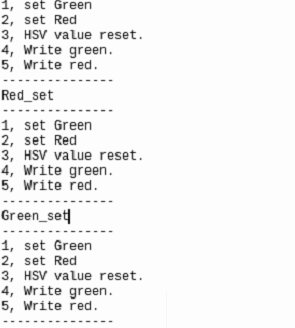</div>|
</div>

- ### Competition Programming Language Introduction - Python
   - Python is a high-level, general-purpose, interpreted programming language created by Guido van Rossum in 1991. It is designed to be concise, readable, and comes with a rich standard library, allowing developers to write code quickly and efficiently.
  standard library, enabling developers to write code quickly and efficiently. 
   - Python is widely used in web development, scientific computing, data analysis, artificial intelligence, machine learning, and various other fields. It features dynamic typing, automatic garbage collection, and supports multiple platforms.
   - With an active community, Python has a plethora of third-party libraries and tools, making development even more convenient. Python has become a popular choice for both beginners and experienced developers.  

  __Therefore, we choose Python as the programming language for the development of the self-driving vehicle.__

- ### Competition Programming Editor Introduction - Mobaxterm
  - MobaXterm is a feature-rich cross-platform remote computing management tool. 
  - It integrates various network tools such as X11 server, remote computing, SSH, VNC, and more, providing an intuitive user interface for easy connection to remote servers in Windows environments.
  - MobaXterm also supports simultaneous management of multiple sessions, allowing users to switch and operate different remote connections effortlessly. This tool is highly valuable for system administrators, network engineers, and developers.
 
  __Therefore, we chose Mobaxterm as the remote control programming tool for the Raspberry Pi in our self-driving vehicle.__


  - Software Website：[Mobaxterm](https://mobaxterm.mobatek.net/) 

# <div align="center">[Return Home](../../)</div> 
