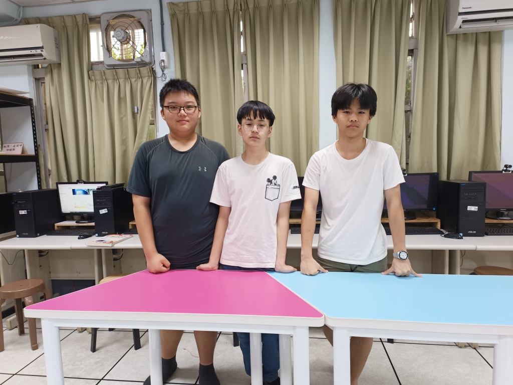
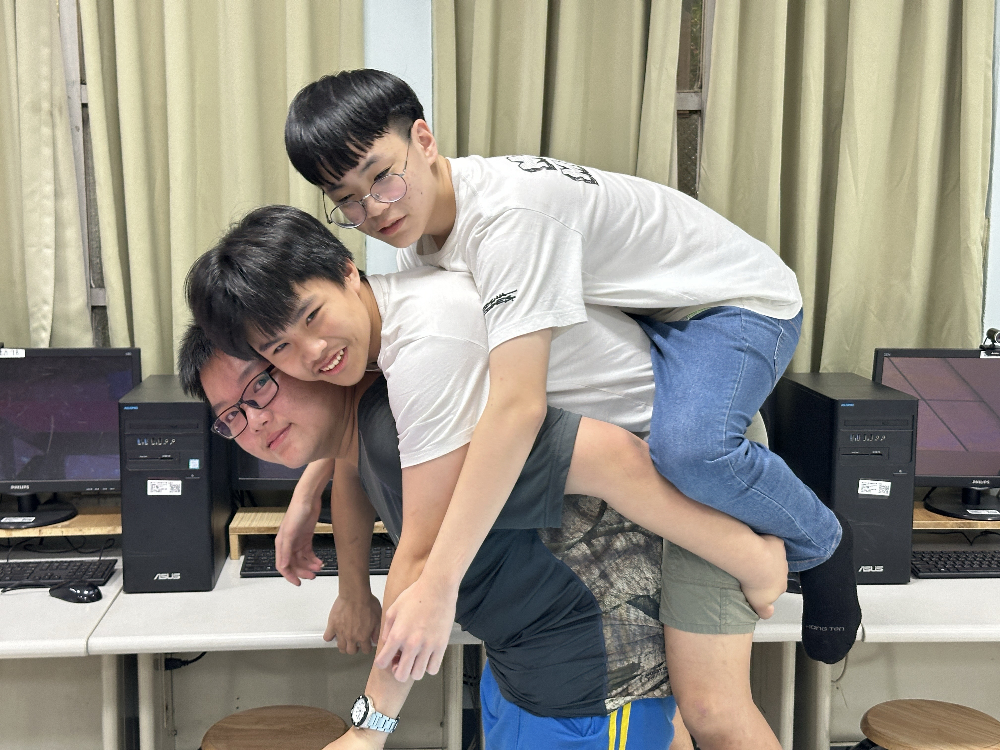
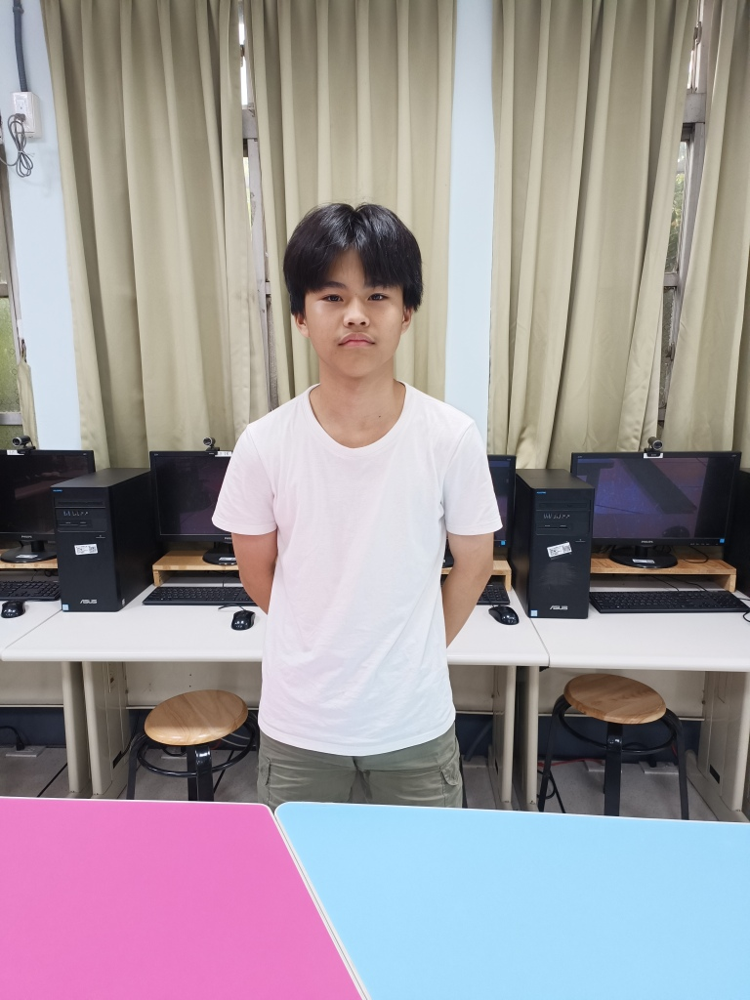
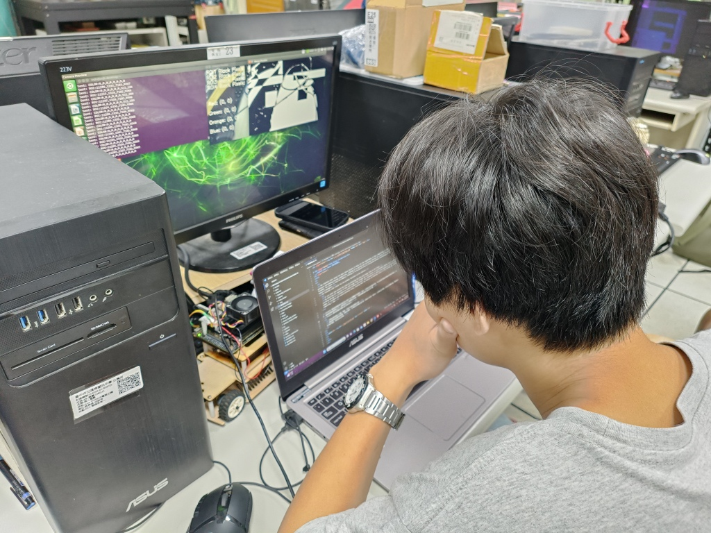
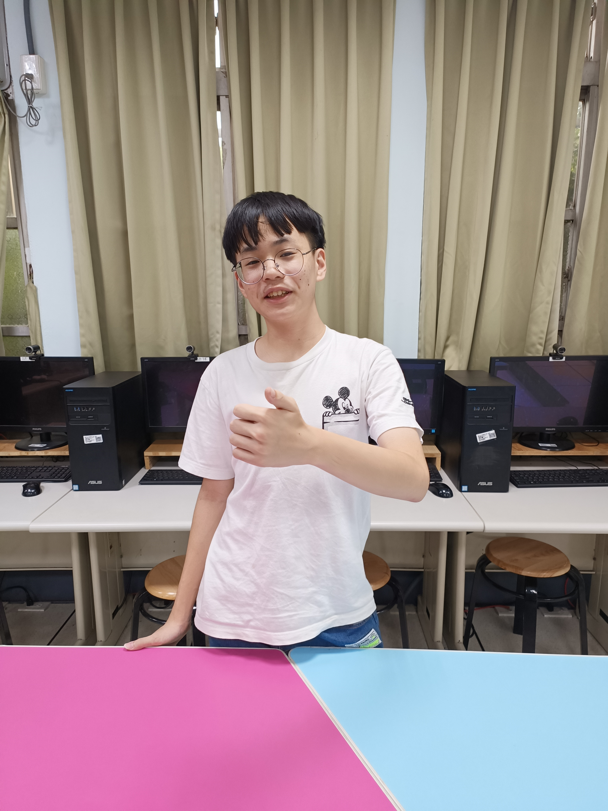
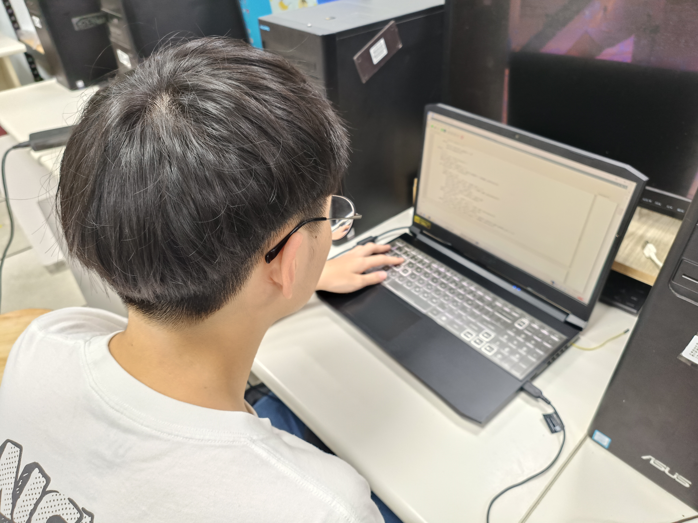
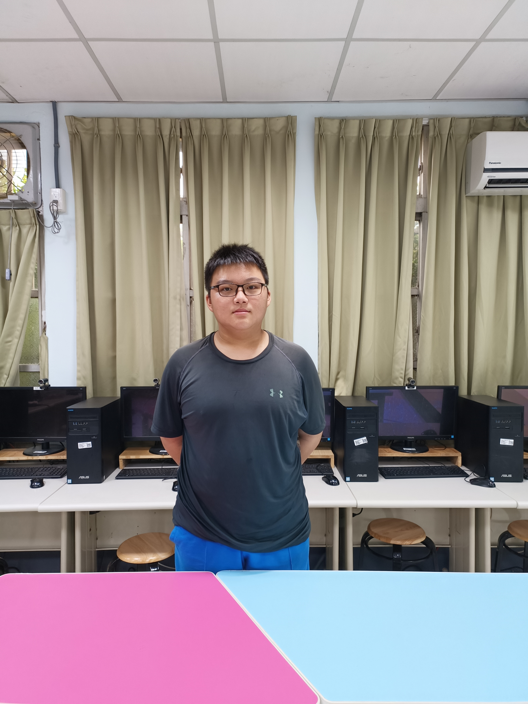
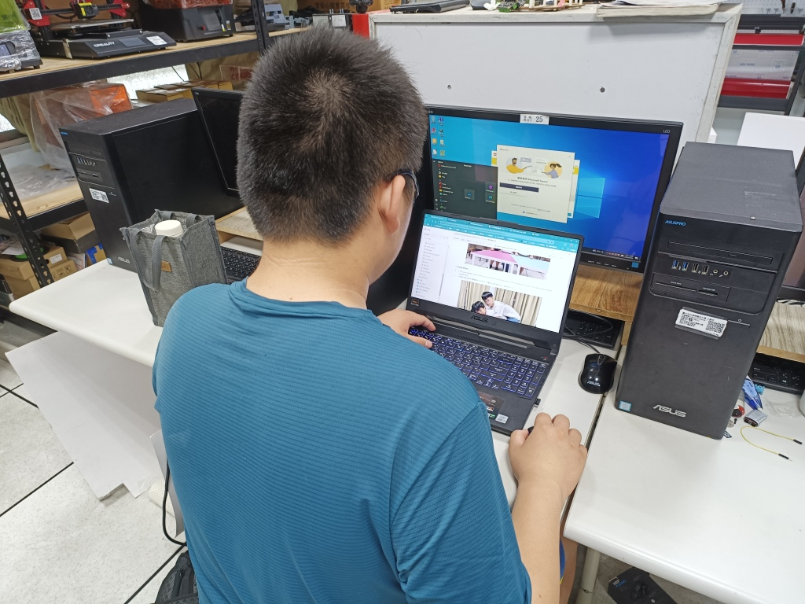

## 
 Team Members Introduction(團隊成員介紹)

- ### Team Photo  

- - Today is the first day that our team was established, so I took a photo to commemorate it. The location was chosen in the club classroom.

- - 今天是我們隊伍成立的第一天，因此拍了照片來做紀念，地點選在了社團教室內

||
  

- ### Funny Photo
- - This is our attempt to take a photo using the method of stacking Arhats. In fact, the angle of our back is a bit wrong and we almost slipped down.
- - 這張是我們試著使用疊羅漢的方式拍照，其實背的角度有點不對，差點就滑下去了

 
  

## Team Members of Introduction  
|   |   |
| :----: | :----: |
| __胡賢邑 (HU,SIAN-YI)__  | __Work Assignments(工作分配)：__ Code writing.|
|   Personal photo.個人照 | Work photo.工作照 |
|  |  |
| __賴孟承 (LAI,MENG-CHENG)__  | __Work Assignments(工作分配)：__ Code writing and hardware design.|
|  Personal photo.個人照  |  Work photo.工作照   |    
|  |  |
| __黃科輔 (HUANG,KE-FU)__  |  __Work Assignments(工作分配)：__ Report recording and writing. |
|   Personal photo.個人照  |  Work photo.工作照   |   
|  |  |  

# 
[Return Home](../)
 

