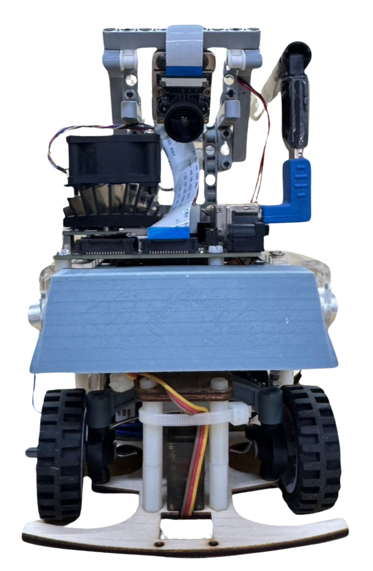
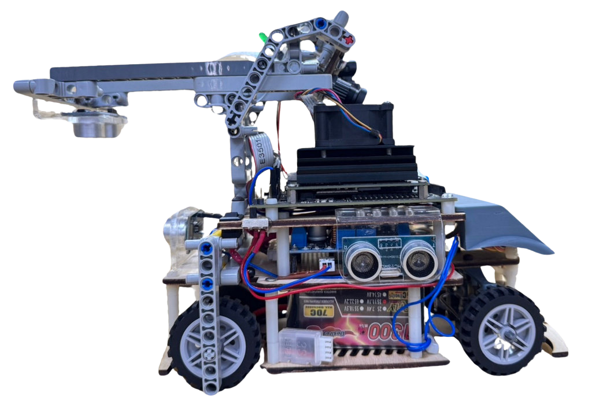

## 
 Machine introduction 機器介紹

### Machine photos 機器照片

<table>
  <tr align="center">
    <th>Top View 上視圖</th>
    <th> Front View 前視圖</th>
    <th>Left View 左視圖</th>
  </tr>
    <tr align="center">
    <td> </td>
    <td></td>
    <td></td>
  </tr>
    <tr align="center">
    <th>Bottom View 仰視圖 </th>
    <th>Rear View 後視圖 </th>
    <th>Right View 右視圖</th>
  </tr>
    </tr>
    <tr align="center">
    <td></td>
    <td></td>
    <td></td>
  </tr>
</table>

 

# 
[Return Home](../)
 