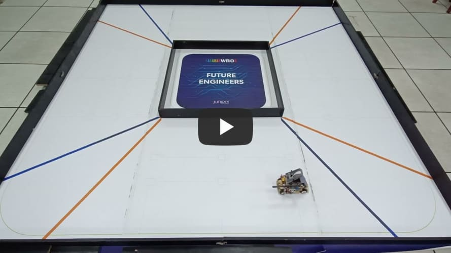
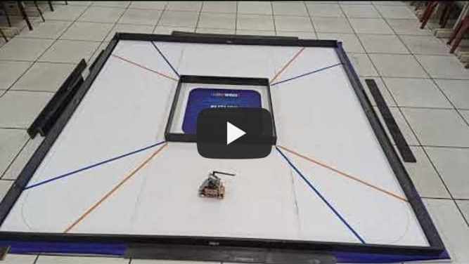
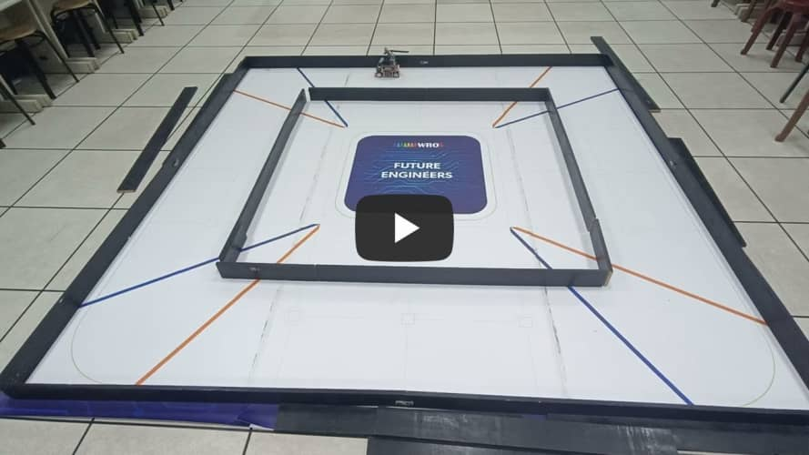
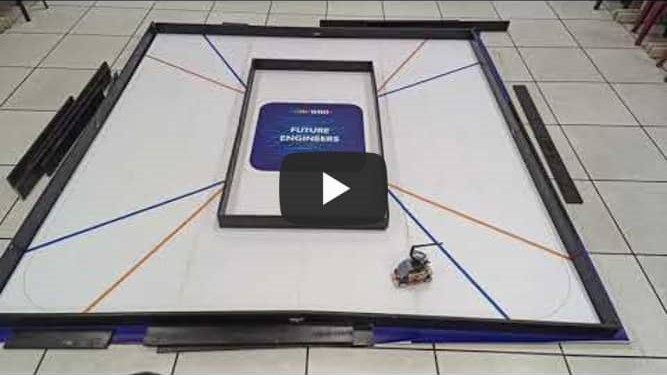

## 
Testing Video of Self-Driving Car in Open Challenge
 

  Here are test videos of vehicles in different power and field combinations.

- ### Full width

  This is a test video of a vehicle in a field set to "wide-wide-wide-wide".

|Power 50 |Power 70|
|:----:|:----:|
|||

- ### Half-width half-narrow
 
  This is a test video of a vehicle in a "wide-narrow-wide-narrow" field configuration, which is more difficult.
  
|Power 50 |Power 70|
|:----:|:----:|
|||

- ### Full narrow
  This is a testing video of the vehicle on a course set as 'narrow-narrow-narrow-narrow.' As all road widths have been reduced, this results in a limited correction space for the machine, making it easy for it to overshoot during turns and potentially collide with the walls.

|Power 50 |Power 70|
|:----:|:----:|
|||

- ### wide narrow wide narrow

  These are test videos of a vehicle in a "wide-narrow-wide-narrow" field configuration, recorded clockwise and counterclockwise.

|Clockwise|Counter Clockwise|
|:---:|:---:|
| ||
# 
[Return Home](../../)
  

